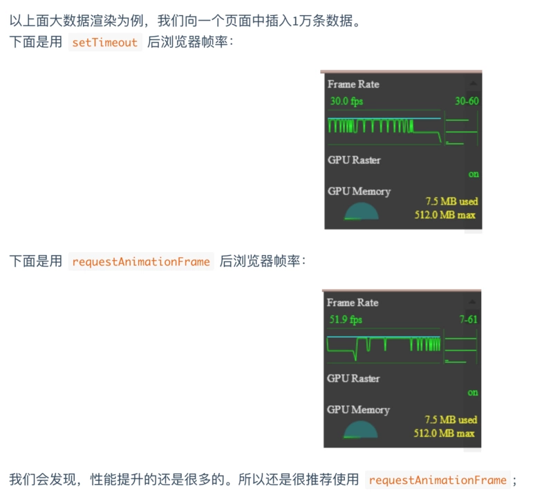
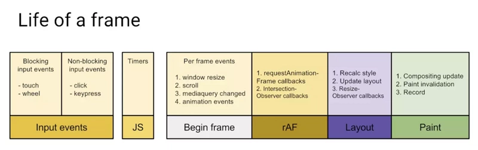
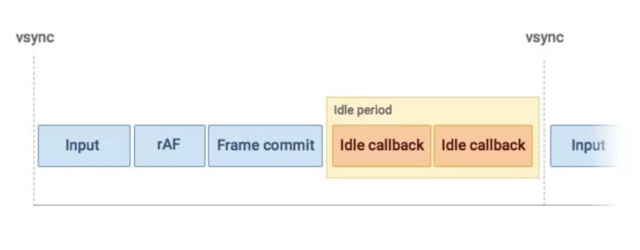

# awsome-knowledge-front-end
## 目录
1. [遇到过的兼容性问题](#遇到过的兼容性问题)
2. [两种以上方式实现已知或者未知宽度的垂直水平居中?（有赞/百度）](#两种以上方式实现已知或者未知宽度的垂直水平居中)
3. [实现效果，点击容器内的图标，图标边框变成border 1px solid red，点击空白处重置?](#wrapper-border)
4. [CSS和JS的位置会影响页面效率，为什么？(有赞)](#css-js)
5. [图片懒加载怎么实现](#图片懒加载怎么实现)
6. [假如现在页面里放在head的css文件下载速度很慢，页面会出现什么情况？](#假如现在页面里放在head的css文件下载速度很慢页面会出现什么情况)
7. [假如我现在在页面动态添加了一个CSS文件，页面一定会回流吗？例如页面这个CSS文件中有translate3d呢？](#假如我现在在页面动态添加了一个CSS文件页面一定会回流吗例如页面这个CSS文件中有translate3d呢)
8. [左右布局：左边定宽、右边自适应，不少于3种方法](#左右布局左边定宽右边自适应不少于3种方法)
9. [CSS3用过哪些新特性](#CSS3用过哪些新特性)
10. [BFC和IFC](#BFC和IFC)
11. [1像素边框问题](#1像素边框问题)
12. [添加一个什么css属性可以让div的实际宽度仍然保持在100px](#添加一个什么css属性可以让div的实际宽度仍然保持在100px)
13. [清除浮动的方式，提供尽可能多的方案](#清除浮动的方式提供尽可能多的方案)
14. [如何让两个div分别以40%和60%的比例排在一行内，提供尽可能多的方案](#如何让两个div分别以40和60的比例排在一行内提供尽可能多的方案)
15. [如何用css实现一个div的一秒内向右平滑移动100px的动画](#如何用css实现一个div的一秒内向右平滑移动100px的动画)
16. [CSS垂直居中的11种实现方式（海康/快手）](#css_center)
17. [对栅格的理解](#对栅格的理解)
18. [水平居中有哪些实现方式](#水平居中有哪些实现方式)
19. [伪元素选择器不包含(大搜车)](#伪元素选择器不包含)
20. [标准盒模型和怪异盒模型的转化（坚果云二面）](#标准盒模型和怪异盒模型的转化)
## 题目

### CSS

1. #### 遇到过的兼容性问题

遇到的兼容性问题与解决方法

- 浏览器兼容问题一：不同浏览器的标签默认的外补丁和内补丁不同

问题症状：随便写几个标签，不加样式控制的情况下，各自的`margin` 和`padding`差异较大。

解决方案：CSS里 `*{margin:0;padding:0;}`

备注：这个是最常见的也是最易解决的一个浏览器兼容性问题，几乎所有的 CSS 文件开头都会用通配符 * 来设置各个标签的内外补丁是 0。

- 浏览器兼容问题二：块属性标签 float 后，又有横行的 margin 情况下，在 IE6 显示`margin`比设置的大

问题症状:常见症状是 IE6 中后面的一块被顶到下一行

碰到频率：90%（稍微复杂点的页面都会碰到，float 布局最常见的浏览器兼容问题）

解决方案：在 float 的标签样式控制中加入 display:inline;将其转化为行内属性

备注：我们最常用的就是 div+CSS 布局了，而 div 就是一个典型的块属性标签，横向布局的时候我们通常都是用 div float 实现的，横向的间距设置如果用 margin 实现，这就是一个必然会碰到的兼容性问题。

- 浏览器兼容问题三：设置较小高度标签（一般小于10px），在IE6，IE7，遨游中高度超出自己设置高度

问题症状：IE6、7和遨游里这个标签的高度不受控制，超出自己设置的高度

碰到频率：60%

解决方案：给超出高度的标签设置overflow:hidden;或者设置行高line-height 小于你设置的高度。

备注：这种情况一般出现在我们设置小圆角背景的标签里。出现这个问题的原因是IE8之前的浏览器都会给标签一个最小默认的行高的高度。即使你的标签是空的，这个标签的高度还是会达到默认的行高。

- 浏览器兼容问题四：行内属性标签，设置display:block后采用float布局，又有横行的margin的情况，IE6间距bug

问题症状：IE6里的间距比超过设置的间距

碰到几率：20%

解决方案：在display:block;后面加入display:inline;display:table;

备注：行内属性标签，为了设置宽高，我们需要设置display:block;(除了input标签比较特殊)。在用float布局并有横向的margin后，在IE6下，他就具有了块属性float后的横向margin的bug。不过因为它本身就是行内属性标签，所以我们再加上display:inline的话，它的高宽就不可设了。这时候我们还需要在display:inline后面加入display:talbe。

- 浏览器兼容问题五：图片默认有间距

问题症状：几个img标签放在一起的时候，有些浏览器会有默认的间距，加了问题一中提到的通配符也不起作用。

碰到几率：20%

解决方案：使用float属性为img布局

备注：因为img标签是行内属性标签，所以只要不超出容器宽度，img标签都会排在一行里，但是部分浏览器的img标签之间会有个间距。去掉这个间距使用float是正道。（我的一个学生使用负margin，虽然能解决，但负margin本身就是容易引起浏览器兼容问题的用法，所以我禁止他们使用）

- 浏览器兼容问题六：标签最低高度设置min-height不兼容

问题症状：因为min-height本身就是一个不兼容的CSS属性，所以设置min-height时不能很好的被各个浏览器兼容

碰到几率：5%

解决方案：如果我们要设置一个标签的最小高度200px，需要进行的设置为：{min-height:200px; height:auto !important; height:200px; overflow:visible;}

备注：在B/S系统前端开时，有很多情况下我们又这种需求。当内容小于一个值（如300px）时。容器的高度为300px；当内容高度大于这个值时，容器高度被撑高，而不是出现滚动条。这时候我们就会面临这个兼容性问题。

- 浏览器兼容问题七：透明度的兼容CSS设置

做兼容页面的方法是：每写一小段代码（布局中的一行或者一块）我们都要在不同的浏览器中看是否兼容，当然熟练到一定的程度就没这么麻烦了。建议经常会碰到兼容性问题的新手使用。很多兼容性问题都是因为浏览器对标签的默认属性解析不同造成的，只要我们稍加设置都能轻松地解决这些兼容问题。如果我们熟悉标签的默认属性的话，就能很好的理解为什么会出现兼容问题以及怎么去解决这些兼容问题。

/* CSS hack*/ 
我很少使用hacker的，可能是个人习惯吧，我不喜欢写的代码IE不兼容，然后用hack来解决。不过hacker还是非常好用的。使用hacker我可以把浏览器分为3类：IE6 ；IE7和遨游；其他（IE8 chrome ff safari opera等）

◆IE6认识的hacker 是下划线_ 和星号 *

◆IE7 遨游认识的hacker是星号 *

比如这样一个CSS设置：
```css
height:300px;*height:200px;_height:100px;
```
IE6浏览器在读到height:300px的时候会认为高时300px；继续往下读，他也认识*heihgt， 所以当IE6读到*height:200px的时候会覆盖掉前一条的相冲突设置，认为高度是200px。继续往下读，IE6还认识_height,所以他又会覆盖掉200px高的设置，把高度设置为100px；

IE7 和遨游也是一样的从高度 300px 的设置往下读。当它们读到 *height200px 的时候就停下了，因为它们不认识 _height。所以它们会把高度解析为 200px，剩下的浏览器只认识第一个 height:300px;所以他们会把高度解析为 300px。因为优先级相同且想冲突的属性设置后一个会覆盖掉前一个，所以书写的次序是很重要的。


2. #### 两种以上方式实现已知或者未知宽度的垂直水平居中
两种以上方式实现已知或者未知宽度的垂直水平居中?（有赞/百度）
<details><summary><b>答案</b></summary>
<pre>
// 1
.wrapper {
  position: relative;
  .box {
    position: absolute;
    top: 50%;
    left: 50%;
    width: 100px;
    height: 100px;
    margin: -50px 0 0 -50px;
  }
}

// 2
.wrapper {
  position: relative;
  .box {
    position: absolute;
    top: 50%;
    left: 50%;
    transform: translate(-50%, -50%);
  }
}

// 3
.wrapper {
  .box {
    display: flex;
    justify-content:center;
    align-items: center;
    height: 100px;
  }
}

// 4
.wrapper {
  display: table;
  .box {
    display: table-cell;
    vertical-align: middle;
  }
}
</pre>
</details>


---

[[↑] 回到顶部](#awsome-knowledge-front-end)

3. #### <div id="wrapper-border"></div> 实现效果，点击容器内的图标，图标边框变成border 1px solid red，点击空白处重置?
```html
<div id="box" style="padding:50px;margin:50px;">
  <div class="icon">图标</div>
</div>
```

```js
window.onload = function() {
  const box = document.getElementById("box");
  function isIcon(target) {
    return target.className.includes("icon");
  }
  box.onclick = function(e) {
    e.stopPropagation();
    const target = e.target;
    if (isIcon(target)) {
      target.style.border = "1px solid red";
    }
  };
  const doc = document;
  doc.onclick = function(e) {
    const children = box.children;
    for (let i = 0; i < children.length; i++) {
      if (isIcon(children)) {
        children.style.border = "none";
      }
    }
  };
};

```

---

[[↑] 回到顶部](#awsome-knowledge-front-end)

4. #### <div id="css-js"></div> CSS和JS的位置会影响页面效率，为什么？(有赞)
css 在加载过程中不会影响到 DOM 树的生成，但是会影响到 Render 树的生成，进而影响到 layout，所以一般来说，style 的 link 标签需要尽量放在 head 里面，因为在解析 DOM 树的时候是自上而下的，而 css 样式又是通过异步加载的，这样的话，解析 DOM 树下的 body 节点和加载 css 样式能尽可能的并行，加快 Render 树的生成的速度。

js 脚本应该放在底部，原因在于 js 线程与 GUI 渲染线程是互斥的关系，如果 js 放在首部，当下载执行 js 的时候，会影响渲染行程绘制页面，js 的作用主要是处理交互，而交互必须得先让页面呈现才能进行，所以为了保证用户体验，尽量让页面先绘制出来。

---

[[↑] 回到顶部](#awsome-knowledge-front-end)

5. #### 图片懒加载怎么实现
<details><summary><b>答案</b></summary>
<pre>
监听浏览器的滚动事件，结合clientHeight、offsetHeight、scrollTop、scrollHeight等等变量计算当前图片是否在可视区域，如果在，则替换src加载图片，当然这个滚动事件要主要节流。

</pre>
</details>

---

[[↑] 回到顶部](#awsome-knowledge-front-end)

6. #### 假如现在页面里放在head的css文件下载速度很慢页面会出现什么情况
假如现在页面里放在head的css文件下载速度很慢，页面会出现什么情况？
<details><summary><b>答案</b></summary>
<pre>
大概页面会等待这个CSS的下载，这个时候页面是白屏状态，然后这个CSS资源会有一个超时时间，假如超过了这个超时时间，这个资源相当于会下载失败，浏览器会直接跳过这个CSS资源，根据已有的CSS资源生成CSS规则树，进而生成Render树，然后渲染页面。
</pre>
</details>

---

[[↑] 回到顶部](#awsome-knowledge-front-end)

7. #### <div id="css-backflow"></div>假如我现在在页面动态添加了一个CSS文件，页面一定会回流吗？例如页面这个CSS文件中有translate3d呢？
只要加入的 `CSS` 影响到了页面的结构，那么浏览器就会回流。其实我感觉它不会回流，因为 `translate3d` 只是变换了自己的位置，不会影响其他元素的位置，但是实际上是会造成回流的。

---

[[↑] 回到顶部](#awsome-knowledge-front-end)

8. #### 左右布局左边定宽右边自适应不少于3种方法
左右布局：左边定宽、右边自适应，不少于3种方法
<details><summary><b>答案</b></summary>
```html
<!DOCTYPE html>
<html lang="en">
<head>
    <meta charset="UTF-8">
    <title>Document</title>
    <style>
        * {
            padding: 0;
            margin: 0;
            color: #fff;
            font-size: 30px;
            font-weight: bold;
            text-align: center;
            box-sizing: border-box;
        }
        aside {
            width: 200px;
            height: 200px;
            padding-top: 75px;
            background: #5A6A94;
        }
        section {
            height: 200px;
            padding-top: 75px;
            background: #BE4F4F;
        }
    </style>
</head>
<body>
    <!-- 左边定宽 -->
    <aside class="left">Left</aside>
    <!-- 右边自适应 -->
    <section class="right">Right</section>
</body>
</html>
```
方法一：左边设置左浮动，右边宽度设置100%
<pre>
          float:left;
</pre>
方法二： 父容器设置 display：flex；Right部分设置 flex：1 
<pre>
    body {
      display: flex;
    }

        section {
      flex: 1;}
</pre>

方法四：使用负margin
<pre>
     <div class="container">
    <section class="right">right</section>
  </div>
  <aside class="left">left</aside>      

    .container {
      float: left;
      width: 100%;
    }

    .right {
      margin-left: 200px;
    }

    .left {
      float: left;
      margin-left: -100%
    }
</pre>
</details>


---

[[↑] 回到顶部](#awsome-knowledge-front-end)


9. #### CSS3用过哪些新特性
<details><summary><b>答案</b></summary>

##### CSS3选择器Selector
CSS3 选择器（Selector）
<pre> 
E:nth-last-child(n) 
E:nth-of-type(n) 
E:nth-last-of-type(n) 
E:last-child 
E:first-of-type 
E:only-child 
E:only-of-type 
E:empty 
E:checked 
E:enabled 
E:disabled 
E::selection 
E:not(s)
</pre>

##### Fontface特性
@Font-face 特性
Font-face 可以用来加载字体样式，而且它还能够加载服务器端的字体文件，让客户端显示客户端所没有安装的字体。
```css
@font-face { 
font-family: BorderWeb; 
src:url(BORDERW0.eot); 
} 
@font-face { 
font-family: Runic; 
src:url(RUNICMT0.eot); 
} 
 
.border { FONT-SIZE: 35px; COLOR: black; FONT-FAMILY: "BorderWeb" } 
.event { FONT-SIZE: 110px; COLOR: black; FONT-FAMILY: "Runic" }
```
声明的两个服务端字体，其字体源指向“BORDERW0.eot”和“RUNICMT0.eot”文件，并分别冠以“BorderWeb”和“Runic”的字体名称。声明之后，我们就可以在页面中使用了：“ FONT-FAMILY: "BorderWeb" ” 和 “ FONT-FAMILY: "Runic" ”。

##### Word-wrap & Text-overflow 样式
```html
<div style="width:300px; border:1px solid #999999; overflow: hidden"> 
wordwrapbreakwordwordwrapbreakwordwordwrapbreakwordwordwrapbreakword 
</div> 
 
 
<div style="width:300px; border:1px solid #999999; word-wrap:break-word;"> 
wordwrapbreakwordwordwrapbreakwordwordwrapbreakwordwordwrapbreakword 
</div>
```
上述两段代码，加入了“word-wrap: break-word”，设置或检索当当前行超过指定容器的边界时是否断开转行，文字此时已被打散。所以可见如下的差别：

知道了 word-wrap 的原理，我们再来看看 text-overflow，其实它与 word-wrap 是协同工作的，word-wrap 设置或检索当当前行超过指定容器的边界时是否断开转行，而 text-overflow 则设置或检索当当前行超过指定容器的边界时如何显示，

```css
.clip{text-overflow:clip; overflow:hidden; white-space:nowrap; 
  width:200px;background:#ccc;} 
.ellipsis{text-overflow:ellipsis; overflow:hidden; white-space:nowrap; 
  width:200px; background:#ccc;} 
 ```
 ```html
<div class="clip"> 
 不显示省略标记，而是简单的裁切条
</div> 
 
<div class="ellipsis"> 
 当对象内文本溢出时显示省略标记
</div>
```
这里我们可以看到，ellipsis 的显示方式比较人性化，clip 方式比较传统，我们可以依据需求进行选择。

##### 文字渲染（Text-decoration）
CSS3 里面开始支持对文字的更深层次的渲染

##### CSS3 的多列布局（multi-column layout）

```html
.multi_column_style{ 
-webkit-column-count: 3; 
-webkit-column-rule: 1px solid #bbb; 
-webkit-column-gap: 2em; 
} 
 
<div class="multi_column_style"> 
................. 
................. 
</div>
```
这里我们还是以 webkit 内核浏览器为例：

Column-count：表示布局几列。

Column-rule：表示列与列之间的间隔条的样式

Column-gap：表示列于列之间的间隔

##### 边框和颜色（color, border）

##### CSS3 的渐变效果（Gradient）
  
##### CSS3 的阴影（Shadow）和反射（Reflect）效果

#####  CSS3 的背景效果

##### CSS3 的盒子模型（快手）
[CSS Box Model (盒子模型)](https://www.w3cschool.cn/css/css-boxmodel.html)
##### CSS3 的 Transitions, Transforms 和 Animation

</details>

---

[[↑] 回到顶部](#awsome-knowledge-front-end)

10.  #### BFC和IFC
<details><summary><b>答案</b></summary>


1. 块格式化上下文（Block Formatting Context，BFC） 是Web页面的可视化CSS渲染的一部分，是块盒子的布局过程发生的区域，也是浮动元素与其他元素交互的区域。

下列方式会创建块格式化上下文：

根元素(<html>)
浮动元素（元素的 float 不是 none）
绝对定位元素（元素的 position 为 absolute 或 fixed）
行内块元素（元素的 display 为 inline-block）
表格单元格（元素的 display为 table-cell，HTML表格单元格默认为该值）
表格标题（元素的 display 为 table-caption，HTML表格标题默认为该值）
匿名表格单元格元素（元素的 display为 table、table-row、 table-row-group、table-header-group、table-footer-group（分别是HTML table、row、tbody、thead、tfoot的默认属性）或 inline-table）
overflow 值不为 visible 的块元素
display 值为 flow-root 的元素
contain 值为 layout、content或 paint 的元素
弹性元素（display为 flex 或 inline-flex元素的直接子元素）
网格元素（display为 grid 或 inline-grid 元素的直接子元素）
多列容器（元素的 column-count 或 column-width 不为 auto，包括 column-count 为 1）
column-span 为 all 的元素始终会创建一个新的BFC，即使该元素没有包裹在一个多列容器中（标准变更，Chrome bug）。
块格式化上下文包含创建它的元素内部的所有内容.

块格式化上下文对浮动定位（参见 float）与清除浮动（参见 clear）都很重要。浮动定位和清除浮动时只会应用于同一个BFC内的元素。浮动不会影响其它BFC中元素的布局，而清除浮动只能清除同一BFC中在它前面的元素的浮动。外边距折叠（Margin collapsing）也只会发生在属于同一BFC的块级元素之间。

2. IFC布局规则
子元素水平方向横向排列，并且垂直方向起点为元素顶部。
子元素只会计算横向样式空间，【padding、border、margin】，垂直方向样式空间不会被计算，【padding、border、margin】。
在垂直方向上，子元素会以不同形式来对齐（vertical-align）
能把在一行上的框都完全包含进去的一个矩形区域，被称为该行的行框（line box）。行框的宽度是由包含块（containing box）和与其中的浮动来决定。
IFC中的“line box”一般左右边贴紧其包含块，但float元素会优先排列。
IFC中的“line box”高度由 CSS 行高计算规则来确定，同个IFC下的多个line box高度可能会不同。
当 inline-level boxes的总宽度少于包含它们的line box时，其水平渲染规则由 text-align 属性值来决定。
当一个“inline box”超过父元素的宽度时，它会被分割成多个boxes，这些 oxes 分布在多个“line box”中。如果子元素未设置强制换行的情况下，“inline box”将不可被分割，将会溢出父元素。

</details>


---

[[↑] 回到顶部](#awsome-knowledge-front-end)


11. #### 1像素边框问题
<details><summary><b>答案</b></summary>
border-image 图片 实现

background-image 渐变实现
除啦用图片，难道纯粹的css就不能实现吗？我的确不想使用图片，感觉制作起来很麻烦，其实百度糯米团首页就是这么做的但是这种方法有个缺点，就是不能实现圆角

viewport+rem实现
这篇文章的解决方案是使用viewport+rem+js来实现的 链接走起 《移动端1像素边框问题的解决方案》，里边还引入了张鑫旭大神的文章 《设备像素比devicePixelRatio简单介绍》，优点是可以直接设置1px就行了，剩下的就交给js了，而且圆角什么的都没问题。


box-shadow 实现
利用阴影我们也可以实现，那么我们来看看阴影，优点是圆角不是问题，缺点是颜色不好控制。

transform: scale(0.5) 实现 推荐相当灵活

1.用height：1px的div，然后根据媒体查询设置transform: scaleY(0.5);，

2.用::after和::befor,设置border-bottom：1px solid #000,然后在缩放-webkit-transform: scaleY(0.5);可以实现两根边线的需求

3.用::after设置border：1px solid #000; width:200%; height:200%,然后再缩放scaleY(0.5); 优点可以实现圆角，京东就是这么实现的，缺点是按钮添加active比较麻烦。

--------------------- 
版权声明：移动web 1像素边框 瞧瞧大公司是怎么做的
原文链接：https://segmentfault.com/a/1190000007604842

</details>


---

[[↑] 回到顶部](#awsome-knowledge-front-end)


12. #### 添加一个什么css属性可以让div的实际宽度仍然保持在100px

一个div，宽度是100px，此时设置padding是20px，添加一个什么css属性可以让div的实际宽度仍然保持在100px，而不是140px？
<details><summary><b>答案</b></summary>
box-sizing:border-box;
</details>

---

[[↑] 回到顶部](#awsome-knowledge-front-end)


13. #### 清除浮动的方式提供尽可能多的方案
清除浮动的方式，提供尽可能多的方案
<details><summary><b>答案</b></summary>
1. 找到父元素添加overflow : hidden

2. 额外标签 clear : both

3. 伪元素

clearfix :after {

content : "" ;

clear : both ;

height : 0;

line-height : 0;

display : block;

visibility :hidden;

}
</details>

---

[[↑] 回到顶部](#awsome-knowledge-front-end)


14. #### 如何让两个div分别以40和60的比例排在一行内提供尽可能多的方案
如何让两个div分别以40%和60%的比例排在一行内，提供尽可能多的方案
<details><summary><b>答案</b></summary>
<pre>
//伪代码
//方法1
father-box{position: relative;}
son-left-box{position: absolute;width: 40%;}
son-right-box{position: absolute;margin-left: 40%;width:60%}

//方法2
father-box{}
son-left-box{float: left;width: 40%;}
son-right-box{float: right;width:60%;}

//方法3
father-box{display:flex}
son-left-box{width: 40%}
son-right-box{width:60%}

//方法4
display : inline-block 注 ： 中间的空白文本元素
</pre>
</details>

---

[[↑] 回到顶部](#awsome-knowledge-front-end)


15. #### 如何用css实现一个div的一秒内向右平滑移动100px的动画

<details><summary><b>答案</b></summary>
<pre>
transition：1s
 @keyframes myfirst
    {
    from {margin-left: 0;}
    to {margin-left: 100px;}
    }
    .box{
        animation: myfirst 1s;
        -moz-animation: myfirst 5s; /* Firefox */
        -webkit-animation: myfirst 5s;  /* Safari 和 Chrome */
        -o-animation: myfirst 5s;   /* Opera */
        width: 1rem;
        height: 1rem;
        background: red;
    }
</pre>
</details>

---

[[↑] 回到顶部](#awsome-knowledge-front-end)

16. #### <div id="css_center"></div> CSS垂直居中的11种实现方式（海康/快手）
<details><summary><b>答案</b></summary>
11种实现方式分别如下：

1. 使用绝对定位和负外边距对块级元素进行垂直居中
html代码：
<div id="box">
    <div id="child">我是测试DIV</div>
</div>
css代码：
#box {
    width: 300px;
    height: 300px;
    background: #ddd;
    position: relative;
}
#child {
    width: 150px;
    height: 100px;
    background: orange;
    position: absolute;
    top: 50%;
    margin: -50px 0 0 0;
    line-height: 100px;
}
运行结果如下：

这个方法兼容性不错，但是有一个小缺点：必须提前知道被居中块级元素的尺寸，否则无法准确实现垂直居中。
 
2. 使用绝对定位和transform
html代码：
<div id="child">
    我是一串很长很长很长很长很长很长很长很长很长很长很长很长很长很长很长很长的文本
</div>
css代码：

#box {
    width: 300px;
    height: 300px;
    background: #ddd;
    position: relative;
}
#child {
    background: #93BC49;
    position: absolute;
    top: 50%;
    transform: translate(0, -50%);
}
运行结果如下：

这种方法有一个非常明显的好处就是不必提前知道被居中元素的尺寸了，因为 `transform` 中 `translate` 偏移的百分比就是相对于元素自身的尺寸而言的。
 
3. 另外一种使用绝对定位和负外边距进行垂直居中的方式
 html代码：
<div id="box">
    <div id="child">我也是个测试DIV</div>
</div>
css代码：
#box {
    width: 300px;
    height: 300px;
    background: #ddd;
    position: relative;
}
#child {
　　width: 50%;
    height: 30%;
    background: pink;
    position: absolute;
    top: 50%;
    margin: -15% 0 0 0;
}
复制代码
运行结果如下：

这种方式的原理实质上和前两种相同。补充的一点是：`margin` 的取值也可以是百分比，这时这个值规定了该元素基于父元素尺寸的百分比，可以根据实际的使用场景来决定是用具体的数值还是用百分比。
 
4. 绝对定位结合margin: auto
html代码：
<div id="box">
    <div id="child">呆呆今天退役了(。﹏。)</div>
</div>
css代码：

#box {
    width: 300px;
    height: 300px;
    background: #ddd;
    position: relative;
}
#child {
    width: 200px;
    height: 100px;
    background: #A1CCFE;
    position: absolute;
    top: 0;
    bottom: 0;
    margin: auto;
    line-height: 100px;
}
运行结果如下：

这种实现方式的两个核心是：把要垂直居中的元素相对于父元素绝对定位，`top` 和 `bottom` 设为相等的值，我这里设成了0，当然你也可以设为99999px或者-99999px无论什么，只要两者相等就行，这一步做完之后再将要居中元素的margin设为auto，这样便可以实现垂直居中了。
　　被居中元素的宽高也可以不设置，但不设置的话就必须是图片这种自身就包含尺寸的元素，否则无法实现。
 
5. 使用padding实现子元素的垂直居中
html代码：
<div id="box">
    <div id="child">今天西安的霾严重的吓人，刚看了一眼PM2.5是422</div>
</div>
css代码：

复制代码
#box {
    width: 300px;
    background: #ddd;
    padding: 100px 0;
}
#child {
    width: 200px;
    height: 100px;
    background: #F7A750;
    line-height: 50px;
}
运行结果如下：

这种实现方式非常简单，就是给父元素设置相等的上下内边距，则子元素自然是垂直居中的，当然这时候父元素是不能设置高度的，要让它自动被填充起来，除非设置了一个正好等于上内边距+子元素高度+下内边距的值，否则无法精确的垂直居中。

这种方式看似没有什么技术含量，但其实在某些场景下也是非常好用的。
 
1. 设置第三方基准
html代码：
<div id="box">
    <div id="base"></div>
    <div id="child">今天写了第一篇博客，希望可以坚持写下去！</div>
</div>
css代码：

#box {
    width: 300px;
    height: 300px;
    background: #ddd;
}
#base {
    height: 50%;
    background: #AF9BD3;
}
#child {
    height: 100px;
    background: rgba(131, 224, 245, 0.6);
    line-height: 50px;
    margin-top: -50px;
}
运行结果如下：

这种方式也非常简单，首先设置一个高度等于父元素高度一半的第三方基准元素，那么此时该基准元素的底边线自然就是父元素纵向上的中分线，做完这些之后再给要垂直居中的元素设置一个margin-top，值的大小是它自身高度的一半取负，则实现垂直居中。
 
7. 使用flex布局
html代码：
<div id="box">雾霾天气，太久没有打球了</div>
css代码：

#box {
    width: 300px;
    height: 300px;
    background: #ddd;
    display: flex;
    align-items: center;
}
运行结果如下：

这种方式同样适用于块级元素：

html代码：

<div id="box">
    <div id="child">
        程序员怎么才能保护好眼睛？
    </div>
</div>
css代码：

复制代码
#box {
    width: 300px;
    height: 300px;
    background: #ddd;
    display: flex;
    align-items: center;
}
#child {
    width: 300px;
    height: 100px;
    background: #8194AA;
    line-height: 100px;
}
复制代码
运行结果如下：

flex布局（弹性布局/伸缩布局）里门道颇多，这里先针对用到的东西简单说一下，想深入学习的小伙伴可以去看阮一峰老师的博客。（http://www.ruanyifeng.com/blog/2015/07/flex-grammar.html）
　　flex也就是flexible，意为灵活的、柔韧的、易弯曲的。
　　元素可以通过设置display:flex;将其指定为flex布局的容器，指定好了容器之后再为其添加align-items属性，该属性定义项目在交叉轴（这里是纵向轴）上的对齐方式，可能的取值有五个，分别如下：
　　flex-start:：交叉轴的起点对齐；
　　flex-end：交叉轴的终点对齐；
　　center：交叉轴的中点对齐；
　　baseline：项目第一行文字的基线对齐；
　　stretch（该值是默认值）：如果项目没有设置高度或者设为了auto，那么将占满整个容器的高度。
 
8. 第二种使用弹性布局的方式
html代码：
<div id="box">
    <div id="child">
        答案当然是多用绿色的背景哈哈
    </div>
</div>
css代码：

复制代码
#box {
    width: 300px;
    height: 300px;
    background: #ddd;
    display: flex;
    flex-direction: column;
    justify-content: center;
}
#child {
    width: 300px;
    height: 100px;
    background: #08BC67;
    line-height: 100px;
}
复制代码
运行结果如下：


　　这种方式也是首先给父元素设置display:flex，设置好之后改变主轴的方向flex-direction: column，该属性可能的取值有四个，分别如下：
　　row（该值为默认值）：主轴为水平方向，起点在左端；
　　row-reverse：主轴为水平方向，起点在右端；
　　column：主轴为垂直方向，起点在上沿；
　　column-reverse：主轴为垂直方向，起点在下沿。
　　
　　justify-content属性定义了项目在主轴上的对齐方式，可能的取值有五个，分别如下（不过具体的对齐方式与主轴的方向有关，以下的值都是假设主轴为从左到右的）：
　　flex-start（该值是默认值）：左对齐；
　　flex-end：右对齐；
　　center：居中对齐；
　　space-between：两端对齐，各个项目之间的间隔均相等；
　　space-around：各个项目两侧的间隔相等。
 
9. 还有一种在前面已经见到过很多次的方式就是使用 line-height 对单行文本进行垂直居中
html代码：
<div id="box">
    我是一段测试文本
</div>
css代码：

复制代码
#box{
    width: 300px;
    height: 300px;
    background: #ddd;
    line-height: 300px;
}
复制代码
运行结果如下：


　　这里有一个小坑需要大家注意：line-height(行高) 的值不能设为100%，我们来看看官方文档中给出的关于line-height取值为百分比时候的描述：基于当前字体尺寸的百分比行间距。所以大家就明白了，这里的百分比并不是相对于父元素尺寸而言，而是相对于字体尺寸来讲的。
 
10. 使用 line-height 和 vertical-align 对图片进行垂直居中
html代码：
<div id="box">
    
</div>
css代码：

复制代码
#box{
    width: 300px;
    height: 300px;
    background: #ddd;
    line-height: 300px;
}
#box img {
    vertical-align: middle;
}
复制代码
运行结果如下：


vertical-align并不像看起来那样天真无邪童叟无欺，以后会单独拎出来专门写一篇。
 
11. 使用 display 和 vertical-align 对容器里的文字进行垂直居中
html代码：
<div id="box">
    <div id="child">我也是一段测试文本</div>
</div>
css代码：

复制代码
#box {
    width: 300px;
    height: 300px;
    background: #ddd;
    display: table;
}
#child {
    display: table-cell;
    vertical-align: middle;
}
复制代码
运行结果如下：


　　这里关于vertical-align啰嗦两句：vertical-align属性只对拥有valign特性的html元素起作用，例如表格元素中的<td><th>等等，而像<div><span>这样的元素是不行的。

　　valign属性规定单元格中内容的垂直排列方式，语法：<td valign="value">，value的可能取值有四种：

　　top：对内容进行上对齐
　　middle：对内容进行居中对齐
　　bottom：对内容进行下对齐
　　baseline：基线对齐
 
　　关于baseline值：基线是一条虚构的线。在一行文本中，大多数字母以基线为基准。baseline 值设置行中的所有表格数据都分享相同的基线。该值的效果常常与 bottom 值相同。不过，如果文本的字号各不相同，那么 baseline 的效果会更好。 
 
</details>

---

[[↑] 回到顶部](#awsome-knowledge-front-end)


17.  #### 对栅格的理解
<details><summary><b>答案</b></summary>

container 容器 ：目的是设置整个栅格化布局的宽度，通常一般这个宽度设置为100%，但是或许你想为屏幕较大的媒体设置一个最大的宽度（max-width）如果box-sizing的值不是border-box,给宽度是百分比的元素设置一个固定的padding值是一个痛苦的事情。好在设置为border-box后，方便了太多。
<pre>
container{width：100%；

box-sizing：border-box；

}
</pre>
row 行：行元素的目的是防止他的内部的列column元素溢出到别的行，为了实现这个目的，我们需要clearfix；来清除浮动
<pre>
.row：bofore，.row：after{

content：“”，

display：table；

clear：both；

}
</pre>
column列：列是栅格系统纵向排布依据，常用的PC端是12列，移动端是6列。列数越多纵向排布内容就可以越细致，但是版面内容就会变的更稠密，内容更碎。

Float inline-block display:table display:flex 这些css中所有的定位的方法.以float为例;当所有的列都是空的话,他们会叠加起来.为了避免这个,我们将会给列设置float属性再设置最小的高度1px
<pre>
[class*='col-']{

    float:left;

    min-height:1px;

}
</pre>
列的宽度:为了得到一个列的宽度我们需要容器(container)的宽度/列的总数;以container的宽度是100%,列的宽度就是100%/6=16.6%
<pre>
[class*='col-']{

    float:left;

    min-height:1px;

   width:16.6%;

}
</pre>
然后呢
<pre>
.col-1{

width:16.6%

}

.col-2{

width:33.33%

}

....

.col-6{

100%

}
</pre>
注意:(这里敲黑板)我们现在是6列为例,自己的项目自己设定的列的总数,自己设置)

每一列的间距

如果box-sizing的值不是border-box,给宽度是百分比的元素设置一个固定的padding值会有问题,但是box-sizing设置后,说明摒弃了ie8的浏览器.

<pre>

container-wrap{

box-sizing:border-box;

}

[class*='col-']{

    float:left;

    min-height:1px;

   width:16.6%;

  padding:10px;

}
</pre>
 
<pre>
<!DOCTYPE html>
<html lang="en">

<head>
  <meta charset="UTF-8">
  <title>Document</title>
  <style>
    * {
      list-style: none;
    }

    .container-wrap {
      width: 100%;
      box-sizing: border-box;
      min-width: 1200px;
    }

    .row:bofore,
    .row:after {
      content: "";
      display: table;
      clear: both;
    }

    [class*='col-'] {
      float: left;
      min-height: 1px;
      width: 16.6% padding:10px;
    }

    .col-1 {
      width: 16.6%;
    }

    .col-2 {
      width: 33.3%;
    }

    .col-3 {
      width: 50%;
    }

    .outline,
    .outline * {
      outline: 1px solid blue;
    }
  </style>
</head>

<body>
  <div class="container-wrap outline">
    <ul class="row">
      <li class="col-1">col-1</li>
      <li class="col-1">col-1</li>
      <li class="col-1">col-1</li>
      <li class="col-1">col-1</li>
      <li class="col-1">col-1</li>
      <li class="col-1">col-1</li>
    </ul>
    <ul class="row">
      <li class="col-2">col-2</li>
      <li class="col-2">col-2</li>
      <li class="col-2">col-2</li>
    </ul>
    <ul class="row">
      <li class="col-3">col-3</li>
      <li class="col-3">col-3</li>
    </ul>
  </div>
</body>

</html>
</pre>
</details>


---

[[↑] 回到顶部](#awsome-knowledge-front-end)


18.  #### 水平居中有哪些实现方式
<details><summary><b>答案</b></summary>
对于行内元素：
<pre>
text-align:center;
</pre>

对于确定宽度的块级元素

margin和width实现水平居中
<pre>
常用(前提：已设置width值)：margin-left:auto; margin-right:auto;
</pre>

绝对定位和margin-left: -(宽度值/2)实现水平居中
<pre>
固定宽度块级元素水平居中，通过使用绝对定位，以及设置元素margin-left为其宽度的一半

.content{

width: 200px;

position: absolute;

left: 50%;

margin-left: -100px; // 该元素宽度的一半，即100px

background-color: aqua;

}
--------------------- 
版权声明：本文为CSDN博主「Deng冬」的原创文章，遵循CC 4.0 by-sa版权协议，转载请附上原文出处链接及本声明。
原文链接：https://blog.csdn.net/dengdongxia/article/details/80297116
</pre>


position:absolute + （left=0+top=0+right=0+bottom=0） + margin:auto
<pre>
.content{

position: absolute;

width: 200px;

top: 0;

right: 0;

bottom: 0;

left: 0;

margin: auto;

}
</pre>

对于未知宽度的块级元素：


table标签配合margin左右auto实现水平居中

使用table标签（或直接将块级元素设值为display:table），再通过给该标签添加左右margin为auto


inline-block实现水平居中方法
<pre>
display：inline-block;（或display:inline）和text-align:center;实现水平居中
</pre>


绝对定位实现水平居中
<pre>
绝对定位+transform，translateX可以移动本省元素的50%
.content{

position: absolute;

left: 50%;

transform: translateX(-50%); /* 移动元素本身50% */

background: aqua;

}
--------------------- 
版权声明：本文为CSDN博主「Deng冬」的原创文章，遵循CC 4.0 by-sa版权协议，转载请附上原文出处链接及本声明。
原文链接：https://blog.csdn.net/dengdongxia/article/details/80297116
</pre>


相对定位实现水平居中
<pre>
用float或者display把父元素变成行内块状元素
.contentParent{

display: inline-block; /* 把父元素转化为行内块状元素 */

/*float: left; 把父元素转化为行内块状元素 */

position: relative;

left: 50%;

}

/*目标元素*/

.content{

position: relative;

right: 50%;

background-color:aqua;

}


--------------------- 
版权声明：本文为CSDN博主「Deng冬」的原创文章，遵循CC 4.0 by-sa版权协议，转载请附上原文出处链接及本声明。
原文链接：https://blog.csdn.net/dengdongxia/article/details/80297116
</pre>


CSS3的flex实现水平居中方法，法一
<pre>
.contentParent{

display: flex;

flex-direction: column;

}

.content{

align-self:center;

}
</pre>


CSS3的flex实现水平居中方法，法二
<pre>
.contentParent{

display: flex;

}

.content{

margin: auto;

}
</pre>


CSS3的fit-content配合左右margin为auto实现水平居中方法


<pre>
.content{

width: fit-content;

margin-left: auto;

margin-right: auto;

}
</pre>


</details>


---

[[↑] 回到顶部](#awsome-knowledge-front-end)


19. #### 伪元素选择器不包含
伪元素选择器不包含(大搜车)

<details><summary><b>答案</b></summary>
原题是一个选择题，从下列几个选项中挑出哪些不是伪元素选择器,选择C


A. last-line
B. last-letter
C. behind
D. first-line
E. first-letter

##### 伪元素选择器
MDN中的介绍

伪元素是一个附加至选择器末的关键词，允许你对被选择元素的特定部分修改样式。下例中的 ::first-line 伪元素可改变段落首行文字的样式。
```css
/* 每一个 <p> 元素的第一行。 */
p::first-line {
  color: blue;
  text-transform: uppercase;
}
```

```css
::after (:after)
::backdrop 
::before (:before)
::cue (:cue)
::first-letter (:first-letter)
::first-line (:first-line)
::grammar-error 
::marker 
::placeholder 
::selection
::slotted()
::spelling-error 
```

CSS伪元素::after用来创建一个伪元素，作为已选中元素的最后一个子元素。通常会配合content属性来为该元素添加装饰内容。这个虚拟元素默认是行内元素。

::backdrop CSS 伪元素 是在任何处于全屏模式的元素下的即刻渲染的盒子（并且在所有其他在堆中的层级更低的元素之上）。


CSS中，::before 创建一个伪元素，其将成为匹配选中的元素的第一个子元素。常通过 content 属性来为一个元素添加修饰性的内容。此元素默认为行内元素。


</details>


---

[[↑] 回到顶部](#awsome-knowledge-front-end)


20. #### 3个div第一个高度100px第三个高度100px要求第二个高度自适应
##### 题目:3个div，第一个高度100px，第三个高度100px，要求第二个高度自适应（字节跳动）

解法一: 通过计算属性高度使第二个高度自适应
```html
<style>
.d {
    &:nth-of-type(1) {
        height: 100px;
        background: #ff0000;
    }
    &:nth-of-type(2) {
        height: calc(100vh - 200px);
        background: #00ff00;
    }
    &:nth-of-type(3) {
        height: 100px;
        background: #0000ff;
    }
}
</style>
<div class="d">A</div>
<div class="d">B</div>
<div class="d">C</div>
```
解法二：通过flex布局
```html
<style>
.flex{
    display:flex;
    flex-direction: column;
    flex-wrap: nowrap;
    width: 100%;
    height: 500px;
}
.d {
    &:nth-of-type(1) {
        height: 100px;
        background: #ff0000;
    }
    &:nth-of-type(2) {
        flex-grow: 1;
        background: #00ff00;
    }
    &:nth-of-type(3) {
        height: 100px;
        background: #0000ff;
    }
}
</style>
<div class="flex">
    <div class="d">A</div>
    <div class="d">B</div>
    <div class="d">C</div>
</div>
```
---

[[↑] 回到顶部](#awsome-knowledge-front-end)

21. #### display的取值和各种值的区别？
##### 题目:display的取值和各种值的区别？（字节跳动）

---

[[↑] 回到顶部](#awsome-knowledge-front-end)

22. #### 相邻的两个inline-block节点为什么会出现间隔，该如何解决？
##### 题目:相邻的两个inline-block节点为什么会出现间隔，该如何解决？（字节跳动）

---

[[↑] 回到顶部](#awsome-knowledge-front-end)

23. #### 回流和重绘
> 回流必将引起重绘，重绘不一定会引起回流

1. 回流(Reflow)
当 `Render Tree` 中部分或全部元素的尺寸、结构、或某些属性发生改变时，浏览器重新渲染部分或全部文档的过程称为回流。

比如下面内容会导致回流：
- 页面首次渲染
- 浏览器窗口大小发生改变
- 元素尺寸或位置发生改变
- 元素内容变化（文字数量或图片大小等等）
- 元素字体大小变化
- 添加或者删除可见的DOM元素
- 激活 `CSS` 伪类（例如 `::hover` ）
- 查询某些属性或调用某些方法

一些常用且会导致回流的属性和方法：
- clientWidth、clientHeight、clientTop、clientLeft
- offsetWidth、offsetHeight、offsetTop、offsetLeft
- scrollWidth、scrollHeight、scrollTop、scrollLeft
- scrollIntoView()、scrollIntoViewIfNeeded()
- getComputedStyle()
- getBoundingClientRect()
- scrollTo()

2. 重绘
当页面中元素样式的改变并不影响它在文档流中的位置时（例如： `color` 、 `background-color` 、 `visibility` 等），浏览器会将新样式赋予给元素并重新绘制它，这个过程称为重绘。

> 性能影响
回流比重绘的代价要更高。

有时即使仅仅回流一个单一的元素，它的父元素以及任何跟随它的元素也会产生回流。

现代浏览器会对频繁的回流或重绘操作进行优化：

浏览器会维护一个队列，把所有引起回流和重绘的操作放入队列中，如果队列中的任务数量或者时间间隔达到一个阈值的，浏览器就会将队列清空，进行一次批处理，这样可以把多次回流和重绘变成一次。
当你访问以下属性或方法时，浏览器会立刻清空队列：

```
clientWidth、clientHeight、clientTop、clientLeft


offsetWidth、offsetHeight、offsetTop、offsetLeft


scrollWidth、scrollHeight、scrollTop、scrollLeft


width、height


getComputedStyle()


getBoundingClientRect()
```

因为队列中可能会有影响到这些属性或方法返回值的操作，即使你希望获取的信息与队列中操作引发的改变无关，浏览器也会强行清空队列，确保你拿到的值是最精确的。

> 如何避免
1. CSS

- 避免使用 `table` 布局
- 尽可能在 `DOM` 树的最末端改变 `class`
- 避免设置多层内联样式
- 将动画效果应用到 `position` 属性为 `absolute` 或 `fixed` 的元素上
- 避免使用 `CSS` 表达式（例如： `calc()` ）

2. JavaScript

- 避免频繁操作样式，最好一次性重写 `style` 属性，或者将样式列表定义为 `class` 并一次性更改 `class` 属性
- 避免频繁操作 `DOM` ，创建一个 `documentFragment` ，在它上面应用所有 `DOM` 操作，最后再把它添加到文档中。
- 也可以先为元素设置 `display: none` ，操作结束后再把它显示出来。因为在 `display` 属性为 `none` 的元素上进行的 `DOM` 操作不会引发回流和重绘。
- 避免频繁读取会引发回流/重绘的属性，如果确实需要多次使用，就用一个变量缓存起来。
- 对具有复杂动画的元素使用绝对定位，使它脱离文档流，否则会引起父元素及后续元素频繁回流。
##### 参考文献
[浏览器的回流与重绘 (Reflow & Repaint)](https://juejin.im/post/6844903569087266823)

---

[[↑] 回到顶部](#awsome-knowledge-front-end)

24. #### 你对前端的异步编程有哪些了解呢
1. 传统的定时器，异步编程：
```
setTimeout(),setInterval()等。

缺点：当同步的代码比较多的时候，不确定异步定时器的任务时候能在指定的时间执行。

例如：

在第100行执行代码 setTimeout(()=>{console.log(1)},1000)//1s后执行里面函数

但是后面可能有10000行代码+很多计算的任务，例如循环遍历，那么1s后就无法输出console.log(1)

可能要到2s甚至更久

setInterval跟上面同理 当同步代码比较多时，不确保每次能在一样的间隔执行代码，

如果是动画，那么可能会掉帧
```
2. `ES6` 的异步编程：
- `promise:new promise((resolve,reject)=>{ resolve() }).then()....`
- 缺点： 仍然没有摆脱回掉函数，虽然改善了回掉地狱;
- `generator` 函数 调用 `next()` 执行到下一个 `yeild` 的代码内容，如果传入参数则作为上一个 `yield` 的返回值
- 缺点：不够自动化;
- `async await` :只有 `async` 函数内部可以用 `await` ,将异步代码变成同步书写，但是由于 `async` 函数本身返回一个 `promise` ,也很容易产生 `async` 嵌套地狱。

3. `requestAnimationFrame` 和 `requestIdleCallback` 
传统的 `javascript` 动画是通过定时器  `setTimeout` 或者 `setInterval` 实现的。但是定时器动画一直存在两个问题:
- 第一个就是动画的循时间环间隔不好确定，设置长了动画显得不够平滑流畅，设置短了浏览器的重绘频率会达到瓶颈，推荐的最佳循环间隔是 `17ms`（大多数电脑的显示器刷新频率是 `60Hz` ， `1000ms/60` ）；
- 第二个问题是定时器第二个时间参数只是指定了多久后将动画任务添加到浏览器的 `UI` 线程队列中，如果 `UI` 线程处于忙碌状态，那么动画不会立刻执行。为了解决这些问题， `H5` 中加入了 `requestAnimationFrame` 以及 `requestIdleCallback`；
- `requestAnimationFrame` 会把每一帧中的所有 `DOM` 操作集中起来，在一次重绘或回流中就完成，并且重绘或回流的时间间隔紧紧跟随浏览器的刷新频率；
- 在隐藏或不可见的元素中， `requestAnimationFrame` 将不会进行重绘或回流，这当然就意味着更少的 `CPU` 、 `GPU` 和内存使用量；
- `requestAnimationFrame` 是由浏览器专门为动画提供的 `API` ，在运行时浏览器会自动优化方法的调用，并且如果页面不是激活状态下的话，动画会自动暂停，有效节省了 `CPU` 开销。

##### 性能对比

`requestAnimationFrame` 的回调会在每一帧确定执行，属于高优先级任务，而 `requestIdleCallback` 的回调则不一定，属于低优先级任务。


我们所看到的网页，都是浏览器一帧一帧绘制出来的，通常认为 `FPS` 为 `60` 的时候是比较流畅的，而 `FPS` 为个位数的时候就属于用户可以感知到的卡顿了，那么在一帧里面浏览器都要做哪些事情呢，如下所示：

- 图中一帧包含了用户的交互、 `js` 的执行、以及 `requestAnimationFrame` 的调用，布局计算以及页面的重绘等工作。
- 假如某一帧里面要执行的任务不多，在不到 `16ms（1000/60)` 的时间内就完成了上述任务的话，那么这一帧就会有一定的空闲时间，这段时间就恰好可以用来执行 `requestIdleCallback` 的回调，如下图所示：

##### 参考文献
[](https://juejin.im/post/6857800782276902919)

---

[[↑] 回到顶部](#awsome-knowledge-front-end)

1. #### 怎么实现响应式布局的（百度）
- 百分比设置
- 媒体查询@media
- vw/vh响应式布局
- rem响应式布局
- flex弹性/grid网格/table表格等布局方案
- 
https://juejin.cn/post/6844903814332432397
---

[[↑] 回到顶部](#awsome-knowledge-front-end)


1. #### flex各个属性值（百度）
容器属性：
- flex-direction
- flex-wrap
- flex-fl ow
- justify-content
- align-content
- align-items

项目属性：
- order
- flex-grow
- flex-shrink(缩小)
- flex-basis
- flex
- align-self
  
https://www.runoob.com/w3cnote/flex-grammar.html

---

[[↑] 回到顶部](#awsome-knowledge-front-end)


1. #### css 动画 animation 各个时间值含义（百度）
- @keyframes	规定动画模式。
- animation	设置所有动画属性的简写属性。
- animation-delay	规定动画开始的延迟。
- animation-direction	定动画是向前播放、向后播放还是交替播放。
- animation-duration	规定动画完成一个周期应花费的时间。
- animation-fill-mode	规定元素在不播放动画时的样式（在开始前、结束后，或两者同时）。
- animation-iteration-count	规定动画应播放的次数。
- animation-name	规定 @keyframes 动画的名称。
- animation-play-state	规定动画是运行还是暂停。
- animation-timing-function	规定动画的速度曲线。

https://www.w3school.com.cn/css/css3_animations.asp

---

[[↑] 回到顶部](#awsome-knowledge-front-end)

1. #### css 如何实现让一个元素旋转并横向移动，如果只用一个 css 属性（百度）
- transition/animation
- transform

---

[[↑] 回到顶部](#awsome-knowledge-front-end)

1. #### less 与 sass 区别，技术选型时如何取舍（百度）
sass比less多了条件语句（高级函数）

---

[[↑] 回到顶部](#awsome-knowledge-front-end)

1. #### css优先级（快手）
[CSS 样式优先级](https://www.runoob.com/w3cnote/css-style-priority.html)

---

[[↑] 回到顶部](#awsome-knowledge-front-end)

1. #### 性能对比

---

[[↑] 回到顶部](#awsome-knowledge-front-end)

1. #### 性能对比

---

[[↑] 回到顶部](#awsome-knowledge-front-end)

1. #### 性能对比

---

[[↑] 回到顶部](#awsome-knowledge-front-end)

1. #### 性能对比

---

[[↑] 回到顶部](#awsome-knowledge-front-end)

1. #### 性能对比

---

[[↑] 回到顶部](#awsome-knowledge-front-end)
