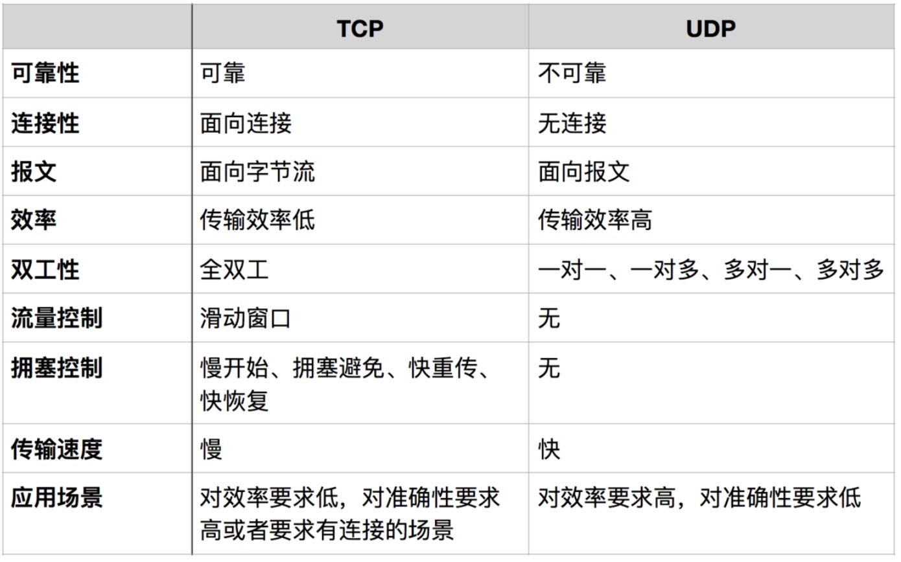

# awsome-knowledge-front-end
## 目录
- [awsome-knowledge-front-end](#awsome-knowledge-front-end)
  - [目录](#目录)
  - [题目](#题目)
    - [计算机网络](#计算机网络)
        - [from memory cache 和 from disk cache的区别](#from-memory-cache-和-from-disk-cache的区别)
        - [强缓存和协商缓存](#强缓存和协商缓存)
        - [题目：ETag是这个字符串是怎么生成的？（有赞）](#题目etag是这个字符串是怎么生成的有赞)
        - [题目：你记得的所有的排序，他们的原理是什么？](#题目你记得的所有的排序他们的原理是什么)
        - [题目：软件版本号规范与命名原则（海康）](#题目软件版本号规范与命名原则海康)
        - [题目：关于http请求，下面说法不正确的是(大搜车)](#题目关于http请求下面说法不正确的是大搜车)
        - [题目：Cookie和Session的区别及使用（海康）](#题目cookie和session的区别及使用海康)
        - [题目:有几种方式可以实现存储功能，分别有什么优缺点？什么是 Service Worker？（海康）](#题目有几种方式可以实现存储功能分别有什么优缺点什么是-service-worker海康)
        - [题目：插入几万个 DOM，如何实现页面不卡顿？](#题目插入几万个-dom如何实现页面不卡顿)
        - [题目：重绘（Repaint）和回流（Reflow）](#题目重绘repaint和回流reflow)
        - [题目：什么是 XSS 攻击？如何防范 XSS 攻击？什么是 CSP？](#题目什么是-xss-攻击如何防范-xss-攻击什么是-csp)
        - [题目：什么是 CSRF 攻击？如何防范 CSRF 攻击？（字节跳动）](#题目什么是-csrf-攻击如何防范-csrf-攻击字节跳动)
        - [题目：什么是点击劫持？如何防范点击劫持？](#题目什么是点击劫持如何防范点击劫持)
        - [题目：什么是中间人攻击？如何防范中间人攻击？](#题目什么是中间人攻击如何防范中间人攻击)
        - [题目：关于缓存下面说法不正确的是(大搜车)](#题目关于缓存下面说法不正确的是大搜车)
        - [题目：关于跨端开发下面说法不正确的是(大搜车)](#题目关于跨端开发下面说法不正确的是大搜车)
        - [题目：web存储方式(大搜车)](#题目web存储方式大搜车)
        - [题目：获取浏览器的ua(大搜车)](#题目获取浏览器的ua大搜车)
        - [题目：HTTP/2(字节跳动)](#题目http2字节跳动)
        - [二进制传输](#二进制传输)
        - [多路复用](#多路复用)
        - [Header 压缩](#header-压缩)
        - [服务端 Push](#服务端-push)
        - [题目：HTTP/3(个推一面)](#题目http3个推一面)
        - [QUIC](#quic)
          - [多路复用](#多路复用-1)
          - [0-RTT](#0-rtt)
          - [纠错机制](#纠错机制)
        - [题目： HTTP/2和HTTP/3的区别（个推一面）](#题目-http2和http3的区别个推一面)
        - [题目： V8 内存回收机制(字节跳动)](#题目-v8-内存回收机制字节跳动)
        - [题目： https的加密方式（个推一面）](#题目-https的加密方式个推一面)
  - [1.  ####](#1--)
  - [34. ####](#34-)
  - [34. ####](#34--1)
  - [34. ####](#34--2)
  - [34. ####](#34--3)
  - [34. ####](#34--4)
## 题目

### 计算机网络

1. #### <div id="url"></div>从输入URL到看到页面发生的全过程越详细越好(有赞/快手)
1. 首先浏览器主进程接管，开了一个下载线程
2. 然后进行HTTP请求（DNS查询、IP寻址等等），中间会有三次握手，等待响应，开始下载响应报文
3. 将下载完的内容转交给Renderer进程管理
4. Renderer进程开始解析css rule tree和dom tree，这两个过程是并行的，所以一般我会把link标签放在页面顶部
5. 解析绘制过程中，当浏览器遇到link标签或者script、img等标签，浏览器会去下载这些内容，遇到有缓存的使用缓存，不适用缓存的重新下载资源
6. css rule tree和dom tree生成完了之后，开始合成render tree，这个时候浏览器会进行layout，开始计算每一个节点的位置，然后进行绘制
7. 绘制结束后，关闭TCP连接，过程有四次挥手

---

[[↑] 回到顶部](#awsome-knowledge-front-end)

2.  #### <div id="cache"></div>浏览器的缓存机制（有赞/字节跳动/快手）

[实践这一次,彻底搞懂浏览器缓存机制](https://juejin.cn/post/6844903764566999054)
这篇文章非常详细


##### from memory cache 和 from disk cache的区别
- 相同点
只能存储一些派生类资源文件

只能存储一些派生类资源文件

- 不同点
退出进程时数据会被清除

退出进程时数据不会被清除

- 存储资源
一般脚本、字体、图片会存在内存当中

一般非脚本会存在磁盘当中，如css等


因为CSS文件加载一次就可渲染出来,我们不会频繁读取它,所以它不适合缓存到内存中,但是js之类的脚本却随时可能会执行,如果脚本在磁盘当中,我们在执行脚本的时候需要从磁盘取到内存中来,这样IO开销就很大，浏览器会失去相应。

##### 强缓存和协商缓存

浏览器缓存机制有两种：一种为强缓存，一种为协商缓存。

对于强缓存，浏览器在第一次请求的时候，会直接下载资源，然后缓存在本地，第二次请求的时候，直接使用缓存。

对于协商缓存，第一次请求缓存且保存缓存标识与时间，重复请求向服务器发送缓存标识和最后缓存时间，服务端进行校验，如果失效则使用缓存。

- 强缓存方案
`Exprires`：服务端的响应头，第一次请求的时候，告诉客户端，该资源什么时候会过期。`Exprires` 的缺陷是必须保证服务端时间和客户端时间严格同步。

`Cache-control`：`max-age`，表示该资源多少时间后过期，解决了客户端和服务端时间必须同步的问题，
- 协商缓存方案
`If-None-Match/ETag`：缓存标识，对比缓存时使用它来标识一个缓存，第一次请求的时候，服务端会返回该标识给客户端，客户端在第二次请求的时候会带上该标识与服务端进行对比并返回`If-None-Match` 标识是否表示匹配。

`Last-modified/If-Modified-Since`：第一次请求的时候服务端返回 `Last-modified` 表明请求的资源上次的修改时间，第二次请求的时候客户端带上请求头 `If-Modified-Since`，表示资源上次的修改时间，服务端拿到这两个字段进行对比。

> 总结
>> 当浏览器再次访问一个已经访问过的资源时，它会这样做：
>> 1.看看是否命中强缓存，如果命中，就直接使用缓存了。
>> 2.如果没有命中强缓存，就发请求到服务器检查是否命中协商缓存。
>> 3.如果命中协商缓存，服务器会返回 304 告诉浏览器使用本地缓存。
>> 4.否则，返回最新的资源。


---

[[↑] 回到顶部](#awsome-knowledge-front-end)

1.  #### ETag是这个字符串是怎么生成的
##### 题目：ETag是这个字符串是怎么生成的？（有赞）
<details><summary><b>答案</b></summary>
通常，使用内容的散列，最后修改时间戳的哈希值，或简单地使用版本号。

</details>

---

[[↑] 回到顶部](#awsome-knowledge-front-end)

4.  #### 描述二叉树的几种遍历方式
<details><summary><b>答案</b></summary>
先序遍历：若二叉树非空，访问根结点，遍历左子树，遍历右子树。

中序遍历：若二叉树非空，遍历左子树；访问根结点；遍历右子树。

后序遍历：若二叉树非空，遍历左子树；遍历右子树；访问根结点。

所有遍历是以递归的形似，直到没有子节点。
</details>

---

[[↑] 回到顶部](#awsome-knowledge-front-end)

5.  #### 你记得的所有的排序他们的原理是什么
##### 题目：你记得的所有的排序，他们的原理是什么？
<details><summary><b>答案</b></summary>
冒泡排序：双层遍历，对比前后两个节点，如果满足条件，位置互换，直到遍历结束。
快速排序：去数组中间的那一个数，然后遍历所有数，小于该数的push到一个数组，大于该数的push到另外一个数组，然后递归去排序这两个数组，最后将所有结果连接起来。
选择排序：声明一个数组，每次去输入数组里面找数组中的最大值或者最小值，取出来后push到声明的数组中，直到输入数组为空。

</details>

---

[[↑] 回到顶部](#awsome-knowledge-front-end)

6.  #### 性能优化的方案
<details><summary><b>答案</b></summary>
首先，减少HTTP请求次数，比如说合并CSS和JS文件，但是也不要完全的合并在同一个文件里面，一个域名分散三四个资源，这样方便浏览器去并行下载，当然浏览器对每个域名的并行下载个数有限制，一个域名分配三四个资源虽然增加了HTTP请求数量，但是对比并行下载来说，性价比更高。

</details>

---

7.  #### CDN的原理
<details><summary><b>答案</b></summary>
首先，浏览器会先请求CDN域名，CDN域名服务器会给浏览器返回指定域名的CNAME，浏览器在对这些CNAME进行解析，得到CDN缓存服务器的IP地址，浏览器在去请求缓存服务器，CDN缓存服务器根据内部专用的DNS解析得到实际IP，然后缓存服务器会向实际IP地址请求资源，缓存服务器得到资源后进行本地保存和返回给浏览器客户端。

</details>

---

[[↑] 回到顶部](#awsome-knowledge-front-end)

8. #### 三次握手四次挥手（有赞）

[​TCP的三次握手和四次挥手](https://zhuanlan.zhihu.com/p/58603455)

[以女朋友为例讲解 TCP/IP 三次握手与四次挥手](https://zhuanlan.zhihu.com/p/35768805)

---

[[↑] 回到顶部](#awsome-knowledge-front-end)

9. #### 软件版本号规范与命名原则
##### 题目：软件版本号规范与命名原则（海康）
<details><summary><b>答案</b></summary>
1. 软件版本阶段说明

* Alpha版: 此版本表示该软件在此阶段主要是以实现软件功能为主，通常只在软件开发者内部交流，一般而言，该版本软件的Bug较多，需要继续修改。
* Beta版: 该版本相对于α版已有了很大的改进，消除了严重的错误，但还是存在着一些缺陷，需要经过多次测试来进一步消除，此版本主要的修改对像是软件的UI。
* RC版: 该版本已经相当成熟了，基本上不存在导致错误的BUG，与即将发行的正式版相差无几。
* Release版: 该版本意味“最终版本”，在前面版本的一系列测试版之后，终归会有一个正式版本，是最终交付用户使用的一个版本。该版本有时也称为标准版。一般情况下，Release不会以单词形式出现在软件封面上，取而代之的是符号(R)。

2. 版本命名规范

软件版本号由四部分组成：

第一个1为主版本号

第二个1为子版本号

第三个1为阶段版本号

第四部分为日期版本号加希腊字母版本号

希腊字母版本号共有5种，分别为：base、alpha、beta、RC、release。例如：1.1.1.051021_beta

常规：完全的版本号定义，分三项：：<主版本号>.<次版本号>.<修订版本号>，如 1.0.0

3. 版本号定修改规则

* 主版本号(1)：当功能模块有较大的变动，比如增加多个模块或者整体架构发生变化。此版本号由项目决定是否修改。
* 子版本号(1)：当功能有一定的增加或变化，比如增加了对权限控制、增加自定义视图等功能。此版本号由项目决定是否修改。
* 阶段版本号(1)：一般是 Bug 修复或是一些小的变动，要经常发布修订版，时间间隔不限，修复一个严重的bug即可发布一个修订版。此版本号由项目经理决定是否修改。
* 日期版本号(051021):用于记录修改项目的当前日期，每天对项目的修改都需要更改日期版本号。此版本号由开发人员决定是否修改。
* 希腊字母版本号(beta):此版本号用于标注当前版本的软件处于哪个开发阶段，当软件进入到另一个阶段时需要修改此版本号。此版本号由项目决定是否修改。

4. 文件命名规范

文件名称由四部分组成：第一部分为项目名称，第二部分为文件的描述，第三部分为当前软件的版本号，第四部分为文件阶段标识加文件后缀，例如：项目外 包平台测试报告1.1.1.051021_beta_b.xls，此文件为项目外包平台的测试报告文档，版本号为：1.1.1.051021_beta。

如果是同一版本同一阶段的文件修改过两次以上，则在阶段标识后面加以数字标识，每次修改数字加1，项目外包平台测试报告1.1.1.051021_beta_b1.xls。

当有多人同时提交同一份文件时，可以在阶段标识的后面加入人名或缩写来区别，例如：项目外包平台测试报告 1.1.1.051021_beta_b_LiuQi.xls。当此文件再次提交时也可以在人名或人名缩写的后面加入序号来区别，例如：项目外包平台测试 报告1.1.1.051021_beta_b_LiuQi2.xls。

5. 版本号的阶段标识

软件的每个版本中包括11个阶段，详细阶段描述如下：

阶段名称                            阶段标识
需求控制                               a
设计阶段                               b
编码阶段                               c
单元测试                               d
单元测试修改                       e
集成测试                               f
集成测试修改                       g
系统测试                               h
系统测试修改                       i
验收测试                               j
验收测试修改                       k

https://www.cnblogs.com/scottx/p/5463447.html
</details>

---

[[↑] 回到顶部](#awsome-knowledge-front-end)

10. #### 关于http请求下面说法不正确的是
##### 题目：关于http请求，下面说法不正确的是(大搜车)
<details><summary><b>答案</b></summary>

  A. get请求在客户端中能够被缓存
  B. 302状态码表示moved permanently
</details>

---

[[↑] 回到顶部](#awsome-knowledge-front-end)

11. #### Cookie和Session的区别及使用
##### 题目：Cookie和Session的区别及使用（海康）
<details><summary><b>答案</b></summary>
前言
HTTP是一种无状态的协议，为了分辨链接是谁发起的，需自己去解决这个问题。不然有些情况下即使是同一个网站每打开一个页面也都要登录一下。而Session和Cookie就是为解决这个问题而提出来的两个机制。
应用场景
登录网站，今输入用户名密码登录了，第二天再打开很多情况下就直接打开了。这个时候用到的一个机制就是cookie。
session一个场景是购物车，添加了商品之后客户端处可以知道添加了哪些商品，而服务器端如何判别呢，所以也需要存储一些信息就用到了session。
1.Cookie
通俗讲，是访问某些网站后在本地存储的一些网站相关信息，下次访问时减少一些步骤。更准确的说法是：Cookies是服务器在本地机器上存储的小段文本并随每一个请求发送至同一服务器，是在客户端保持状态的方案。
Cookie的主要内容包括：名字，值，过期时间，路径和域。使用Fiddler抓包就可以看见，比方说我们打开百度的某个网站可以看到Headers包括Cookie，如下：

BIDUPSID: 9D2194F1CB8D1E56272947F6B0E5D47E
PSTM: 1472480791
BAIDUID: 3C64D3C3F1753134D13C33AFD2B38367:FG
ispeed_lsm: 2
MCITY: -131:
pgv_pvi: 3797581824
pgv_si: s9468756992
BDUSS: JhNXVoQmhPYTVENEdIUnQ5S05xcHZMMVY5QzFRNVh5SzZoV0xMVDR6RzV-bEJZSVFBQUFBJCQAAAAAAAAAAAEAAACteXsbYnRfY2hpbGQAAAAAAAAAAAAAAAAAAAAAAAAAAAAAAAAAAAAAAAAAAAAAAAAAAAAAAAAAAAAAAAAAAAAAAAAAALlxKVi5cSlYZj
BD_HOME: 1
H_PS_PSSID: 1423_21080_17001_21454_21408_21530_21377_21525_21193_21340
BD_UPN: 123253
sug: 3
sugstore: 0
ORIGIN: 0
bdime: 0

key, value形式。过期时间可设置的，如不设，则浏览器关掉就消失了，存储在内存当中，否则就按设置的时间来存储在硬盘上的，过期后自动清除，比方说开关机关闭再打开浏览器后他都会还存在，前者称之为Session cookie 又叫 transient cookie，后者称之为Persistent cookie 又叫 permenent cookie。路径和域就是对应的域名，a网站的cookie自然不能给b用。
2.Session
存在服务器的一种用来存放用户数据的类HashTable结构。
浏览器第一次发送请求时，服务器自动生成了一HashTable和一Session ID来唯一标识这个HashTable，并将其通过响应发送到浏览器。浏览器第二次发送请求会将前一次服务器响应中的Session ID放在请求中一并发送到服务器上，服务器从请求中提取出Session ID，并和保存的所有Session ID进行对比，找到这个用户对应的HashTable。
一般这个值会有个时间限制，超时后毁掉这个值，默认30分钟。
当用户在应用程序的 Web页间跳转时，存储在 Session 对象中的变量不会丢失而是在整个用户会话中一直存在下去。
Session的实现方式和Cookie有一定关系。建立一个连接就生成一个session id，打开几个页面就好几个了，这里就用到了Cookie，把session id存在Cookie中，每次访问的时候将Session id带过去就可以识别了.
区别
存储数据量方面：session 能够存储任意的 java 对象，cookie 只能存储 String 类型的对象
一个在客户端一个在服务端。因Cookie在客户端所以可以编辑伪造，不是十分安全。
Session过多时会消耗服务器资源，大型网站会有专门Session服务器，Cookie存在客户端没问题。
域的支持范围不一样，比方说a.com的Cookie在a.com下都能用，而www.a.com的Session在api.a.com下都不能用，解决这个问题的办法是JSONP或者跨域资源共享。
session多服务器间共享
服务器实现的 session 复制或 session 共享，如 webSphere或 JBOSS 在搭集群时配置实现 session 复制或 session 共享.致命缺点:不好扩展和移植。
利用成熟技术做session复制，如12306使用的gemfire，如常见内存数据库redis或memorycache，虽较普适但依赖第三方.
将 session维护在客户端，利用 cookie，但客户端存在风险数据不安全，且可以存放的数据量较小，所以将session 维护在客户端还要对 session 中的信息加密。
第二种方案和第三种方案的合体，可用gemfire实现 session 复制共享，还可将session 维护在 redis中实现 session 共享，同时可将 session 维护在客户端的cookie 中，但前提是数据要加密。
这三种方式可迅速切换，而不影响应用正常执行。在实践中，首选 gemfire 或者 redis 作为 session 共享的载体，一旦 session 不稳定出现问题的时候，可以紧急切换 cookie 维护 session 作为备用，不影响应用提供服务

单点登录中，cookie 被禁用了怎么办？（一点登陆，子网站其他系统不用再登陆）
单点登录的原理是后端生成一个 session ID，设置到 cookie，后面所有请求浏览器都会带上cookie，然后服务端从cookie获取 session ID，查询到用户信息。
所以，保持登录的关键不是cookie，而是通过cookie 保存和传输的 session ID，本质是能获取用户信息的数据。
除了cookie，还常用 HTTP 请求头来传输。但这个请求头浏览器不会像cookie一样自动携带，需手工处理
————————————————
版权声明：本文为CSDN博主「成功人士从不写博客」的原创文章，遵循 CC 4.0 BY-SA 版权协议，转载请附上原文出处链接及本声明。
原文链接：https://blog.csdn.net/liyifan687/article/details/80077928
</details>

---

[[↑] 回到顶部](#awsome-knowledge-front-end)

12. #### 有几种方式可以实现存储功能分别有什么优缺点什么是ServiceWorker
##### 题目:有几种方式可以实现存储功能，分别有什么优缺点？什么是 Service Worker？（海康）
<details><summary><b>答案</b></summary>
cookie，localStorage，sessionStorage，indexDB
我们先来通过表格学习下这几种存储方式的区别

特性	cookie	localStorage	sessionStorage	indexDB
数据生命周期	一般由服务器生成，可以设置过期时间	除非被清理，否则一直存在	页面关闭就清理	除非被清理，否则一直存在
数据存储大小	4K	5M	5M	无限
与服务端通信	每次都会携带在 header 中，对于请求性能影响	不参与	不参与	不参与
从上表可以看到，cookie 已经不建议用于存储。如果没有大量数据存储需求的话，可以使用 localStorage 和 sessionStorage 。对于不怎么改变的数据尽量使用 localStorage 存储，否则可以用 sessionStorage 存储。

对于 cookie 来说，我们还需要注意安全性。

属性	作用
value	如果用于保存用户登录态，应该将该值加密，不能使用明文的用户标识
http-only	不能通过 JS 访问 Cookie，减少 XSS 攻击
secure	只能在协议为 HTTPS 的请求中携带
same-site	规定浏览器不能在跨域请求中携带 Cookie，减少 CSRF 攻击
Service Worker
Service Worker 是运行在浏览器背后的独立线程，一般可以用来实现缓存功能。使用 Service Worker的话，传输协议必须为 HTTPS。因为 Service Worker 中涉及到请求拦截，所以必须使用 HTTPS 协议来保障安全。

Service Worker 实现缓存功能一般分为三个步骤：首先需要先注册 Service Worker，然后监听到 install 事件以后就可以缓存需要的文件，那么在下次用户访问的时候就可以通过拦截请求的方式查询是否存在缓存，存在缓存的话就可以直接读取缓存文件，否则就去请求数据。以下是这个步骤的实现：

// index.js
if (navigator.serviceWorker) {
  navigator.serviceWorker
    .register('sw.js')
    .then(function(registration) {
      console.log('service worker 注册成功')
    })
    .catch(function(err) {
      console.log('servcie worker 注册失败')
    })
}
// sw.js
// 监听 `install` 事件，回调中缓存所需文件
self.addEventListener('install', e => {
  e.waitUntil(
    caches.open('my-cache').then(function(cache) {
      return cache.addAll(['./index.html', './index.js'])
    })
  )
})

// 拦截所有请求事件
// 如果缓存中已经有请求的数据就直接用缓存，否则去请求数据
self.addEventListener('fetch', e => {
  e.respondWith(
    caches.match(e.request).then(function(response) {
      if (response) {
        return response
      }
      console.log('fetch source')
    })
  )
})
打开页面，可以在开发者工具中的 Application 看到 Service Worker 已经启动了


在 Cache 中也可以发现我们所需的文件已被缓存


当我们重新刷新页面可以发现我们缓存的数据是从 Service Worker 中读取的


</details>

---

[[↑] 回到顶部](#awsome-knowledge-front-end)

1.  #### 插入几万个DOM如何实现页面不卡顿
##### 题目：插入几万个 DOM，如何实现页面不卡顿？
<details><summary><b>答案</b></summary>
对于这道题目来说，首先我们肯定不能一次性把几万个 DOM 全部插入，这样肯定会造成卡顿，所以解决问题的重点应该是如何分批次部分渲染 DOM。大部分人应该可以想到通过 requestAnimationFrame 的方式去循环的插入 DOM，其实还有种方式去解决这个问题：虚拟滚动（virtualized scroller）。

这种技术的原理就是只渲染可视区域内的内容，非可见区域的那就完全不渲染了，当用户在滚动的时候就实时去替换渲染的内容。
</details>

---

[[↑] 回到顶部](#awsome-knowledge-front-end)

16. #### 什么情况阻塞渲染

<details><summary><b>答案</b></summary>
首先渲染的前提是生成渲染树，所以 HTML 和 CSS 肯定会阻塞渲染。如果你想渲染的越快，你越应该降低一开始需要渲染的文件大小，并且扁平层级，优化选择器。

然后当浏览器在解析到 script 标签时，会暂停构建 DOM，完成后才会从暂停的地方重新开始。也就是说，如果你想首屏渲染的越快，就越不应该在首屏就加载 JS 文件，这也是都建议将 script 标签放在 body 标签底部的原因。

当然在当下，并不是说 script 标签必须放在底部，因为你可以给 script 标签添加 defer 或者 async 属性。

当 script 标签加上 defer 属性以后，表示该 JS 文件会并行下载，但是会放到 HTML 解析完成后顺序执行，所以对于这种情况你可以把 script 标签放在任意位置。

对于没有任何依赖的 JS 文件可以加上 async 属性，表示 JS 文件下载和解析不会阻塞渲染。
</details>

---

[[↑] 回到顶部](#awsome-knowledge-front-end)

17. #### 重绘Repaint和回流Reflow
##### 题目：重绘（Repaint）和回流（Reflow）
<details><summary><b>答案</b></summary>
重绘和回流会在我们设置节点样式时频繁出现，同时也会很大程度上影响性能。

重绘是当节点需要更改外观而不会影响布局的，比如改变 color 就叫称为重绘
回流是布局或者几何属性需要改变就称为回流。
回流必定会发生重绘，重绘不一定会引发回流。回流所需的成本比重绘高的多，改变父节点里的子节点很可能会导致父节点的一系列回流。

以下几个动作可能会导致性能问题：

改变 window 大小
改变字体
添加或删除样式
文字改变
定位或者浮动
盒模型
并且很多人不知道的是，重绘和回流其实也和 Eventloop 有关。

当 Eventloop 执行完 Microtasks 后，会判断 document 是否需要更新，因为浏览器是 60Hz 的刷新率，每 16.6ms 才会更新一次。
然后判断是否有 resize 或者 scroll 事件，有的话会去触发事件，所以 resize 和 scroll 事件也是至少 16ms 才会触发一次，并且自带节流功能。
判断是否触发了 media query
更新动画并且发送事件
判断是否有全屏操作事件
执行 requestAnimationFrame 回调
执行 IntersectionObserver 回调，该方法用于判断元素是否可见，可以用于懒加载上，但是兼容性不好
更新界面
以上就是一帧中可能会做的事情。如果在一帧中有空闲时间，就会去执行 requestIdleCallback 回调。
以上内容来自于 HTML 文档。

既然我们已经知道了重绘和回流会影响性能，那么接下来我们将会来学习如何减少重绘和回流的次数。

减少重绘和回流
使用 transform 替代 top
```html
<div class="test"></div>
<style>
  .test {
    position: absolute;
    top: 10px;
    width: 100px;
    height: 100px;
    background: red;
  }
</style>
<script>
  setTimeout(() => {
    // 引起回流
    document.querySelector('.test').style.top = '100px'
  }, 1000)
</script>
```
使用 visibility 替换 display: none ，因为前者只会引起重绘，后者会引发回流（改变了布局）

不要把节点的属性值放在一个循环里当成循环里的变量

for(let i = 0; i < 1000; i++) {
    // 获取 offsetTop 会导致回流，因为需要去获取正确的值
    console.log(document.querySelector('.test').style.offsetTop)
}
不要使用 table 布局，可能很小的一个小改动会造成整个 table 的重新布局

动画实现的速度的选择，动画速度越快，回流次数越多，也可以选择使用 requestAnimationFrame

CSS 选择符从右往左匹配查找，避免节点层级过多

将频繁重绘或者回流的节点设置为图层，图层能够阻止该节点的渲染行为影响别的节点。比如对于 video 标签来说，浏览器会自动将该节点变为图层。


设置节点为图层的方式有很多，我们可以通过以下几个常用属性可以生成新图层

will-change
video、iframe 标签
</details>

---

[[↑] 回到顶部](#awsome-knowledge-front-end)

18. #### 什么是XSS攻击如何防范XSS攻击什么是CSP
##### 题目：什么是 XSS 攻击？如何防范 XSS 攻击？什么是 CSP？
<details><summary><b>答案</b></summary>
XSS 简单点来说，就是攻击者想尽一切办法将可以执行的代码注入到网页中。

XSS 可以分为多种类型，但是总体上我认为分为两类：持久型和非持久型。

持久型也就是攻击的代码被服务端写入进数据库中，这种攻击危害性很大，因为如果网站访问量很大的话，就会导致大量正常访问页面的用户都受到攻击。

举个例子，对于评论功能来说，就得防范持久型 XSS 攻击，因为我可以在评论中输入以下内容


这种情况如果前后端没有做好防御的话，这段评论就会被存储到数据库中，这样每个打开该页面的用户都会被攻击到。

非持久型相比于前者危害就小的多了，一般通过修改 URL 参数的方式加入攻击代码，诱导用户访问链接从而进行攻击。

举个例子，如果页面需要从 URL 中获取某些参数作为内容的话，不经过过滤就会导致攻击代码被执行

<!-- http://www.domain.com?name=<script>alert(1)</script> -->
```html
<div>{{name}}</div>                                                  
```
但是对于这种攻击方式来说，如果用户使用 Chrome 这类浏览器的话，浏览器就能自动帮助用户防御攻击。但是我们不能因此就不防御此类攻击了，因为我不能确保用户都使用了该类浏览器。


对于 XSS 攻击来说，通常有两种方式可以用来防御。

转义字符
首先，对于用户的输入应该是永远不信任的。最普遍的做法就是转义输入输出的内容，对于引号、尖括号、斜杠进行转义
```js
function escape(str) {
  str = str.replace(/&/g, '&amp;')
  str = str.replace(/</g, '&lt;')
  str = str.replace(/>/g, '&gt;')
  str = str.replace(/"/g, '&quto;')
  str = str.replace(/'/g, '&#39;')
  str = str.replace(/`/g, '&#96;')
  str = str.replace(/\//g, '&#x2F;')
  return str
}
```
通过转义可以将攻击代码 
```js
<script>alert(1)</script>
```
变成
```js
// -> &lt;script&gt;alert(1)&lt;&#x2F;script&gt;
escape('<script>alert(1)</script>')
```
但是对于显示富文本来说，显然不能通过上面的办法来转义所有字符，因为这样会把需要的格式也过滤掉。对于这种情况，通常采用白名单过滤的办法，当然也可以通过黑名单过滤，但是考虑到需要过滤的标签和标签属性实在太多，更加推荐使用白名单的方式。
```js
const xss = require('xss')
let html = xss('<h1 id="title">XSS Demo</h1><script>alert("xss");</script>')
// -> <h1>XSS Demo</h1>&lt;script&gt;alert("xss");&lt;/script&gt;
console.log(html)
```
以上示例使用了 js-xss 来实现，可以看到在输出中保留了 h1 标签且过滤了 script 标签。

CSP
CSP 本质上就是建立白名单，开发者明确告诉浏览器哪些外部资源可以加载和执行。我们只需要配置规则，如何拦截是由浏览器自己实现的。我们可以通过这种方式来尽量减少 XSS 攻击。

通常可以通过两种方式来开启 CSP：

设置 HTTP Header 中的 Content-Security-Policy
设置 meta 标签的方式 <meta http-equiv="Content-Security-Policy">
这里以设置 HTTP Header 来举例

只允许加载本站资源

Content-Security-Policy: default-src ‘self’
只允许加载 HTTPS 协议图片

Content-Security-Policy: img-src https://*
允许加载任何来源框架

Content-Security-Policy: child-src 'none'
当然可以设置的属性远不止这些，你可以通过查阅 文档 的方式来学习，这里就不过多赘述其他的属性了。

对于这种方式来说，只要开发者配置了正确的规则，那么即使网站存在漏洞，攻击者也不能执行它的攻击代码，并且 CSP 的兼容性也不错。
</details>

---

[[↑] 回到顶部](#awsome-knowledge-front-end)

19. #### 什么是CSRF攻击如何防范CSRF攻击
##### 题目：什么是 CSRF 攻击？如何防范 CSRF 攻击？（字节跳动）
<details><summary><b>答案</b></summary>
CSRF 中文名为跨站请求伪造。原理就是攻击者构造出一个后端请求地址，诱导用户点击或者通过某些途径自动发起请求。如果用户是在登录状态下的话，后端就以为是用户在操作，从而进行相应的逻辑。

举个例子，假设网站中有一个通过 GET 请求提交用户评论的接口，那么攻击者就可以在钓鱼网站中加入一个图片，图片的地址就是评论接口
```html

```
那么你是否会想到使用 POST 方式提交请求是不是就没有这个问题了呢？其实并不是，使用这种方式也不是百分百安全的，攻击者同样可以诱导用户进入某个页面，在页面中通过表单提交 POST 请求。

如何防御
防范 CSRF 攻击可以遵循以下几种规则：

Get 请求不对数据进行修改
不让第三方网站访问到用户 Cookie
阻止第三方网站请求接口
请求时附带验证信息，比如验证码或者 Token
SameSite
可以对 Cookie 设置 SameSite 属性。该属性表示 Cookie 不随着跨域请求发送，可以很大程度减少 CSRF 的攻击，但是该属性目前并不是所有浏览器都兼容。

验证 Referer
对于需要防范 CSRF 的请求，我们可以通过验证 Referer 来判断该请求是否为第三方网站发起的。

Token
服务器下发一个随机 Token，每次发起请求时将 Token 携带上，服务器验证 Token 是否有效。
</details>

---

[[↑] 回到顶部](#awsome-knowledge-front-end)

20. #### 什么是点击劫持如何防范点击劫持
##### 题目：什么是点击劫持？如何防范点击劫持？
<details><summary><b>答案</b></summary>
点击劫持是一种视觉欺骗的攻击手段。攻击者将需要攻击的网站通过 iframe 嵌套的方式嵌入自己的网页中，并将 iframe 设置为透明，在页面中透出一个按钮诱导用户点击。

对于这种攻击方式，推荐防御的方法有两种。

X-FRAME-OPTIONS
X-FRAME-OPTIONS 是一个 HTTP 响应头，在现代浏览器有一个很好的支持。这个 HTTP 响应头 就是为了防御用 iframe 嵌套的点击劫持攻击。

该响应头有三个值可选，分别是

DENY，表示页面不允许通过 iframe 的方式展示
SAMEORIGIN，表示页面可以在相同域名下通过 iframe 的方式展示
ALLOW-FROM，表示页面可以在指定来源的 iframe 中展示
JS 防御
对于某些远古浏览器来说，并不能支持上面的这种方式，那我们只有通过 JS 的方式来防御点击劫持了。
```html
<head>
  <style id="click-jack">
    html {
      display: none !important;
    }
  </style>
</head>
<body>
  <script>
    if (self == top) {
      var style = document.getElementById('click-jack')
      document.body.removeChild(style)
    } else {
      top.location = self.location
    }
  </script>
</body>
```
以上代码的作用就是当通过 iframe 的方式加载页面时，攻击者的网页直接不显示所有内容了。
</details>

---

[[↑] 回到顶部](#awsome-knowledge-front-end)

21. #### 什么是中间人攻击如何防范中间人攻击
##### 题目：什么是中间人攻击？如何防范中间人攻击？
<details><summary><b>答案</b></summary>
中间人攻击是攻击方同时与服务端和客户端建立起了连接，并让对方认为连接是安全的，但是实际上整个通信过程都被攻击者控制了。攻击者不仅能获得双方的通信信息，还能修改通信信息。

通常来说不建议使用公共的 Wi-Fi，因为很可能就会发生中间人攻击的情况。如果你在通信的过程中涉及到了某些敏感信息，就完全暴露给攻击方了。

当然防御中间人攻击其实并不难，只需要增加一个安全通道来传输信息。HTTPS 就可以用来防御中间人攻击，但是并不是说使用了 HTTPS 就可以高枕无忧了，因为如果你没有完全关闭 HTTP 访问的话，攻击方可以通过某些方式将 HTTPS 降级为 HTTP 从而实现中间人攻击。
</details>

---

[[↑] 回到顶部](#awsome-knowledge-front-end)

22. #### 关于缓存下面说法不正确的是
##### 题目：关于缓存下面说法不正确的是(大搜车)
A. expires,age,cache-control都是和缓存相关的头
B. 
<details><summary><b>答案</b></summary>

</details>

---

[[↑] 回到顶部](#awsome-knowledge-front-end)

23. #### 浏览器接收到HTML文件并转换为DOM树的步骤

<details><summary><b>答案</b></summary>
当我们打开一个网页时，浏览器都会去请求对应的 HTML 文件。虽然平时我们写代码时都会分为 JS、CSS、HTML 文件，也就是字符串，但是计算机硬件是不理解这些字符串的，所以在网络中传输的内容其实都是 0 和 1 这些字节数据。当浏览器接收到这些字节数据以后，它会将这些字节数据转换为字符串，也就是我们写的代码。


当数据转换为字符串以后，浏览器会先将这些字符串通过词法分析转换为标记（token），这一过程在词法分析中叫做标记化（tokenization）。


那么什么是标记呢？这其实属于编译原理这一块的内容了。简单来说，标记还是字符串，是构成代码的最小单位。这一过程会将代码分拆成一块块，并给这些内容打上标记，便于理解这些最小单位的代码是什么意思。


当结束标记化后，这些标记会紧接着转换为 Node，最后这些 Node 会根据不同 Node 之前的联系构建为一颗 DOM 树。


以上就是浏览器从网络中接收到 HTML 文件然后一系列的转换过程。


当然，在解析 HTML 文件的时候，浏览器还会遇到 CSS 和 JS 文件，这时候浏览器也会去下载并解析这些文件，接下来就让我们先来学习浏览器如何解析 CSS 文件。

将 CSS 文件转换为 CSSOM 树
其实转换 CSS 到 CSSOM 树的过程和上一小节的过程是极其类似的


在这一过程中，浏览器会确定下每一个节点的样式到底是什么，并且这一过程其实是很消耗资源的。因为样式你可以自行设置给某个节点，也可以通过继承获得。在这一过程中，浏览器得递归 CSSOM 树，然后确定具体的元素到底是什么样式。

如果你有点不理解为什么会消耗资源的话，我这里举个例子

```html
<div>
  <a> <span></span> </a>
</div>
<style>
  span {
    color: red;
  }
  div > a > span {
    color: red;
  }
</style>
```

对于第一种设置样式的方式来说，浏览器只需要找到页面中所有的 span 标签然后设置颜色，但是对于第二种设置样式的方式来说，浏览器首先需要找到所有的 span 标签，然后找到 span 标签上的 a 标签，最后再去找到 div 标签，然后给符合这种条件的 span 标签设置颜色，这样的递归过程就很复杂。所以我们应该尽可能的避免写过于具体的 CSS 选择器，然后对于 HTML 来说也尽量少的添加无意义标签，保证层级扁平。

生成渲染树
当我们生成 DOM 树和 CSSOM 树以后，就需要将这两棵树组合为渲染树。


在这一过程中，不是简单的将两者合并就行了。渲染树只会包括需要显示的节点和这些节点的样式信息，如果某个节点是 display: none 的，那么就不会在渲染树中显示。

当浏览器生成渲染树以后，就会根据渲染树来进行布局（也可以叫做回流），然后调用 GPU 绘制，合成图层，显示在屏幕上。对于这一部分的内容因为过于底层，还涉及到了硬件相关的知识，这里就不再继续展开内容了。

那么通过以上内容，我们已经详细了解到了浏览器从接收文件到将内容渲染在屏幕上的这一过程。接下来，我们将会来学习上半部分遗留下来的一些知识点。
</details>

---

[[↑] 回到顶部](#awsome-knowledge-front-end)

24. #### 关于跨端开发下面说法不正确的是
##### 题目：关于跨端开发下面说法不正确的是(大搜车)
<details><summary><b>答案</b></summary>

使用rn或者weex跟使用webview内嵌h5用户体验相差不多
flutter开发的语言是dart
rn跟原生通信，用的是native modules
weex网络请求使用浏览器xxx（不是stream.StreamAPIfetch）的发出

</details>

---

[[↑] 回到顶部](#awsome-knowledge-front-end)

25. #### web存储方式
##### 题目：web存储方式(大搜车)
<details><summary><b>答案</b></summary>

</details>

---

[[↑] 回到顶部](#awsome-knowledge-front-end)


26. #### 获取浏览器的ua
##### 题目：获取浏览器的ua(大搜车)
<details><summary><b>答案</b></summary>

</details>

---

[[↑] 回到顶部](#awsome-knowledge-front-end)

27. #### http2
##### 题目：HTTP/2(字节跳动)
<details><summary><b>答案</b></summary>

HTTP/2 相比于 HTTP/1，可以说是大幅度提高了网页的性能。

在 HTTP/1 中，为了性能考虑，我们会引入雪碧图、将小图内联、使用多个域名等等的方式。这一切都是因为浏览器限制了同一个域名下的请求数量（Chrome 下一般是限制六个连接），当页面中需要请求很多资源的时候，队头阻塞（Head of line blocking）会导致在达到最大请求数量时，剩余的资源需要等待其他资源请求完成后才能发起请求。

在 HTTP/2 中引入了多路复用的技术，这个技术可以只通过一个 TCP 连接就可以传输所有的请求数据。多路复用很好的解决了浏览器限制同一个域名下的请求数量的问题，同时也间接更容易实现全速传输，毕竟新开一个 TCP 连接都需要慢慢提升传输速度。

大家可以通过 [该链接](https://http2.akamai.com/demo) 感受下 HTTP/2 比 HTTP/1 到底快了多少。
在 HTTP/1 中，因为队头阻塞的原因，你会发现发送请求是长这样的

在 HTTP/2 中，因为可以复用同一个 TCP 连接，你会发现发送请求是长这样的

##### 二进制传输
HTTP/2 中所有加强性能的核心点在于此。在之前的 HTTP 版本中，我们是通过文本的方式传输数据。在 HTTP/2 中引入了新的编码机制，所有传输的数据都会被分割，并采用二进制格式编码。

##### 多路复用
在 HTTP/2 中，有两个非常重要的概念，分别是帧（frame）和流（stream）。

帧代表着最小的数据单位，每个帧会标识出该帧属于哪个流，流也就是多个帧组成的数据流。

多路复用，就是在一个 TCP 连接中可以存在多条流。换句话说，也就是可以发送多个请求，对端可以通过帧中的标识知道属于哪个请求。通过这个技术，可以避免 HTTP 旧版本中的队头阻塞问题，极大的提高传输性能。

##### Header 压缩
在 HTTP/1 中，我们使用文本的形式传输 header，在 header 携带 cookie 的情况下，可能每次都需要重复传输几百到几千的字节。

在 HTTP /2 中，使用了 HPACK 压缩格式对传输的 header 进行编码，减少了 header 的大小。并在两端维护了索引表，用于记录出现过的 header ，后面在传输过程中就可以传输已经记录过的 header 的键名，对端收到数据后就可以通过键名找到对应的值。
##### 服务端 Push
在 HTTP/2 中，服务端可以在客户端某个请求后，主动推送其他资源。

可以想象以下情况，某些资源客户端是一定会请求的，这时就可以采取服务端 push 的技术，提前给客户端推送必要的资源，这样就可以相对减少一点延迟时间。当然在浏览器兼容的情况下你也可以使用 prefetch 。


</details>

---

[[↑] 回到顶部](#awsome-knowledge-front-end)

28. #### http3
##### 题目：HTTP/3(个推一面)
<details><summary><b>答案</b></summary>
虽然 HTTP/2 解决了很多之前旧版本的问题，但是它还是存在一个巨大的问题，虽然这个问题并不是它本身造成的，而是底层支撑的 TCP 协议的问题。

因为 HTTP/2 使用了多路复用，一般来说同一域名下只需要使用一个 TCP 连接。当这个连接中出现了丢包的情况，那就会导致 HTTP/2 的表现情况反倒不如 HTTP/1 了。

因为在出现丢包的情况下，整个 TCP 都要开始等待重传，也就导致了后面的所有数据都被阻塞了。但是对于 HTTP/1 来说，可以开启多个 TCP 连接，出现这种情况反到只会影响其中一个连接，剩余的 TCP 连接还可以正常传输数据。

那么可能就会有人考虑到去修改 TCP 协议，其实这已经是一件不可能完成的任务了。因为 TCP 存在的时间实在太长，已经充斥在各种设备中，并且这个协议是由操作系统实现的，更新起来不大现实。

基于这个原因，Google 就更起炉灶搞了一个基于 UDP 协议的 QUIC 协议，并且使用在了 HTTP/3 上，当然 HTTP/3 之前名为 HTTP-over-QUIC，从这个名字中我们也可以发现，HTTP/3 最大的改造就是使用了 QUIC，接下来我们就来学习关于这个协议的内容。
##### QUIC
之前我们学习过 UDP 协议的内容，知道这个协议虽然效率很高，但是并不是那么的可靠。QUIC 虽然基于 UDP，但是在原本的基础上新增了很多功能，比如多路复用、0-RTT、使用 TLS1.3 加密、流量控制、有序交付、重传等等功能。这里我们就挑选几个重要的功能学习下这个协议的内容。
###### 多路复用
虽然 HTTP/2 支持了多路复用，但是 TCP 协议终究是没有这个功能的。QUIC 原生就实现了这个功能，并且传输的单个数据流可以保证有序交付且不会影响其他的数据流，这样的技术就解决了之前 TCP 存在的问题。

并且 QUIC 在移动端的表现也会比 TCP 好。因为 TCP 是基于 IP 和端口去识别连接的，这种方式在多变的移动端网络环境下是很脆弱的。但是 QUIC 是通过 ID 的方式去识别一个连接，不管你网络环境如何变化，只要 ID 不变，就能迅速重连上。
###### 0-RTT
通过使用类似 TCP 快速打开的技术，缓存当前会话的上下文，在下次恢复会话的时候，只需要将之前的缓存传递给服务端验证通过就可以进行传输了。
###### 纠错机制
假如说这次我要发送三个包，那么协议会算出这三个包的异或值并单独发出一个校验包，也就是总共发出了四个包。

当出现其中的非校验包丢包的情况时，可以通过另外三个包计算出丢失的数据包的内容。

当然这种技术只能使用在丢失一个包的情况下，如果出现丢失多个包就不能使用纠错机制了，只能使用重传的方式了。
</details>

---

[[↑] 回到顶部](#awsome-knowledge-front-end)

29. #### http2和http3的区别
##### 题目： HTTP/2和HTTP/3的区别（个推一面）
HTTP/2 通过多路复用、二进制流、Header 压缩等等技术，极大地提高了性能，但是还是存在着问题的
QUIC 基于 UDP 实现，是 HTTP/3 中的底层支撑协议，该协议基于 UDP，又取了 TCP 中的精华，实现了即快又可靠的协议

---

[[↑] 回到顶部](#awsome-knowledge-front-end)

30.  #### V8内存回收机制
##### 题目： V8 内存回收机制(字节跳动)
<details><summary><b>答案</b></summary>
关键词：信道复用，server push
</details>

---

[[↑] 回到顶部](#awsome-knowledge-front-end)

31. #### https的加密方式
##### 题目： https的加密方式（个推一面）

---

[[↑] 回到顶部](#awsome-knowledge-front-end)

32. #### 什么是TCP
​    TCP传输控制协议，是一种面向连接的、可靠的、基于字节流的传输层通信协议。通讯双方建立一次tcp连接，需要经过三次步骤1、客户端发送syn包（syn=j）到服务器，并入SYN_SEND状态，等待服务器确认。2、服务器收入syn包，必须确认客户的SYN（ack=j+1），同时自己也发送一个SYN包（syn=k），既SYN+ACK包，此时服务器进入SYN_RECV状态。3、客户端收到服务器的SYN+ACK包，向服务器发送确认包ACK（ack=k+1），此包发送完毕，客户端和服务器进入ESTABLISHED状态，完成三次握手。（tcp在握手过程中并不携带数据，而是在三次握手完成之后才会进行数据传送）

SYN：synchronous 建立联机

ACK：acknowledgement 确认

SYN_SENT 、


SYN_RECV 服务端被动打开后，接收到了客户端的SYN并且发送了ACK时的状态，再进一步接收到客户端的ACK就进入ESTABISHED状态。

UDP（User Datagram Protocol ）用户数据报协议

UDP是非面向连接协议，使用udp协议通讯并不需要建立连接，它只负责把数据尽可能发送出去，并不可靠，在接收端，UDP把每个消息断放入队列中，接收端程序从队列中读取数据。

TCP/IP是位于传输层上的一种协议，用于在网络中传输数据

---

[[↑] 回到顶部](#awsome-knowledge-front-end)

33. #### 什么是socket？
socket是一组实现TCP/UDP通信的接口API，既无论TCP还是UDP，通过对scoket的编程，都可以实现TCP/UCP通信。（TCP或UDP是一种计算机网络通信中在传输层的一种协议，可以简单的理解成是一种约定，只有履行合同才是实质性的行动，所以无论是TCP还是UDP要产生作用，都需要有实际性的行为去执行才能体现协议的作用。socket就是实现这种作用的方法）socket作为一个通信链的句柄，它包含了网络通信必备的5种信息。1、连接使用的协议。2、本地主机的IP地址。3、本地进程的协议端口。4、远地主机的IP地址。5、远地进程的协议端口。即可知道，socket包含了通信本方和对方的ip和端口以及连接使用的协议（TCP/UDP）。通信双方中的一方（客户端）通过socket对另一方（服务端）发起连接请求，服务端在网络上监听请求，当收到客户端发来的请求之后，根据socket里携带的信息，定位到客户端，就相应请求，把socket描述发给客户端，双方确认之后连接就建立了。

socket连接过程的三个步骤

1、服务器监听：服务器实时监控网络状态等待客户端发来的连接请求

2、客户端请求：客户端根据远程主机服务器的IP地址和协议端口向其发起连接请求

3、连接确认：服务端收到socket的连接请求之后，就响应请求，把服务端socket描述发给客户端，客户端收到后一但确认。则双方建立连接，进行数据交互。

socket连接一旦建立就保持连接状态，而HTTP连接则不一样，它基于tcp协议的短连接，也就是客户端发起请求，服务器响应请求之后，连接就会自动断开，不会一直保持。

---

[[↑] 回到顶部](#awsome-knowledge-front-end)

34. #### <div id="localStorage_timeout"></div>如何实现一个可设置过期时间的 localStorage（快手）

https://www.cnblogs.com/ricolee/p/localstorage-expiretime.html

---

[[↑] 回到顶部](#awsome-knowledge-front-end)


34. #### 300系列的状态码（快手）
- 300 Multiple Choices 被请求的资源有一系列可供选择的回馈信息
- 301 Moved Permanently 被请求的资源已永久移动到新位置，并且将来任何对此资源的引用都应该使用本响应返回的若干个 URI 之一。
- 302 Move Temporarily 请求的资源临时从不同的 URI响应请求。
- 303 See Other 对应当前请求的响应可以在另一个 URL 上被找到
- 304 Not Modified 如果客户端发送了一个带条件的 GET 请求且该请求已被允许，而文档的内容（自上次访问以来或者根据请求的条件）并没有改变，则服务器应当返回这个状态码。
- 305 Use Proxy 被请求的资源必须通过指定的代理才能被访问。
- 306 Switch Proxy 已经不再被使用。
- 307 Temporary Redirect 请求的资源临时从不同的URI 响应请求。


---

[[↑] 回到顶部](#awsome-knowledge-front-end)

1.  #### TCP和UDP的区别（快手）
[面试官：说说UDP和TCP的区别及应用场景码农富哥](https://zhuanlan.zhihu.com/p/108579426)

tcp和udp的区别



tcp和udp对应的上层服务


---

[[↑] 回到顶部](#awsome-knowledge-front-end)


1.  #### service worker怎么理解（快手）
[JS（二十）Service Worker](https://blog.csdn.net/u014744118/article/details/102951794)

service worker要解决的问题是用户丢失网络连接，换句话说使用service worker后，当用户在离线状态也可以获得很好的用户体验。

---

[[↑] 回到顶部](#awsome-knowledge-front-end)


1.  #### localstorage/sessionstorage（快手）
在 Web Storage 本地存储 包括 sessionStorage 会话存储 和 localStorage 本地存储。

cookie 和 session 完全是服务器端可以操作的数据，sessionStorage 和 localStorage 完全是浏览器端操作的数据。

cookie 和 session 完全继承同一个 Storage API, 所以 sessionStorage 和 localStorage 的编程接口是一样的。

sessionStorage 和 locatlStorage 区别在于 数据存在时间范围 和 页面范围。

sessionStorage: 数据只保存到存储它的窗口或标签关闭时，数据在构建它们的窗口或标签内也可见

localStorage: 数据的生命周期比窗口或浏览器的生命周期长，数据可被同源的每个窗口或者标签共享。

---

[[↑] 回到顶部](#awsome-knowledge-front-end)


1.  #### 
---

[[↑] 回到顶部](#awsome-knowledge-front-end)


34. #### 
---

[[↑] 回到顶部](#awsome-knowledge-front-end)


34. #### 
---

[[↑] 回到顶部](#awsome-knowledge-front-end)


34. #### 
---

[[↑] 回到顶部](#awsome-knowledge-front-end)


34. #### 
---

[[↑] 回到顶部](#awsome-knowledge-front-end)


34. #### 
---

[[↑] 回到顶部](#awsome-knowledge-front-end)

