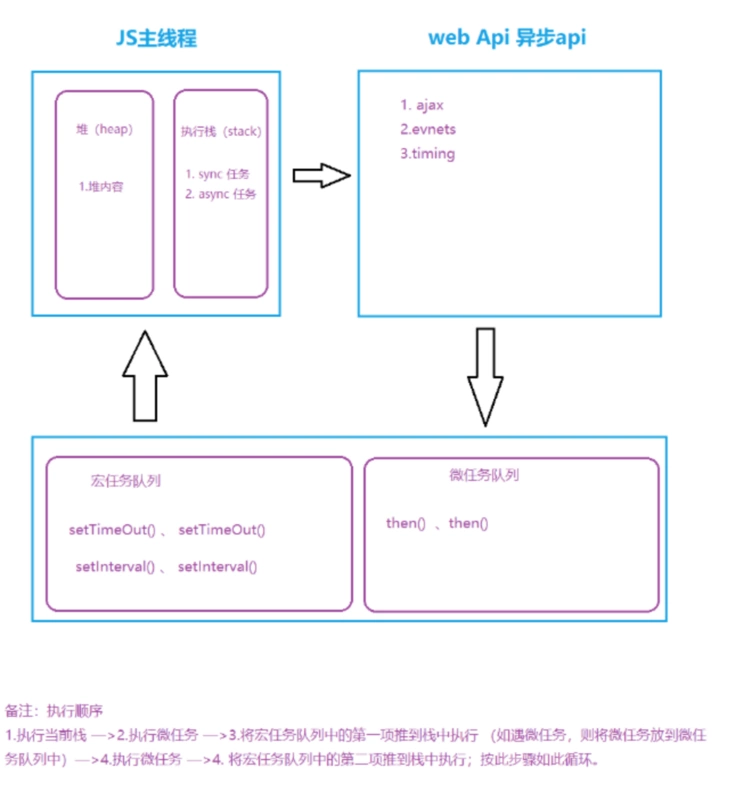
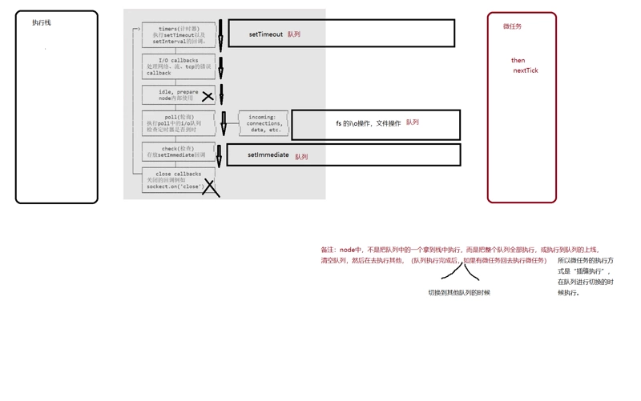

# awsome-knowledge-front-end
## 目录

### Node.js
- [awsome-knowledge-front-end](#awsome-knowledge-front-end)
  - [目录](#目录)
    - [Node.js](#nodejs)
  - [题目](#题目)
    - [Node.js](#nodejs-1)
      - [题目：js 中什么类型是引用传递, 什么类型是值传递? 如何将值类型的变量以引用的方式传递?](#题目js-中什么类型是引用传递-什么类型是值传递-如何将值类型的变量以引用的方式传递)
      - [题目：js 中， 0.1 + 0.2 === 0.3 是否为 true ? 在不知道浮点数位数时应该怎样判断两个浮点数之和与第三数是否相等？](#题目js-中-01--02--03-是否为-true--在不知道浮点数位数时应该怎样判断两个浮点数之和与第三数是否相等)
      - [题目：const 定义的 Array 中间元素能否被修改? 如果可以, 那 const 修饰对象的意义是?](#题目const-定义的-array-中间元素能否被修改-如果可以-那-const-修饰对象的意义是)
      - [题目：a.js 和 b.js 两个文件互相 require 是否会死循环? 双方是否能导出变量? 如何从设计上避免这种问题?](#题目ajs-和-bjs-两个文件互相-require-是否会死循环-双方是否能导出变量-如何从设计上避免这种问题)
      - [题目：如果 a.js require 了 b.js, 那么在 b 中定义全局变量 t = 111 能否在 a 中直接打印出来?](#题目如果-ajs-require-了-bjs-那么在-b-中定义全局变量-t--111-能否在-a-中直接打印出来)
      - [题目：如何在不重启 node 进程的情况下热更新一个 js/json 文件? 这个问题本身是否有问题?](#题目如何在不重启-node-进程的情况下热更新一个-jsjson-文件-这个问题本身是否有问题)
      - [题目：Promise 中 .then 的第二参数与 .catch 有什么区别?](#题目promise-中-then-的第二参数与-catch-有什么区别)
      - [题目：如何实现一个异步的 reduce? (注:不是异步完了之后同步 reduce)](#题目如何实现一个异步的-reduce-注不是异步完了之后同步-reduce)
      - [题目：有这样一个场景, 你在线上使用 koa 搭建了一个网站, 这个网站项目中有一个你同事写的接口 A, 而 A 接口中在特殊情况下会变成死循环. 那么首先问题是, 如果触发了这个死循环, 会对网站造成什么影响?](#题目有这样一个场景-你在线上使用-koa-搭建了一个网站-这个网站项目中有一个你同事写的接口-a-而-a-接口中在特殊情况下会变成死循环-那么首先问题是-如果触发了这个死循环-会对网站造成什么影响)
      - [题目：child_process.fork 与 POSIX 的 fork 有什么区别?](#题目child_processfork-与-posix-的-fork-有什么区别)
      - [题目：父进程或子进程的死亡是否会影响对方? 什么是孤儿进程?](#题目父进程或子进程的死亡是否会影响对方-什么是孤儿进程)
      - [题目：在 IPC 通道建立之前, 父进程与子进程是怎么通信的? 如果没有通信, 那 IPC 是怎么建立的?](#题目在-ipc-通道建立之前-父进程与子进程是怎么通信的-如果没有通信-那-ipc-是怎么建立的)
        - [题目：koa洋葱模型（字节跳动）](#题目koa洋葱模型字节跳动)
        - [题目： 用过nodejs中的EventEmitter吗？详细讲讲 （字节跳动）](#题目-用过nodejs中的eventemitter吗详细讲讲-字节跳动)
        - [题目： 用过nodejs中的EventEmitter吗？详细讲讲 （字节跳动）](#题目-用过nodejs中的eventemitter吗详细讲讲-字节跳动-1)
        - [题目： 用过nodejs中的EventEmitter吗？详细讲讲 （字节跳动）](#题目-用过nodejs中的eventemitter吗详细讲讲-字节跳动-2)
        - [题目： 用过nodejs中的EventEmitter吗？详细讲讲 （字节跳动）](#题目-用过nodejs中的eventemitter吗详细讲讲-字节跳动-3)
        - [题目： 用过nodejs中的EventEmitter吗？详细讲讲 （字节跳动）](#题目-用过nodejs中的eventemitter吗详细讲讲-字节跳动-4)
        - [题目： 用过nodejs中的EventEmitter吗？详细讲讲 （字节跳动）](#题目-用过nodejs中的eventemitter吗详细讲讲-字节跳动-5)


## 题目

### Node.js

1. #### koa和express
`Express` 采用 `callback` 来处理异步，`Koa v1` 采用 `generato，`Koa v2` 采用 `async/await`。 

下面分别对 `js` 当中 `callback`、`promise`、`generator`、`async/await` 这四种异步流程控制进行了对比：`generator` 和 `async/await` 使用同步的写法来处理异步，明显好于 `callback` 和 `promise`，`async/await` 在语义化上又要比 `generator` 更强。
- 错误处理
`Express` 使用 `callback` 捕获异常，对于深层次的异常捕获不了，`Koa` 使用 `try catch`，能更好地解决异常捕获。

> Express
优点：线性逻辑，通过中间件形式把业务逻辑细分、简化，一个请求进来经过一系列中间件处理后再响应给用户，清晰明了。 

缺点：基于 `callback` 组合业务逻辑，业务逻辑复杂时嵌套过多，异常捕获困难。

> Koa
优点：首先，借助 `co` 和 `generator`，很好地解决了异步流程控制和异常捕获问题。其次，`Koa` 把 `Express` 中内置的 `router`、`view` 等功能都移除了，使得框架本身更轻量。 

缺点：社区相对较小

---

[[↑] 回到顶部](#awsome-knowledge-front-end)

2. #### js中什么类型是引用传递什么类型是值传递如何将值类型的变量以引用的方式传递
#### 题目：js 中什么类型是引用传递, 什么类型是值传递? 如何将值类型的变量以引用的方式传递?
对象是引用传递，基础类型是值传递，通过将基础类型包装（`boxing`）可以以引用的方式传递

面试写代码的话, 可以通过如何编写一个 `json 对象的拷贝函数 `等类似的问题来考察对引用的了解

`==` 的 `===` 的区别的了解，然后再问 [1] == [1] 是 `true` 还是 `false`。 如果基础不好的同学可能会被自己对于 `==` 和 `===` 的结论影响然后得出错误的结论.

---

[[↑] 回到顶部](#awsome-knowledge-front-end)

3. #### 在不知道浮点数位数时应该怎样判断两个浮点数之和与第三数是否相等
#### 题目：js 中， 0.1 + 0.2 === 0.3 是否为 true ? 在不知道浮点数位数时应该怎样判断两个浮点数之和与第三数是否相等？
不相等，因为 `JS` 浮点数先转 `2` 进制再计算再转十进制的原因，会丢失精度，所以 `false` 了

尽量避免浮点数比较吧，如果非要比的话，我这边一般两种做法吧

- 一种是标准做法：
`JS` 里，最大整数和最接近零的小数，分别是 `2` 的正负 `52` 次方
而最接近 `0` 的小数，也可以用 `Number.EPSILON` 表示
如果 `Math.abs((0.1+0.2)-0.3)< Number.EPSILON`，就可以说他俩相等了
- 另外一种做法就，比较野鸡
比如算 `0.1+0.2`，我就会 `(0.1+0.2).toFixed(15)*1`
因为那个最接近 `0` 的小数，它其实是 `0.00..02xx`，中间 `15` 个零
缺点嘛一方面 `toFixed` 肯定性能比人家自带的常量会差一点，而且如果真的有两个 `15` 位小数计算，`toFixed` 这个有误差，而 `EPSILON` 无误差。优点就方便
实际情况的话，如果我抽成公共方法了，那我就用常量，如果临时写业务，可能就 `toFixed` 了，因为读代码比较方便易懂。

---

[[↑] 回到顶部](#awsome-knowledge-front-end)

4. #### const定义的Array中间元素能否被修改如果可以那const修饰对象的意义是
#### 题目：const 定义的 Array 中间元素能否被修改? 如果可以, 那 const 修饰对象的意义是? 
其中的值可以被修改。意义上，主要保护引用不被修改 (如用 `Map` 等接口对引用的变化很敏感, 使用 `const` 保护引用始终如一是有意义的), 也适合用在 `immutable` 的场景。

能修改，`const` 相当于把栈里的数据锁死了，`Array` 是个引用数据类型，只是锁死了地址，堆里面的数据依然可以随便改。

---

[[↑] 回到顶部](#awsome-knowledge-front-end)

5. #### JavaScript中不同类型以及不同环境下变量的内存都是何时释放 
引用类型是在没有引用之后, 通过 `v8` 的 `GC` 自动回收, 值类型如果是处于闭包的情况下, 要等闭包没有引用才会被 `GC` 回收, 非闭包的情况下等待 `v8` 的新生代 (`new space`) 切换的时候回收.
你需要了解哪些操作一定会导致内存泄漏, 或者可以崩掉内存。比如如下代码能否爆掉 `V8` 的内存?
```js
let arr = [];
while(true)
  arr.push(1);
``` 
然后上述代码与下方的情况有什么区别?
```js
let arr = [];
while(true)
  arr.push();
```
如果 `push` 的是 `Buffer` 情况又会有什么区别?
```js
let arr = [];
while(true)
  arr.push(new Buffer(1000));
```
思考完之后可以尝试找找别的情况如何爆掉 `V8` 的内存. 以及来聊聊内存泄漏?
```js
function out() {
  const bigData = new Buffer(100);
  inner = function () {
    void bigData;
  }
}
```
闭包会引用到父级函数中的变量，如果闭包未释放，就会导致内存泄漏。上面例子是 `inner` 直接挂在了 `root` 上，从而导致内存泄漏（`bigData` 不会释放）。详见[《如何分析 Node.js 中的内存泄漏》](https://zhuanlan.zhihu.com/p/25736931)

---

[[↑] 回到顶部](#awsome-knowledge-front-end)

6. #### a和b两个文件互相require是否会死循环双方是否能导出变量如何从设计上避免这种问题
#### 题目：a.js 和 b.js 两个文件互相 require 是否会死循环? 双方是否能导出变量? 如何从设计上避免这种问题?
不会, 先执行的导出其未完成的副本，通过导出工厂函数让对方从函数去拿比较好避免。模块在导出的只是 `var module = { exports: {...} };` 中的 `exports`, 以从 `a.js` 启动为例，`a.js` 还没执行完会返回一个 `a.js` 的 `exports` 对象的未完成的副本给 `b.js` 模块。 然后 `b.js` 完成加载，并将 `exports` 对象提供给 `a.js` 模块。

另外还有非常基础和常见的问题, 比如 `module.exports` 和 `exports` 的区别这里也能一并解决了 `exports` 只是 `module.exports` 的一个引用

再晋级一点, 众所周知, `node` 的模块机制是基于 `CommonJS` 规范的。对于从前端转 `node` 的同学, 如果面试官想问的难一点会考验关于 `CommonJS` 的一些问题. 比如比较 `AMD`, `CMD`, `CommonJS` 三者的区别, 包括询问关于 `node` 中 `require` 的实现原理等。

[JavaScript 模块的循环加载](http://www.ruanyifeng.com/blog/2015/11/circular-dependency.html)

---

[[↑] 回到顶部](#awsome-knowledge-front-end)

7. #### 如果ajsrequire了bjs那么在b中定义全局变量t111能否在a中直接打印出来
#### 题目：如果 a.js require 了 b.js, 那么在 b 中定义全局变量 t = 111 能否在 a 中直接打印出来?
每个 `.js` 能独立一个环境只是因为 `node` 帮你在外层包了一圈自执行, 所以你使用 `t = 111` 定义全局变量在其他地方当然能拿到. 情况如下:
```js
// b.js
(function (exports, require, module, __filename, __dirname) {
  t = 111;
})();

// a.js
(function (exports, require, module, __filename, __dirname) {
  // ...
  console.log(t); // 111
})();

```

---

[[↑] 回到顶部](#awsome-knowledge-front-end)

8. #### 如何在不重启node进程的情况下热更新一个js文件这个问题本身是否有问题
#### 题目：如何在不重启 node 进程的情况下热更新一个 js/json 文件? 这个问题本身是否有问题?
可以清除掉 `require.cache` 的缓存重新 `require(xxx)`, 视具体情况还可以用 `VM` 模块重新执行。

当然这个问题可能是典型的 `X-Y Problem`, 使用 `js` 实现热更新很容易碰到 `v8` 优化之后各地拿到缓存的引用导致热更新 `js` 没意义。当然热更新 `json` 还是可以简单一点比如用读取文件的方式来热更新, 但是这样也不如从 `redis` 之类的数据库中读取比较合理。

---

[[↑] 回到顶部](#awsome-knowledge-front-end)

9. #### 热更新
从面试官的角度看，热更新是很多程序常见的问题。对客户端而言，热更新意味着不用换包，当然也包含着 `md5` 校验/差异更新等复杂问题；对服务端而言, 热更新意味着服务不用重启, 这样可用性较高同时也优雅和有逼格。

从 `PHP` 转 `node` 的同学可能会有些想法, 比如 `PHP` 的代码直接刷上去就好了, 并没有所谓的重启。而 `node` 重启看起来动作还挺大。当然这里面的区别, 主要是与同时有 `PHP` 与 `node` 开发经验的同学可以讨论, 也是很好的切入点。

在 `Node.js` 中做热更新代码, 牵扯到的知识点可能主要是 `require` 会有一个 `cache`, 有这个 `cache` 在, 即使你更新了 `.js` 文件, 在代码中再次 `require` 还是会拿到之前的编译好缓存在 `v8` 内存 (`code space`) 中的的旧代码。 但是如果只是单纯的清除掉 `require` 中的 `cache`, 再次 `require` 确实能拿到新的代码, 但是这时候很容易碰到各地维持旧的引用依旧跑的旧的代码的问题。如果还要继续推行这种热更新代码的话, 可能要推翻当前的架构, 从头开始从新设计一下目前的框架。

不过热更新 `json` 之类的配置文件的话, 还是可以简单的实现的, 更新 `require` 的 `cache` 可以实现, 不会有持有旧引用的问题, 可以参见我 `2` 年前写着玩的[例子](https://www.npmjs.com/package/auto-reload), 但是如果旧的引用一直被持有很容易出现内存泄漏, 而要热更新配置的话, 为什么不存数据库? 或者用 `zookeeper` 之类的服务? 通过更新文件还要再发布一次, 但是存数据库直接写个接口配个界面多爽你说是不是?

所以这个问题其实本身其实是值得商榷的, 可能是典型的 `X-Y Problem`, 不过聊起来确实是可以暴露水平。

---

[[↑] 回到顶部](#awsome-knowledge-front-end)

10.  #### 上下文
对于 `Node.js` 而言, 正常情况下只有一个上下文, 甚至于内置的很多方面例如 `require` 的实现只是在启动的时候运行了内置的函数。

每个单独的 `.js` 文件并不意味着单独的上下文, 在某个 `.js` 文件中污染了全局的作用域一样能影响到其他的地方。

而目前的 `Node.js` 将 `VM` 的接口暴露了出来, 可以让你自己创建一个新的 `js` 上下文, 这一点上跟前端 `js` 还是区别挺大的. 在执行外部代码的时候, 通过创建新的上下文沙盒 (`sandbox`) 可以避免上下文被污染:
```js
'use strict';
const vm = require('vm');

let code =
`(function(require) {

  const http = require('http');

  http.createServer( (request, response) => {
    response.writeHead(200, {'Content-Type': 'text/plain'});
    response.end('Hello World\\n');
  }).listen(8124);

  console.log('Server running at http://127.0.0.1:8124/');
})`;

vm.runInThisContext(code)(require);
```
这种执行方式与 `eval` 和 `Function` 有明显的区别. 关于 `VM` 更多的一些接口可以先阅读[官方文档 VM (虚拟机)](https://nodejs.org/dist/latest-v6.x/docs/api/vm.html)

---

[[↑] 回到顶部](#awsome-knowledge-front-end)

11.  #### Promise中then的第二参数与catch有什么区别
#### 题目：Promise 中 .then 的第二参数与 .catch 有什么区别?
`Promise.prototype.catch(onRejected)`

添加一个拒绝(`rejection`) 回调到当前 `promise`, 返回一个新的 `promise`。当这个回调函数被调用，新 `promise` 将以它的返回值来 `resolve`，否则如果当前 `promise` 进入 `fulfilled` 状态，则以当前 `promise` 的完成结果作为新 `promise` 的完成结果。

`Promise.prototype.then(onFulfilled, onRejected)`

添加解决(`fulfillment`)和拒绝(`rejection`)回调到当前 `promise`, 返回一个新的 `promise`, 将以回调的返回值来 `resolve`。

- 异常捕获
```js
getJSON("/post/1.json").then(function(post) {
  return getJSON(post.commentURL);
}).then(function funcA(comments) {
// 这里的异常，then的第二个参数捕获不到
  console.log("resolved: ", comments);
}, function funcB(err){
  console.log("rejected: ", err);
});

```
- 冒泡性质
`Promise` 对象的错误具有“冒泡”性质，会一直向后传递，直到被捕获为止。也就是说，错误总是会被下一个 `catch` 语句捕获。
```js
getJSON('/post/1.json').then(function(post) {
  return getJSON(post.commentURL);
}).then(function(comments) {
  // some code
}).catch(function(error) {
  // 处理前面三个Promise产生的错误
});
```
上面代码中，一共有三个 `Promise` 对象：一个由 `getJSON` 产生，两个由 `then` 产生。它们之中任何一个抛出的错误，都会被最后一个 `catch` 捕获。

这也是 `then` 的第二个参数处理不了的。

---

[[↑] 回到顶部](#awsome-knowledge-front-end)

12.  #### Eventemitter的emit是同步还是异步(难)
`Node.js` 中 `Eventemitter` 的 `emit` 是同步的. 在官方文档中有说明:

`EventListener` 按注册顺序同步调用所有侦听器。这对于确保事件的正确顺序和避免竞争条件或逻辑错误很重要。

另外, 可以讨论如下的执行结果是输出 `hi 1` 还是 `hi 2`?
```js
const EventEmitter = require('events');

let emitter = new EventEmitter();

emitter.on('myEvent', () => {
  console.log('hi 1');
});

emitter.on('myEvent', () => {
  console.log('hi 2');
});

emitter.emit('myEvent');
```
或者如下情况是否会死循环?
```js
const EventEmitter = require('events');

let emitter = new EventEmitter();

emitter.on('myEvent', () => {
  console.log('hi');
  emitter.emit('myEvent');
});

emitter.emit('myEvent');
```
以及这样会不会死循环?
```js
const EventEmitter = require('events');

let emitter = new EventEmitter();

emitter.on('myEvent', function sth () {
  emitter.on('myEvent', sth);
  console.log('hi');
});

emitter.emit('myEvent');
```
使用 `emitter` 处理问题可以处理比较复杂的状态场景, 比如 `TCP` 的复杂状态机, 做多项异步操作的时候每一步都可能报错, 这个时候 `.emit` 错误并且执行某些 `.once` 的操作可以将你从泥沼中拯救出来。

另外可以注意一下的是, 有些同学喜欢用 `emitter` 来监控某些类的状态, 但是在这些类释放的时候可能会忘记释放 `emitter`, 而这些类的内部可能持有该 `emitter` 的 `listener` 的引用从而导致内存泄漏。

---

[[↑] 回到顶部](#awsome-knowledge-front-end)

13. #### 如何判断接口是否异步是否只要有回调函数就是异步(难)
开放性问题, 每个写 `node` 的人都有一套自己的判断方式.

- 看文档
- console.log 打印看看
- 看是否有 IO 操作

单纯使用回调函数并不会异步, `IO` 操作才可能会异步, 除此之外还有使用 `setTimeout` 等方式实现异步。

---

[[↑] 回到顶部](#awsome-knowledge-front-end)

14. #### nextTicksetTimeout以及setImmediate三者有什么区别(难)
结论：
`process.nextTick()`，效率最高，消费资源小，但会阻塞CPU的后续调用；
`setTimeout()`，精确度不高，可能有延迟执行的情况发生，且因为动用了红黑树，所以消耗资源大；
`setImmediate()`，消耗的资源小，也不会造成阻塞，但效率也是最低的。

————————————————
版权声明：本文为CSDN博主「hkh_1012」的原创文章，遵循CC 4.0 BY-SA版权协议，转载请附上原文出处链接及本声明。
原文链接：https://blog.csdn.net/hkh_1012/article/details/53453138

---

[[↑] 回到顶部](#awsome-knowledge-front-end)

15.  #### 如何实现一个sleep函数
```js
function sleep(ms) {
  var start = Date.now(), expire = start + ms;
  while (Date.now() < expire) ;
  return;
}
```
而异步, 是使用 `libuv` 来实现的 (`C/C++`的同学可以参见 `libev` 和 `libevent`) 另一个线程里的事件队列.

如果在线上的网站中出现了死循环的逻辑被触发, 整个进程就会一直卡在死循环中, 如果没有多进程部署的话, 之后的网站请求全部会超时, `js` 代码没有结束那么事件队列就会停下等待不会执行异步, 整个网站无法响应.

---

[[↑] 回到顶部](#awsome-knowledge-front-end)

16. #### 如何实现一个异步的reduce注不是异步完了之后同步reduce(难)
#### 题目：如何实现一个异步的 reduce? (注:不是异步完了之后同步 reduce)
需要了解 `reduce` 的情况, 是第 `n` 个与 `n+1` 的结果异步处理完之后, 在用新的结果与第 `n+2` 个元素继续依次异步下去. 

---

[[↑] 回到顶部](#awsome-knowledge-front-end)

17. #### 有这样一个场景你在线上使用koa搭建了一个网站这个网站项目中有一个你同事写的接口A而A接口中在特殊情况下会变成死循环那么首先问题是如果触发了这个死循环会对网站造成什么影响
#### 题目：有这样一个场景, 你在线上使用 koa 搭建了一个网站, 这个网站项目中有一个你同事写的接口 A, 而 A 接口中在特殊情况下会变成死循环. 那么首先问题是, 如果触发了这个死循环, 会对网站造成什么影响?
`Node.js` 中执行 `js` 代码的过程是单线程的。只有当前代码都执行完, 才会切入事件循环, 然后从事件队列中 `pop` 出下一个回调函数开始执行代码。所以 ① 实现一个 `sleep` 函数, 只要通过一个死循环就可以阻塞整个 `js` 的执行流程。(关于如何避免坑爹的同事写出死循环, 在后面的测试环节有写到)

---

[[↑] 回到顶部](#awsome-knowledge-front-end)

18. #### 并行和并发
并行 (`Parallel`) 与并发 (`Concurrent`) 是两个很常见的概念.


并发 (`Concurrent`) = 2 队列对应 `1` 咖啡机.

并行 (`Parallel`) = 2 队列对应 `2` 咖啡机.

`Node.js` 通过事件循环来挨个抽取事件队列中的一个个 `Task` 执行, 从而避免了传统的多线程情况下 `2` 个队列对应 `1` 个咖啡机的时候上下文切换以及资源争抢/同步的问题, 所以获得了高并发的成就.

至于在 `node` 中并行, 你可以通过 `cluster` 来再添加一个咖啡机.

---

[[↑] 回到顶部](#awsome-knowledge-front-end)

19. #### 进程的当前工作目录是什么有什么作用
当前进程启动的目录, 通过 `process.cwd()` 获取当前工作目录 (`current working directory`)，通常是命令行启动的时候所在的目录 (也可以在启动时指定)，文件操作等使用相对路径的时候会相对当前工作目录来获取文件。

一些获取配置的第三方模块就是通过你的当前目录来找配置文件的。所以如果你错误的目录启动脚本, 可能没法得到正确的结果。在程序中可以通过 `process.chdir()` 来改变当前的工作目录。

---

[[↑] 回到顶部](#awsome-knowledge-front-end)

20. #### childprocessfork与POSIX的fork有什么区别
#### 题目：child_process.fork 与 POSIX 的 fork 有什么区别?
`Node.js` 的 `child_process.fork()` 在 `Unix` 上的实现最终调用了 `POSIX fork(2)`, 而 `POSIX` 的 `fork` 需要手动管理子进程的资源释放 (`waitpid`), `child_process.fork` 则不用关心这个问题, `Node.js` 会自动释放, 并且可以在 `option` 中选择父进程死后是否允许子进程存活。

- spawn() 启动一个子进程来执行命令
- options.detached 父进程死后是否允许子进程存活
- options.stdio 指定子进程的三个标准流
- spawnSync() 同步版的 spawn, 可指定超时, 返回的对象可获得子进程的情况
- exec() 启动一个子进程来执行命令, 带回调参数获知子进程的情况, 可指定进程运行的超时时间
- execSync() 同步版的 exec(), 可指定超时, 返回子进程的输出 (stdout)
- execFile() 启动一个子进程来执行一个可执行文件, 可指定进程运行的超时时间
- execFileSync() 同步版的 execFile(), 返回子进程的输出, 如何超时或者 exit code 不为 0, 会直接 throw Error
- fork() 加强版的 spawn(), 返回值是 ChildProcess 对象可以与子进程交互

其中 `exec/execSync` 方法会直接调用 `bash` 来解释命令, 所以如果有命令有外部参数, 则需要注意被注入的情况。

---

[[↑] 回到顶部](#awsome-knowledge-front-end)

21. #### 父进程或子进程的死亡是否会影响对方什么是孤儿进程
#### 题目：父进程或子进程的死亡是否会影响对方? 什么是孤儿进程?
子进程死亡不会影响父进程，不过子进程死亡时（线程组的最后一个线程，通常是“领头”线程死亡时），会向它的父进程发送死亡信号。反之父进程死亡，一般情况下子进程也会随之死亡，但如果此时子进程处于可运行态、僵死状态等等的话，子进程将被进程 `1`（`init` 进程）收养，从而成为孤儿进程。另外，子进程死亡的时候（处于“终止状态”），父进程没有及时调用 `wait()` 或 `waitpid()` 来返回死亡进程的相关信息，此时子进程还有一个 `PCB` 残留在进程表中，被称作僵尸进程。

---

[[↑] 回到顶部](#awsome-knowledge-front-end)

22. #### cluster是如何保证负载均衡的
[如何实现负载均衡](https://blog.csdn.net/JACKO_CHAN/article/details/81060273)

---

[[↑] 回到顶部](#awsome-knowledge-front-end)

23. #### 什么是守护进程如何实现守护进程
[【Linux】守护进程以及实现一个守护进程](https://blog.csdn.net/wenqiang1208/article/details/71550599)

---

[[↑] 回到顶部](#awsome-knowledge-front-end)

24.  #### 在IPC通道建立之前父进程与子进程是怎么通信的如果没有通信那IPC是怎么建立的
#### 题目：在 IPC 通道建立之前, 父进程与子进程是怎么通信的? 如果没有通信, 那 IPC 是怎么建立的?
这个问题也挺简单，只是个思路的问题。在通过 `child_process` 建立子进程的时候, 是可以指定子进程的 `env` (环境变量) 的。所以 `Node.js` 在启动子进程的时候, 主进程先建立 `IPC` 通道, 然后将 `IPC` 通道的 `fd` (文件描述符) 通过环境变量 (`NODE_CHANNEL_FD`) 的方式传递给子进程, 然后子进程通过 `fd` 连上 `IPC` 与父进程建立连接。

---

[[↑] 回到顶部](#awsome-knowledge-front-end)

25. #### mongo事务（知衣科技）
`MongoDB` 数据库中操作单个文档总是原子性的，然而，涉及多个文档的操作，通常被作为一个“事务”，而不是原子性的。因为文档可以是相当复杂并且包含多个嵌套文档，单文档的原子性对许多实际用例提供了支持。尽管单文档操作是原子性的，在某些情况下，需要多文档事务。在这些情况下，使用两阶段提交，提供这些类型的多文档更新支持。因为文档可以表示为 `Pending` 数据和状态，可以使用一个两阶段提交确保数据是一致的，在一个错误的情况下，事务前的状态是可恢复的。

事务最常见的例子是以可靠的方式从 `A` 账户转账到 `B` 账户，在关系型数据库中，此操作将从 `A` 账户减掉金额和给 `B` 账户增加金额的操作封装在单个原子事务中。在 `MongoDB` 中，可以使用两阶段提交达到相同的效果。本文中的所有示例使用 `mongo shell` 与数据库进行交互,并假设有两个集合：首先，一个名为 `accounts` 的集合存储每个账户的文档数据，另一个名为 `transactions` 的集合存储事务本身。

首先创建两个名为 `A` 和 `B` 的账户，使用下面的命令：
```js
db.accounts.save({name: "A", balance: 1000, pendingTransactions: []})
db.accounts.save({name: "B", balance: 1000, pendingTransactions: []})
```
使用 `find()` 方法验证这两个操作已经成功：
```js
db.accounts.find()
```
`mongo` 会返回两个类似下面的文档：
```
{ "_id" : ObjectId("4d7bc66cb8a04f512696151f"), "name" : "A", "balance" : 1000, "pendingTransactions" : [ ] }
{ "_id" : ObjectId("4d7bc67bb8a04f5126961520"), "name" : "B", "balance" : 1000, "pendingTransactions" : [ ] }
```
事务过程：
设置事务初始状态 `initial`：

通过插入下面的文档创建 `transaction` 集合， `transaction` 文档持有源(`source`)和目标(`destination`)，它们引用自 `accounts` 集合文档的字段名，以及 `value` 字段表示改变 `balance` 字段数量的数据。最后，`state` 字段反映事务的当前状态。
```
db.transactions.save({source: "A", destination: "B", value: 100, state: "initial"})
```
验证这个操作已经成功，使用 `find()`：
```
db.transactions.find()
```
这个操作会返回一个类似下面的文档：
```
{ "_id" : ObjectId("4d7bc7a8b8a04f5126961522"), "source" : "A", "destination" : "B", "value" : 100, "state" : "initial" }
```
切换事务到 `Pending` 状态：

在修改 `accounts` 集合记录之前，将事务状态从  `initial` 设置为 `pending`。使用 `findOne()` 方法将 `transaction` 文档赋值给 `shell` 会话中的局部变量 `t`：
```
t = db.transactions.findOne({state: "initial"})
```
变量 `t` 创建后，`shell` 将返回它的值，将会看到如下的输出：
```
{ "_id" : ObjectId("4d7bc7a8b8a04f5126961522"), "source" : "A", "destination" : "B", "value" : 100, "state" : "initial" }
```
使用 `update()` 改变 `state` 的值为 `pending`：
```
db.transactions.update({_id: t._id}, {$set: {state: "pending"}})
db.transactions.find()
```
`find()` 操作将返回 `transaction` 集合的内容，类似下面：
```
{ "_id" : ObjectId("4d7bc7a8b8a04f5126961522"), "source" : "A", "destination" : "B", "value" : 100, "state" : "pending" }
```
将事务应用到两个账户：

使用 `update()` 方法应用事务到两个账户。在 `update()` 查询中，条件 `pendingTransactions:{$ne:t._id}` 阻止事务更新账户，如果账户的 `pendingTransaction` 字段包含事务 `t` 的 `_id`：
```
db.accounts.update(
	{ name: t.source, pendingTransactions: { $ne: t._id } },
	{ $inc: { balance: -t.value }, $push: { pendingTransactions: t._id } }
)
db.accounts.update(
	{ name: t.destination, pendingTransactions: { $ne: t._id } },
	{ $inc: { balance: t.value }, $push: { pendingTransactions: t._id } }
)
db.accounts.find()
```
find()操作将返回accounts集合的内容，现在应该类似于下面的内容：
```
{ "_id" : ObjectId("4d7bc97fb8a04f5126961523"), "balance" : 900, "name" : "A", "pendingTransactions" : [ ObjectId("4d7bc7a8b8a04f5126961522") ] }
{ "_id" : ObjectId("4d7bc984b8a04f5126961524"), "balance" : 1100, "name" : "B", "pendingTransactions" : [ ObjectId("4d7bc7a8b8a04f5126961522") ] }
```
设置事务状态为 `committed`：

使用下面的 `update(`) 操作设置事务的状态为 `committed`：
```
db.transactions.update({_id: t._id}, {$set: {state: "committed"}})
db.transactions.find()
```
`find()` 操作发回 `transactions` 集合的内容，现在应该类似下面的内容：
```
{ "_id" : ObjectId("4d7bc7a8b8a04f5126961522"), "destination" : "B", "source" : "A", "state" : "committed", "value" : 100 }
```
移除 `pending` 事务：

使用下面的 `update()` 操作从 `accounts` 集合中移除 `pending` 事务：
```
db.accounts.update({name: t.source}, {$pull: {pendingTransactions: t._id}})
db.accounts.update({name: t.destination}, {$pull: {pendingTransactions: t._id}})
db.accounts.find()
```
`find()` 操作返回 `accounts` 集合内容，现在应该类似下面内容：
```
{ "_id" : ObjectId("4d7bc97fb8a04f5126961523"), "balance" : 900, "name" : "A", "pendingTransactions" : [ ] }
{ "_id" : ObjectId("4d7bc984b8a04f5126961524"), "balance" : 1100, "name" : "B", "pendingTransactions" : [ ] }
```
设置事务状态为 `done`：

通过设置 `transaction` 文档的 `state` 为 `done` 完成事务：
```
db.transactions.update({_id: t._id}, {$set: {state: "done"}})
db.transactions.find()
```
`find()` 操作返回 `transaction`  集合的内容，此时应该类似下面：
```
{ "_id" : ObjectId("4d7bc7a8b8a04f5126961522"), "destination" : "B", "source" : "A", "state" : "done", "value" : 100 }
```
从失败场景中恢复：
最重要的部分不是上面的典型例子，而是从各种失败场景中恢复未完成的事务的可能性。这部分将概述可能的失败，并提供方法从这些事件中恢复事务。这里有两种类型的失败：

1、所有发生在第一步（即设置事务的初始状态 `initial`）之后，但在第三步（即应用事务到两个账户）之前的失败。为了还原事务，应用应该获取一个 `pending` 状态的 `transaction` 列表并且从第二步（即切换事务到 `pending` 状态）中恢复。

2、所有发生在第三步之后（即应用事务到两个账户）但在第五步(即设置事务状态为 `done`)之前的失败。为了还原事务，应用需要获取一个 `committed` 状态的事务列表，并且从第四步（即移除 `pending` 事务）恢复。

因此应用程序总是能够恢复事务，最终达到一个一致的状态。应用程序开始捕获到每个未完成的事务时运行下面的恢复操作。你可能还希望定期运行恢复操作，以确保数据处于一致状态。达成一致状态所需要的时间取决于应用程序需要多长时间恢复每个事务。

回滚：
在某些情况下可能需要“回滚”或“撤消”事务，当应用程序需要“取消”该事务时，或者是因为它永远需要恢复当其中一个帐户不存在的情况下，或停止现有的事务。这里有两种可能的回滚操作：

1、应用事务（即第三步）之后，你已经完全提交事务，你不应该回滚事务。相反，创建一个新的事务，切换源(源)和目标(`destination`)的值。

2、创建事务（即第一步）之后，在应用事务（即第三步）之前，使用下面的处理过程：

设置事务状态为 `canceling`：

首先设置事务状态为 `canceling`，使用下面的 `update()` 操作：
```
db.transactions.update({_id: t._id}, {$set: {state: "canceling"}})
```
撤销事务：
使用下面的操作顺序从两个账户中撤销事务：
```
db.accounts.update({name: t.source, pendingTransactions: t._id}, {$inc: {balance: t.value}, $pull: {pendingTransactions: t._id}})
db.accounts.update({name: t.destination, pendingTransactions: t._id}, {$inc: {balance: -t.value}, $pull: {pendingTransactions: t._id}})
db.accounts.find()
```
`find()` 操作返回 `acounts` 集合的内容，应该类似下面：
```
{ "_id" : ObjectId("4d7bc97fb8a04f5126961523"), "balance" : 1000, "name" : "A", "pendingTransactions" : [ ] }
{ "_id" : ObjectId("4d7bc984b8a04f5126961524"), "balance" : 1000, "name" : "B", "pendingTransactions" : [ ] }
```
设置事务状态为 `canceled`：

最后，使用下面的 `update()` 状态将事务状态设置为 `canceled`：
```
db.transactions.update({_id: t._id}, {$set: {state: "canceled"}})
```
参考资料：http://docs.mongodb.org/manual/tutorial/perform-two-phase-commits/
标签:数据库 `MongoDBNoSQL`

https://www.tuicool.com/articles/f6ZBjm

---

[[↑] 回到顶部](#awsome-knowledge-front-end)

26. #### koa洋葱模型
##### 题目：koa洋葱模型（字节跳动）
```js
function compose (middleware) {
    if (!Array.isArray(middleware)) {
        throw new Error('middleware must be array');
    }
    for (var i in middleware) {
        if (typeof middleware[i] !== 'function') {
            throw new Error('middlewares are not a function');
        }
    }
    return function (context, next) {
        let index = -1;
        return dispatch(0);
        function dispatch (i) {
            if (i <= index) {
                return Promise.reject();
            }
            index = i;
            fn = middleware[i];
            if (i === middleware.length) {
                fn = next;
            }
            if (!fn) {
                return Promise.resolve();
            }
            try {
                return Promise.resolve(fn(context, dispatch.bind(null, i + 1)))
            } catch () {
                return Promise.reject();
            }
        }
    }
}
```

---

[[↑] 回到顶部](#awsome-knowledge-front-end)

27.  #### nodejs中的EventEmitter吗（字节跳动）
[Node.js EventEmitter](https://www.runoob.com/nodejs/nodejs-event.html)

---

[[↑] 回到顶部](#awsome-knowledge-front-end)

28.  #### 有用过eggjs吗（个推一面）
[Egg.js 是什么?](https://eggjs.org/zh-cn/intro/)

---

[[↑] 回到顶部](#awsome-knowledge-front-end)

29.  #### 简述浏览器的Eventloop和Node.js的Eventloop
- 浏览器的Eventloop

- Node.js的Eventloop


---

[[↑] 回到顶部](#awsome-knowledge-front-end)

28.  #### 用过nodejs中的EventEmitter吗？详细讲讲
##### 题目： 用过nodejs中的EventEmitter吗？详细讲讲 （字节跳动）


---

[[↑] 回到顶部](#awsome-knowledge-front-end)

28.  #### 用过nodejs中的EventEmitter吗
##### 题目： 用过nodejs中的EventEmitter吗？详细讲讲 （字节跳动）


---

[[↑] 回到顶部](#awsome-knowledge-front-end)

28.  #### 用过nodejs中的EventEmitter吗
##### 题目： 用过nodejs中的EventEmitter吗？详细讲讲 （字节跳动）


---

[[↑] 回到顶部](#awsome-knowledge-front-end)

28.  #### 用过nodejs中的EventEmitter吗
##### 题目： 用过nodejs中的EventEmitter吗？详细讲讲 （字节跳动）


---

[[↑] 回到顶部](#awsome-knowledge-front-end)

28.  #### 用过nodejs中的EventEmitter吗
##### 题目： 用过nodejs中的EventEmitter吗？详细讲讲 （字节跳动）


---

[[↑] 回到顶部](#awsome-knowledge-front-end)

28.  #### 用过nodejs中的EventEmitter吗
##### 题目： 用过nodejs中的EventEmitter吗？详细讲讲 （字节跳动）


---

[[↑] 回到顶部](#awsome-knowledge-front-end)
