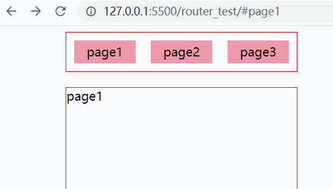
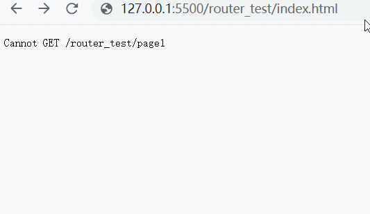

# awsome-knowledge-front-end
## 目录
1. [v-for中key的作用是什么](#v-for中key的作用是什么)
2. [vue组件之间通信](#vue组件之间通信)
3. [父子组件互相调用对方的方法](#父子组件互相调用对方的方法)
4. [hash模式和history模式的区别](#hash模式和history模式的区别)
5. [history模式刷新就会404是怎么造成的呢](#history模式刷新就会404是怎么造成的呢)
6. [工作中怎么解决代码复用的问题](#工作中怎么解决代码复用的问题)
7. [在vue项目中filter一般是怎么用的](#在vue项目中filter一般是怎么用的)
8.  [你们是在组件里注册,还是提取到一个公共的文件然后全局注册](#filter是在组件里注册还是提取到一个公共的文件然后全局注册)
9.  [filter传的function带了两个形参,代表什么意思呢?它这个参数是从哪里传进来的?filter第二个形参在使用的时候从哪里传过来](#filter传的function带了两个形参代表什么意思呢它这个参数是从哪里传进来的filter第二个形参在使用的时候从哪里传过来)
10. [有没有了解过vue的插件想写插件的时候怎么去定义](#有没有了解过vue的插件，想写插件的时候怎么去定义)
12. [有一些数据，直接存在vue的实例原型链上和通过vuex存，有什么本质的区别](#有一些数据直接存在vue的实例原型链上和通过vuex存有什么本质的区别)
13. [定义一个动态路由，怎么去获取路由的参数？](#定义一个动态路由怎么去获取路由的参数)
14. [获取vue-router两种形式的参数，query、params，这两种有什么区别](#获取vuerouter两种形式的参数query和params这两种有什么区别)
15. [路由有哪几种导航钩子](#路由有哪几种导航钩子)
16. [在组件里设计导航钩子，组件内的导航钩子用到的有哪些？](#在组件里设计导航钩子组件内的导航钩子用到的有哪些)
17. [MVVM框架的原理](#MVVM框架的原理)
18. [vue生命周期](#vue生命周期)
19. [NextTick原理分析](#NextTick原理分析)
20. [生命周期分析](#生命周期分析)
21. [VueRouter源码解析](#VueRouter源码解析)
22. [什么是VueJS](#什么是VueJS)
23. [VueJS的主要特征](#VueJS的主要特征)
24. [VueJS生命周期的主要方法是什么](#VueJS生命周期的主要方法是什么)
25. [什么是条件指令](#什么是条件指令)
26. [v-show和v-if指令之间的区别是什么?](#vshow和vif指令之间的区别是什么)
27. [v-for指令的目的是什么](#vfor指令的目的是什么)
## 题目

### Vue.js

1. ####  v-for中key的作用是什么
##### 题目：v-for中key的作用是什么
`key` 代表每一项中的唯一性，`key` 的特殊属性主要用在 `Vue` 的虚拟 `DOM` 算法，在新旧 `nodes` 对比时辨识 `VNodes`。如果不使用 `key`，`Vue` 会使用一种最大限度减少动态元素并且尽可能的尝试修复或者再利用相同类型元素的算法。使用 `key`，它会基于 `key` 的变化重新排列元素顺序，并且会移除 `key` 不存在的元素。

有相同父元素的子元素必须有独特的 `key`。重复的 `key` 会造成渲染错误。

---

[[↑] 回到顶部](#awsome-knowledge-front-end)

2. #### vue组件之间通信
##### 题目：vue组件之间通信
###### props
这个应该非常常见,就是父传子的属性。
`props` 值可以是一个数组或对象。
优缺点很明显，写数组很方便，但是不能限制类型和设置默认值，写对象虽然复杂，优点很多：
1. 限定类型
2. 必须校验
3. 默认值
4. 数据校验
```js
// 数组:不建议使用
props:[]

// 对象:建议
props:{
 val:{
  type:Number, //传入值限定类型
  // type 值可为String,Number,Boolean,Array,Object,Date,Function,Symbol
  // type 还可以是一个自定义的构造函数，并且通过 instanceof 来进行检查确认
  required: true, //是否必传
  default:200,  //默认值,对象或数组默认值必须从一个工厂函数获取如 default:()=>[]
  validator:(value) {
    // 这个值必须匹配下列字符串中的一个
    return ['success', 'warning', 'danger'].indexOf(value) !== -1
  }
 }
}
```
###### $emit
这个也应该非常常见，触发父组件中子组件的自定义事件，其实就是子传父的方法。
```js
// 父组件
<template>
  <child @onCloseDialog="onCloseDialog"/>
</template>
// 子组件
this.$emit('onCloseDialog',true)
```
###### vuex
1. 这个也是很常用的，`vuex` 是一个状态管理器；
2. 是一个独立的插件，适合数据共享多的项目里面，因为如果只是简单的通讯，使用起来会比较重。一般两层以上或兄弟组件就可以用起来啦；
3. API如下
```text
state:定义存贮数据的仓库，可通过this.$store.state或mapState访问；
getter:获取store值,可认为是store的计算属性，可通过this.$store.getter或mapGetters（语法糖）访问；
mutation:同步改变store值,为什么会设计成同步,因为mutation是直接改变store值，vue对操作进行了记录，如果是异步无法追踪改变，可通过mapMutations调用；
action:异步调用函数执行mutation，进而改变 store值,可通过this.$dispatch或mapActions访问；
modules:模块,如果状态过多,可以拆分成模块,最后在入口通过...解构引入
```
###### attrs和listeners
`vue2.4.0` 新增的两个不常用的属性，但是高级用法很常见。
1. $attrs
场景:如果父传子有很多值,那么在子组件需要定义多个 `props`。
解决: `attrs` 获取子传父中未在 `props` 定义的值

```js
// 父组件
<home title="这是标题" width="80" height="80" imgUrl="imgUrl"/>

// 子组件
mounted() {
  console.log(this.$attrs) //{title: "这是标题", width: "80", height: "80", imgUrl: "imgUrl"}
},
```
相对应的如果子组件定义了 `props`，打印的值就是剔除定义的属性：
```js
props: {
  width: {
    type: String,
    default: ''
  }
},
mounted() {
  console.log(this.$attrs) //{title: "这是标题", height: "80", imgUrl: "imgUrl"}
},
```
2. $listeners
场景:子组件需要调用父组件的方法
解决:父组件的方法可以通过 `v-on="listeners"` 传入内部组件——在创建更高层次的组件时非常有用。
```js
// 父组件
<home @change="change"/>

// 子组件
mounted() {
  console.log(this.$listeners) //即可拿到 change 事件
}
```
如果是孙组件要访问父组件的属性和调用方法,直接一级一级传下去就可以

3. inheritAttrs
```js
// 父组件
<home title="这是标题" width="80" height="80" imgUrl="imgUrl"/>

// 子组件
mounted() {
  console.log(this.$attrs) //{title: "这是标题", width: "80", height: "80", imgUrl: "imgUrl"}
},

// inheritAttrs默认值为 true,也就是父组件上的属性会显示到根组件上
// 如果设置为 false 就会隐藏
```
######  provide和inject
`vue2.2.0` 新增的两个属性。`provide` 和 `inject` 主要为高阶插件和组件库提供用例。并不推荐直接用于应用程序代码中（可能其不响应属性会对您的项目造成不必要的损失），并且这对选项需要一起使用，以允许一个祖先组件向其所有子孙后代注入一个依赖，不论组件层次有多深，并在起上下游关系成立的时间里始终生效。
```js
//父组件:
provide: { //provide 是一个对象,提供一个属性或方法
  foo: '这是 foo',
  fooMethod:()=>{
    console.log('父组件 fooMethod 被调用')
  }
},

// 子或者孙子组件
inject: ['foo','fooMethod'], //数组或者对象,注入到子组件
mounted() {
  this.fooMethod()
  console.log(this.foo)
}
//在父组件下面所有的子组件都可以利用inject
```
`provide` 和 `inject` 绑定并不是可响应的。这是官方刻意为之的。然而，如果你传入了一个可监听的对象，那么其对象的属性还是可响应的，对象是因为是引用类型。

```js
//父组件:
provide: { 
  foo: '这是 foo'
},
mounted(){
  this.foo='这是新的 foo'
}

// 子或者孙子组件
inject: ['foo'], 
mounted() {
  console.log(this.foo) //子组件打印的还是'这是 foo'
}
```
###### $parent和$children
`parent`:父实例；
`children`:子实例
```js
//父组件
mounted(){
  console.log(this.$children) 
  //可以拿到一级子组件的属性和方法
  //所以就可以直接改变 data,或者调用 methods 方法
}

//子组件
mounted(){
  console.log(this.$parent) //可以拿到 parent 的属性和方法
}
```
###### $refs
```js
// 父组件
<home ref="home"/>

mounted(){
  console.log(this.$refs.home) //即可拿到子组件的实例,就可以直接操作 data 和 methods
}
```
######  $root
```js
// 父组件
mounted(){
  console.log(this.$root) //获取根实例,最后所有组件都是挂载到根实例上
  console.log(this.$root.$children[0]) //获取根实例的一级子组件
  console.log(this.$root.$children[0].$children[0]) //获取根实例的二级子组件
}
```
######  .sync
在 `vue@1.x` 的时候曾作为双向绑定功能存在，即子组件可以修改父组件中的值；在 `vue@2.0` 的由于违背单项数据流的设计被干掉了；在 `vue@2.3.0+` 以上版本又重新引入了这个 `.sync` 修饰符。
```js
// 父组件
<home :title.sync="title" />
//编译时会被扩展为
<home :title="title"  @update:title="val => title = val"/>

// 子组件
// 所以子组件可以通过$emit 触发 update 方法改变
mounted(){
  this.$emit("update:title", '这是新的title')
}
```
######  v-slot
1. `vue2.6.0` 新增，`slot,slot-cope,scope` 在 `vue2.6.0` 中都被废弃，但未被移除；
2. 作用就是将父组件的 `template` 传入子组件；
3. 插槽分类: A.匿名插槽(也叫默认插槽): 没有命名,有且只有一个。
```js
// 父组件
<todo-list> 
    <template v-slot:default>
       任意内容
       <p>我是匿名插槽 </p>
    </template>
</todo-list> 

// 子组件
<slot>我是默认值</slot>
//v-slot:default写上感觉和具名写法比较统一,容易理解,也可以不用写
```
B.具名插槽: 相对匿名插槽组件slot标签带name命名的;
```js
// 父组件
<todo-list> 
    <template v-slot:todo>
       任意内容
       <p>我是匿名插槽 </p>
    </template>
</todo-list> 

//子组件
<slot name="todo">我是默认值</slot>
```
C.作用域插槽: 子组件内数据可以被父页面拿到(解决了数据只能从父页面传递给子组件)
```js
// 父组件
<todo-list>
 <template v-slot:todo="slotProps" >
   {{slotProps.user.firstName}}
 </template> 
</todo-list> 
//slotProps 可以随意命名
//slotProps 接取的是子组件标签slot上属性数据的集合所有v-bind:user="user"

// 子组件
<slot name="todo" :user="user" :test="test">
    {{ user.lastName }}
 </slot> 
data() {
    return {
      user:{
        lastName:"Zhang",
        firstName:"yue"
      },
      test:[1,2,3,4]
    }
  },
// {{ user.lastName }}是默认数据  v-slot:todo 当父页面没有(="slotProps")
```
###### EventBus
1. 就是声明一个全局 `Vue` 实例变量 `EventBus` , 把所有的通信数据，事件监听都存储到这个变量上；
2. 类似于 `Vuex`，但这种方式只适用于极小的项目；
3. 原理就是利用 `on` 和 `emit` 并实例化一个全局 `vue` 实现数据共享。
```js
// 在 main.js
Vue.prototype.$eventBus=new Vue()

// 传值组件
this.$eventBus.$emit('eventTarget','这是eventTarget传过来的值')

// 接收组件
this.$eventBus.$on("eventTarget",v=>{
  console.log('eventTarget',v);//这是eventTarget传过来的值
})
```
###### broadcast和dispatch
`vue1.x` 有这两个方法，事件广播和派发，但是 `vue2.x` 删除了。下面是对两个方法进行的封装，在很多组件库中都应用了。
```js
function broadcast(componentName, eventName, params) {
  // 遍历子组件
  this.$children.forEach(child => {
    var name = child.$options.componentName;
// 找到对应的组件
    if (name === componentName) {
      // 绑定事件
      child.$emit.apply(child, [eventName].concat(params));
    } else {
      // 递归
      broadcast.apply(child, [componentName, eventName].concat(params));
    }
  });
}
export default {
  methods: {
    dispatch(componentName, eventName, params) {
      var parent = this.$parent;
      var name = parent.$options.componentName;
      while (parent && (!name || name !== componentName)) {
        parent = parent.$parent;

        if (parent) {
          name = parent.$options.componentName;
        }
      }
      if (parent) {
        parent.$emit.apply(parent, [eventName].concat(params));
      }
    },
    broadcast(componentName, eventName, params) {
      broadcast.call(this, componentName, eventName, params);
    }
  }
}
```
###### 路由传参
1. 方案一
```js
// 路由定义
{
  path: '/describe/:id',
  name: 'Describe',
  component: Describe
}
// 页面传参
this.$router.push({
  path: `/describe/${id}`,
})
// 页面获取
this.$route.params.id
```
2. 方案二
```js
// 路由定义
{
  path: '/describe',
  name: 'Describe',
  omponent: Describe
}
// 页面传参
this.$router.push({
  name: 'Describe',
  params: {
    id: id
  }
})
// 页面获取
this.$route.params.id
```
3.方案三
```js
// 路由定义
{
  path: '/describe',
  name: 'Describe',
  component: Describe
}
// 页面传参
this.$router.push({
  path: '/describe',
    query: {
      id: id
  `}
)
// 页面获取
this.$route.query.id
```
> 三种方案对比

方案一参数拼接在后面，不美观，而且暴露了信息；
方案二后面参数页面刷新会丢失；
方案三不会在后面拼接参数，刷新参数也不会丢失。
###### Vue.observable
`vue2.6.0` 新增的一个属性。

用法:
1. 让一个对象可响应。`Vue` 内部会用它来处理 `data` 函数返回的对象；
2. 返回的对象可以直接用于渲染函数和计算属性内，并且会在发生改变时触发相应的更新；
3. 也可以作为最小化的跨组件状态存储器，用于简单的场景。

通讯原理实质上是利用 `Vue.observable` 实现一个简易的 `vuex`
```js
// 文件路径 - /store/store.js
import Vue from 'vue'

export const store = Vue.observable({ count: 0 })
export const mutations = {
  setCount (count) {
    store.count = count
  }
}

//使用
<template>
    <div>
        <label for="bookNum">数 量</label>
            <button @click="setCount(count+1)">+</button>
            <span>{{count}}</span>
            <button @click="setCount(count-1)">-</button>
    </div>
</template>

<script>
import { store, mutations } from '../store/store' // Vue2.6新增API Observable

export default {
  name: 'Add',
  computed: {
    count () {
      return store.count
    }
  },
  methods: {
    setCount: mutations.setCount
  }
}
</script>
```

作者：火狼1
链接：https://juejin.im/post/5d9d386fe51d45784d3f8637
来源：掘金
著作权归作者所有。商业转载请联系作者获得授权，非商业转载请注明出处。

---

[[↑] 回到顶部](#awsome-knowledge-front-end)

3. #### 父子组件互相调用对方的方法
##### 题目：父子组件互相调用对方的方法
拿到对方组件的实例对象后，对它实例的方法进行调用，经常用到。
```js
// 父组件
<template>
  <child-component ref="c" @openDialog="openDialog"/>
</template>
methods:{
  openDialog(){
    ...
  }
}
// 子组件
methods:{
  closeDialog(){
    ...
  }
}
// 父调用子中的方法
this.$refs['c'].closeDialog()
// 子调用父的方法
this.$emit('openDialog', ...)
```

---

[[↑] 回到顶部](#awsome-knowledge-front-end)

4. #### hash模式和history模式的区别

`hash` 模式的 `url` 地址有 `#`，底层是监听 `onhashchange` 事件。默认就是 `hash` 模式。
`history` 模式包括 `back`,`forward`,`go` 三个方法。但 `history` 模式需要后台支持，否则会有`404`。

---

[[↑] 回到顶部](#awsome-knowledge-front-end)

5. #### history模式刷新就会404是怎么造成的呢
因为本地路径中没有这个真实资源存在，这些访问资源都是在 `js` 里渲染的，可以通过后端去做重定向，服务器配置如果 `URL` 匹配不到任何静态资源，就跳转到默认的 `index.html`。

---

[[↑] 回到顶部](#awsome-knowledge-front-end)

6. #### 工作中怎么解决代码复用的问题

抽取公共组件、封装方法、`mixin`（`vue` 高阶用法，混入，是 `vue` 里对代码复用的解决方案）

---

[[↑] 回到顶部](#awsome-knowledge-front-end)

7. #### 在vue项目中filter一般是怎么用的
##### 题目：在vue项目中，filter一般是怎么用的
用于格式化数据，比如： 价格，日期等
```js
<div>{{bananaPrice|price}}</div>
filters:{
  price(p){
    return p*0.6 
  }
}
```

---

[[↑] 回到顶部](#awsome-knowledge-front-end)

8. #### filter是在组件里注册还是提取到一个公共的文件然后全局注册
##### 题目：filter是在组件里注册还是提取到一个公共的文件，然后全局注册
如果每个组件中都用到就抽，单次用到写到单个组件中。

---

[[↑] 回到顶部](#awsome-knowledge-front-end)

9.   #### filter传的function带了两个形参代表什么意思呢它这个参数是从哪里传进来的filter第二个形参在使用的时候从哪里传过来
##### 题目：filter传的function带了两个形参，代表什么意思呢？它这个参数是从哪里传进来的？filter第二个形参在使用的时候从哪里传过来？

在`Vue.filter(name, options)`中，第一个参数是过滤器名称，第二个是回调函数，

回调函数的第一个参数是数据节点，第二个就是在过滤器中要用到的参数，从 `html` 代码中传过来的
用这种方法相当于定义了一个“全局”过滤器，不仅仅是可以在 `app` 这个实例中应用，
如果你还定义了其他的实例，同样可以使用这个过滤器。

---

[[↑] 回到顶部](#awsome-knowledge-front-end)

10.   #### 有没有了解过vue的插件想写插件的时候怎么去定义
##### 题目：有没有了解过vue的插件，想写插件的时候怎么去定义

1. 通过全局方法 Vue.use() 使用插件
2. 添加 Vue 实例方法，通过把它们添加到 Vue.prototype 上实现（一般不这么操作）
3. Vue.js 的插件有一个公开方法 install
【声明插件】——【写插件】——【注册插件】——【使用插件】
(1)声明插件
先写一个 `js` 文件，这个 `js` 文件就是插件文件，里面的基本内容如下：
```js
export default {
    install: function (Vue, options) {
        // 添加的内容写在这个函数里面
    }
};
```
(2) 注册插件
如果使用过 `Vue-router`，就很好理解，通过 `import` 引入后，通过 `Vue.use(插件名)` 注册插件；
(3) 写插件、使用插件按照官方文档，写插件有四种方法，先给出官方的代码：
//以下内容都是添加到上面 `install` 的函数里面的
```js
// 1. 添加全局方法或属性
Vue.myGlobalMethod = function () {
    // 逻辑...
}
// 2. 添加全局资源
Vue.directive('my-directive', {
    bind (el, binding, vnode, oldVnode) {
        // 逻辑...
    }
    ...
})
// 3. 注入组件
Vue.mixin({
    created: function () {
        // 逻辑...
    }
    ...
})
// 4. 添加实例方法
Vue.prototype.$myMethod = function (options) {
    // 逻辑...
}
```

---

[[↑] 回到顶部](#awsome-knowledge-front-end)
11.  #### 有一些数据直接存在vue的实例原型链上和通过vuex存有什么本质的区别
`Vue` 实例一般只是用来挂在视图，把数据放在原型链上会造成原型污染。

---

[[↑] 回到顶部](#awsome-knowledge-front-end)

12. #### 定义一个动态路由怎么去获取路由的参数
##### 题目：定义一个动态路由，怎么去获取路由的参数？
动态路由的创建，主要是使用 `path` 属性过程中，使用动态路径参数，以冒号开头。
```js
{
    path: /user/:id
    component: User
}
```
参数值会被设置到 `this.$route.params` 下，所以通过这个属性可以获取到动态参数。
```js
const User = {
    template: '<div>User {{ $route.params.id }}</div>'
}
```

---

[[↑] 回到顶部](#awsome-knowledge-front-end)

13. #### 获取vuerouter两种形式的参数query和params这两种有什么区别
 ##### 题目：获取vue-router两种形式的参数，query、params，这两种有什么区别
`params：/router1/:id ，/router1/123，/router1/789` ,这里的 `id` 叫做 `params`。

`query：/router1?id=123 ,/router1?id=456` ,这里的 `id` 叫做 `query`。

传参是 `this.$router`，接收参数是 `this.$router`。

`$router` 为 `VueRouter` 实例，想要导航到不同 `URL`，则使用 `$router.push` 方法。

`$route` 为当前 `router` 跳转对象，里面可以获取`name、path、query、params` 等。
```js
this.$router.push({
       path:'/openAccount',
       query:{id:id}
     });
this.$router.push({
     name:'/openAccount',
     params:{
       id: id
     }
   })
```
`params` 传参，`push` 里面只能是 `name:'xxxx'`,不能是 `path:'/xxx'`,因为 `params` 只能用 `name` 来引入路由，
如果这里写成了 `path`，接收参数页面会是`undefined`。

`query` 相当于 `get` 请求，页面跳转的时候，可以在地址栏看到请求参数，
而 `params` 相当于post请求，参数不会再地址栏中显示。

---

[[↑] 回到顶部](#awsome-knowledge-front-end)

14.  #### 路由有哪几种导航钩子
`vue-router` 的导航钩子，主要用来作用是拦截导航，让他完成跳转或取消。

有三种方式可以植入路由导航过程中：

1. 全局导航钩子：
全局导航钩子主要有两种钩子：前置守卫、后置钩子，
注册一个全局前置守卫：
```js
const router = new VueRouter({ ... });
router.beforeEach((to, from, next) => {
    // do someting
});
```
这三个参数 `to` 、`from` 、`next` 分别的作用：

- to: Route，代表要进入的目标，它是一个路由对象

- from: Route，代表当前正要离开的路由，同样也是一个路由对象

- next: Function，这是一个必须需要调用的方法，而具体的执行效果则依赖 next 方法调用的参数

1. next()：进入管道中的下一个钩子，如果全部的钩子执行完了，则导航的状态就是 confirmed（确认的）
2. next(false)：这代表中断掉当前的导航，即 to 代表的路由对象不会进入，被中断，此时该表 URL 地址会被重置到 from 路由对应的地址
3. next(‘/’) 和 next({path: ‘/’})：在中断掉当前导航的同时，跳转到一个不同的地址
4. next(error)：如果传入参数是一个 Error 实例，那么导航被终止的同时会将错误传递给 router.onError() 注册过的回调
注意：`next` 方法必须要调用，否则钩子函数无法 `resolved`。

对于全局后置钩子：
```js
router.afterEach((to, from) => {
    // do someting
});
```
不同于前置守卫，后置钩子并没有 `next` 函数，也不会改变导航本身

2. 路由独享的钩子
顾名思义，即单个路由独享的导航钩子，它是在路由配置上直接进行定义的：
```js
cont router = new VueRouter({
    routes: [
        {
            path: '/file',
            component: File,
            beforeEnter: (to, from ,next) => {
                // do someting
            }
        }
    ]
});
```
至于他的参数的使用，和全局前置守卫是一样的

3. 组建内的导航钩子
组件内的导航钩子主要有这三种：`beforeRouteEnter`、 `beforeRouteUpdate`、`beforeRouteLeave`。他们是直接在路由组件内部直接进行定义的。
```js
const File = {
    template: `<div>This is file</div>`,
    beforeRouteEnter(to, from, next) {
        // do someting
        // 在渲染该组件的对应路由被 confirm 前调用
    },
    beforeRouteUpdate(to, from, next) {
        // do someting
        // 在当前路由改变，但是依然渲染该组件是调用
    },
    beforeRouteLeave(to, from ,next) {
        // do someting
        // 导航离开该组件的对应路由时被调用
    }
}
```
需要注意是：

`beforeRouteEnter` 不能获取组件实例 `this`，因为当守卫执行前，组件实例被没有被创建出来，剩下两个钩子则可以正常获取组件实例 `this`。
但是并不意味着在 `beforeRouteEnter` 中无法访问组件实例，我们可以通过给 `next` 传入一个回调来访问组件实例。在导航被确认是，会执行这个回调，这时就可以访问组件实例了，如：
```js
beforeRouteEnter(to, from, next) {
    next (vm => {
        // 这里通过 vm 来访问组件实例解决了没有 this 的问题
    })
}
```
注意，仅仅是 `beforRouteEnter` 支持给 `next` 传递回调，其他两个并不支持。因为归根结底，支持回调是为了解决 `this` 问题，而其他两个钩子的 `this` 可以正确访问到组件实例，所有没有必要使用回调。

最后是完整的导航解析流程：
```text
1、导航被触发
2、在失活的组件里调用离开守卫
3、调用全局的 beforeEach 守卫
4、在重用的组件里调用 beforeRouteUpdate 守卫
5、在路由配置里调用 beforEnter
6、解析异步路由组件
7、在被激活的组件里调用 beforeRouteEnter
8、调用全局的 beforeResolve 守卫
9、导航被确认
10、调用全局的 afterEach 钩子
11、触发 DOM 更新
12、在创建好的实例调用 beforeRouteEnter 守卫中传给 next 的回调函数
```

作者：world_7735
链接：https://www.jianshu.com/p/5528c30f866b
来源：简书
著作权归作者所有。商业转载请联系作者获得授权，非商业转载请注明出处。

---

[[↑] 回到顶部](#awsome-knowledge-front-end)

15.   #### MVVM框架的原理
用 `object.defineProtery` 把对象转化为 `get` 和 `set`，改变数据会触发 `set` 函数，`set` 改变数据源后，会通知一个叫观察者（`watch`）的东西，`watch` 收到通知后，再进行视图渲染，局部更新。
`get` 和 `set` 也可以监听到属性什么时候被改过。

---

[[↑] 回到顶部](#awsome-knowledge-front-end)

16.  #### vue生命周期
`beforeCreate`：此时获取不到 `prop` 和 `data` 中的数据；
`created`：可以获取到 `prop` 和 `data` 中的数据；
`beforeMount`：获取到了 `VDOM`;
`mounted`：`VDOM`解析成了真实 `DOM`;
`beforeUpdate`：在更新之前调用；
`updated`：在更新之后调用；
`keep-alive`：切换组件之后，组件放进 `activated`，之前的组件放进`deactivated`；
`beforeDestory`：在组件销毁之前调用，可以解决内存泄露的问题，如 `setTimeout` 和 `setInterval` 造成的问题。
`destory`：组件销毁之后调用。

---

[[↑] 回到顶部](#awsome-knowledge-front-end)

17. #### NextTick原理分析

`nexttick` 可以让我们在下次 `DOM` 更新循环结束之后执行延迟回调,用于获得更新后的 `DOM`。

在 `Vue2.4` 之前都是使用的 `microtasks`(微任务)，但是 `microtasks`(微任务) 的优先级过高，在某些情况下可能会出现比事件冒泡更快的情况，但如果都使用 `macrotasks`(宏任务) 又可能会出现渲染的性能问题。所以在新版本中，会默认使用 `microtasks`(微任务)，但在特殊情况下会使用 `macrotasks`(宏任务)，比如 `v-on`。

对于实现 `macrotasks`(宏任务) ，会先判断是否能使用 `setImmediate`，不能的话降级为 `MessageChannel`，以上都不行的话就使用 `setTimeout`。

```js
if (typeof setImmediate !== 'undefined' && isNative(setImmediate)) {
  macroTimerFunc = () => {
    setImmediate(flushCallbacks)
  }
} else if (
  typeof MessageChannel !== 'undefined' &&
  (isNative(MessageChannel) ||
    // PhantomJS
    MessageChannel.toString() === '[object MessageChannelConstructor]')
) {
  const channel = new MessageChannel()
  const port = channel.port2
  channel.port1.onmessage = flushCallbacks
  macroTimerFunc = () => {
    port.postMessage(1)
  }
} else {
  /* istanbul ignore next */
  macroTimerFunc = () => {
    setTimeout(flushCallbacks, 0)
  }
}
```

`nextTick` 同时也支持 `Promise` 的使用，会判断是否实现了 `Promise`。

```js
export function nextTick(cb?: Function, ctx?: Object) {
  let _resolve
  // 将回调函数整合进一个数组中
  callbacks.push(() => {
    if (cb) {
      try {
        cb.call(ctx)
      } catch (e) {
        handleError(e, ctx, 'nextTick')
      }
    } else if (_resolve) {
      _resolve(ctx)
    }
  })
  if (!pending) {
    pending = true
    if (useMacroTask) {
      macroTimerFunc()
    } else {
      microTimerFunc()
    }
  }
  // 判断是否可以使用 Promise
  // 可以的话给 _resolve 赋值
  // 这样回调函数就能以 promise 的方式调用
  if (!cb && typeof Promise !== 'undefined') {
    return new Promise(resolve => {
      _resolve = resolve
    })
  }
}
```

---

[[↑] 回到顶部](#awsome-knowledge-front-end)

18.   #### spa路由实现的两种方式
##### 题目：spa路由实现的两种方式(大搜车)
`SPA` 是 `single page application` 的缩写，直译为单页面应用。简单来说就是一个 `web` 应用程序只有`1`个页面（`1`个`html`）。

在传统的 `web` 程序（多页面应用）中，用户每次进入新的页面都要向服务器发起请求，以获取整个页面的所有代码，几乎每一个响应动作都会刷新整个页面，不但浪费带宽，也影响了用户体验。

而 `SPA` 只需要请求一次页面代码，切换功能模块时，通过 `javascript` 控制渲染不同的内容，避免了请求新的页面（仅仅需要向服务端请求必要的数据），切换“页面”的时候速度很快。

- `SPA` 应该具有的特征
`SPA` 核心是前端路由，路由表示 `URL` 与资源的对应关系，前端路由简单说就是通过前端 `js` 代码处理不同 `URL` 与不同组件模块的对应关系。这些不同的 `URL` 在后端获取的都是整个页面资源，而在浏览器端， `js` 通过判断不同的 `URL` 代表的具体功能模块，从而渲染不同的组件模块。

`1`个 `SPA` 应用具备的特征有：
- 切换组件不刷新页面
- 浏览器的前进后退按钮有效
- URL与组件的一一对应关系

- SPA的两种实现方式
接下来我们通过 `hash` 与 `history API` 两种方式实现一个简单的 `SPA` 页面。

`html` 结构
```html
<!DOCTYPE html>
<html lang="zh">
<head>
<meta charset="UTF-8">
<title></title>
</head>
<style>
  #router-nav {
    width: 300px;
    height: 50px;
    border: 1px solid red;
    padding: 0;
    margin: 0 auto;
  }
  ul {
    margin: 0;
    padding: 0;
  }
  ul li {
    width: 80px;
    height: 30px;
    line-height: 30px;
    background-color: #e9a;
    list-style: none;
    float: left;
    margin: 10px;
    text-align: center;
    cursor: pointer;
  }
  #router-view {
    width: 300px;
    height: 300px;
    border: 1px solid #555;
    margin: 20px auto;
  }
</style>
<body>
  <div id="router-nav">
    <ul>
    <li class="nav-item" data-id="page1">page1</li>
    <li class="nav-item" data-id="page2">page2</li>
    <li class="nav-item" data-id="page3">page3</li>
    </ul>
  </div>
  <div id="router-view">

  </div>
  <!-- <script src="./router1_hash.js"></script> -->
  <script src="./router2_history.js"></script>
</body>
</html>
```
1. 利用hash实现SPA
原理：

- 向通过 `URL` 中的 `hash` 部分（`#`后的锚点值）来映射不同的组件；
- 改变 `hash` ，也不会向服务端重新请求页面，也不会刷新页面；
- 改变 `hash` ，会向浏览器的历史记录压入新的记录，使得浏览器的前进后退按钮可以像传统多页面应用一样正常工作；
- `hash` 部分不会影响 `URL` 在服务端请求的资源，而前端可以通过 `js` 判断需要渲染的组件，从而实现 `URL` 与组件的一一对应。
  
`router_hash.js` 代码如下：
```js
;(function () {
  var navItems = document.querySelectorAll('#router-nav .nav-item')
  var view = document.getElementById('router-view')
  
  window.addEventListener('load', function () {
    if (! location.hash) {location.hash = navItems[0].dataset.id}
    view.innerHTML = location.hash.slice(1)
  })

  for (var navItem of navItems) {
    console.log(navItem)
    navItem.addEventListener('click', function () {
      location.hash = this.dataset.id
    })
  }
  window.addEventListener('hashchange', function () {
    view.innerHTML = location.hash.slice(1)
    // ajax here
  })
})()
```
在 `Http` 和 `File` 协议均能正常运行，效果如图：


1. 利用history API 实现SPA
原理：

通过 `history.replaceState` 和 `history.pushState` 改变历史记录和 `url`

如果改变的不仅仅是 `hash` （如果仅仅改变 `hash` ，那可以直接用 `hash` 的方式实现 `SPA` ，何必用 `history API` 呢），那么实现 `URL` 和组件的一一对应，需要服务端配合。

`router_history.js` 代码如下
```js
;(function () {
  var navItems = document.querySelectorAll('#router-nav .nav-item')
  var view = document.getElementById('router-view')
  
  window.addEventListener('load', function () {
    view.innerHTML = navItems[0].dataset.id
    history.replaceState(navItems[0].dataset.id, null, navItems[0].dataset.id)
  })

  for (var navItem of navItems) {
    console.log(navItem)
    navItem.addEventListener('click', function () {
      history.pushState(this.dataset.id, null, this.dataset.id)
      view.innerHTML = this.dataset.id
      // ajax here
    })
  }

  window.addEventListener('popstate', function (e) {
    if (e.state) {view.innerHTML = e.state}
  })

})()

```
仅能在 `Http` 协议下有效， `File` 协议修改 `url` 会报错，效果如图：


虽然通过 `history API` 修改了 `url` ，但实际上最开始请求服务端的并不是这个 `url` ，所以直接刷新会找不到资源。如下图


如果想要用户刷新没毛病，或者直接通过某个 `url` 渲染对应的组件，需要服务端配合，为这一系列 `URL` 设置同样的后端路由，都响应该 `SPA` 页面。然后前端代码再添加相应的逻辑，即可渲染指定的组件。

个人感觉。使用 `hash` 实现的 `SPA` 比较容易理解，也好实现。

————————————————
版权声明：本文为CSDN博主「晔晔炅萤」的原创文章，遵循CC 4.0 BY-SA版权协议，转载请附上原文出处链接及本声明。
原文链接：https://blog.csdn.net/qq_18369669/article/details/106672046

---

[[↑] 回到顶部](#awsome-knowledge-front-end)

19.   #### vue3.0的变化（海康/teamind）
###### vue3.0的改进思路
`vue` 最主要的特点就是响应式机制、模板、以及对象式的组件声明语法，而 `3.0` 对这三部分都做了更改。
###### 响应式
`2.x` 的响应式是基于 `Object.defineProperty` 实现的代理，兼容主流浏览器和 `ie9` 以上的 `ie` 浏览器，能够监听数据对象的变化，但是监听不到对象属性的增删、数组元素和长度的变化，同时会在 `vue` 初始化的时候把所有的 `Observer` 都建立好，才能观察到数据对象属性的变化。

针对上面的问题，`3.0` 进行了革命性的变更，采用了 `ES2015` 的 `Proxy` 来代替 `Object.defineProperty`，可以做到监听对象属性的增删和数组元素和长度的修改，还可以监听 `Map`、`Set`、`WeakSet`、`WeakMap`，同时还实现了惰性的监听，不会在初始化的时候创建所有的 `Observer`，而是会在用到的时候才去监听。但是，虽然主流的浏览器都支持 `Proxy`，`ie` 系列却还是不兼容，所以针对 `ie11`，`vue3.0` 决定做单独的适配，暴露出来的 `api` 一样，但是底层实现还是 `Object.defineProperty`，这样导致了 `ie11` 还是有 `2.x` 的问题。但是绝大部分情况下，`3.0` 带来的好处已经能够体验到了。

响应式方面，`vue3.0` 做了实现机制的变更，采用 `ES2015` 的 `Proxy`，不但解决了 `vue2.x` 中的问题，还使得性能有了进一步提升。虽然有一些兼容问题，但是通过适配的方式解决掉了。此外，还暴露了 `observable` 的 `api` 来创建响应式对象，可以替代掉 `event bus`，来做一些跨组件的通信。

###### 模板
模板方面没有大的变更，只改了作用域插槽，`2.x` 的机制导致作用域插槽变了，父组件会重新渲染，而 `3.0` 把作用于插槽改成了函数的方式，这样只会影响子组件的重新渲染，提升了渲染的性能。

同时，对于 `render` 函数的方面，`vue3.0` 也会进行一系列更改来方便习惯直接使用 `api` 来生成 `vdom` 的开发者。
###### 对象式的组件声明方式
`vue2.x` 中的组件是通过声明的方式传入一系列 `option`，和 `TypeScript` 的结合需要通过一些装饰器的方式来做，虽然能实现功能，但是比较麻烦。

`3.0` 修改了组件的声明方式，改成了类式的写法，这样使得和 `TypeScript` 的结合变得很容易。

此外，`vue` 的源码也改用了 `TypeScript` 来写。其实当代码的功能复杂之后，必须有一个静态类型系统来做一些辅助管理，如 `React` 使用的 `Flow` ， `Angular` 使用的 `TypeScript` 。现在`vue3.0` 也全面改用 `TypeScript` 来重写了，更是使得对外暴露的 `api` 更容易结合 `TypeScript` 。静态类型系统对于复杂代码的维护确实很有必要。
###### 其他的一些东西
`vue3.0` 的改变是全面的，上面只涉及到主要的`3`个方面，还有一些其他的更改：

- 支持自定义渲染器，从而使得 `weex` 可以通过自定义渲染器的方式来扩展，而不是直接 `fork` 源码来改的方式。
- 支持 `Fragment` （多个根节点）和 `Protal` （在 `dom` 其他部分渲染组件内容）组件，针对一些特殊的场景做了处理。
- 基于 `treeshaking` 优化，提供了更多的内置功能。

###### vue3.0的开发流程规划
`vue` 的开发思路是公开的，尤雨溪说主要的特性会听取一些主要库的开发者的反馈，有比较确定的方案以后公布 `RFC` 收集公众的反馈意见，之后才进入开发，同时会同步生态内相关的库和工具的更新。

虽然 `vue` 不如 `react` 和 `angular` 那样有大公司维护，但是借助开源的力量，整个流程都是开源社区参与的，这样 `vue` 的稳定程度和开发思路自然也就不会有什么大的问题。

###### 总结
`vue3.0` 对 `vue` 的主要`3`个特点：响应式、模板、对象式的组件声明方式，进行了全面的更改，底层的实现和上层的 `api` 都有了明显的变化，基于 `Proxy` 重新实现了响应式，基于 `treeshaking` 内置了更多功能，提供了类式的组件声明方式。而且源码全部用 `typescript` 重写。以及进行了一系列的性能优化。

---

[[↑] 回到顶部](#awsome-knowledge-front-end)

20.   #### 响应式原理（海康/快手）
https://cn.vuejs.org/v2/guide/reactivity.html

`new Vue()` 时会触发init方法，初始化各类数据：`initMethods`、`initState`、`initWatcher`等。

`initState` 会初始化数据，并且 `observer` 会对数据进行劫持，其中用 `object.defineProperty()` 对其进行定义成响应式对象。`getter` 获取其值和 `setter` 改变其值。

这样在 `data` 函数中声明的对象就完成了初始化响应式，当我们在代码中改变 `data` 中对象值的时候，视图中绑定对象的 `dom` 也能得到更新。

这里注意一点：`object.defineProperty()` 方法有缺陷，对象的增加和删除，数组的长度更改和针对指定索引修改并不会触发试图变更，可以通过 `vue` 定义的 `set` 去变更。

---

[[↑] 回到顶部](#awsome-knowledge-front-end)

21. #### <div id="vue-router"></div> vue-router的钩子（海康）

1. 导航被触发。
2. 在失活的组件里调用 `beforeRouteLeave` 守卫。
3. 调用全局的 `beforeEach` 守卫。
4. 在重用的组件里调用 `beforeRouteUpdate` 守卫 (2.2+)。
5. 在路由配置里调用 `beforeEnter`。
6. 解析异步路由组件。
7. 在被激活的组件里调用 `beforeRouteEnter`。
8. 调用全局的 `beforeResolve` 守卫 (2.5+)。
9. 导航被确认。
10. 调用全局的 `afterEach` 钩子。
11. 触发 `DOM` 更新。
12. 调用 `beforeRouteEnter` 守卫中传给 `next` 的回调函数，创建好的组件实例会作为回调函数的参数传入。

1. 全局钩子
- beforeEach 
- beforeResolve 
- afterEach
- beforeEnter
2. 组件内的钩子
- beforeRouteEnter
- beforeRouteUpdate 
- beforeRouteLeave

---
22. ####  生命周期分析


在初始化时，会调用以下代码，生命周期就是通过 `callHook` 调用的。

```js
Vue.prototype._init = function(options) {
  initLifecycle(vm)
  initEvents(vm)
  initRender(vm)
  callHook(vm, 'beforeCreate') // 拿不到 props data
  initInjections(vm)
  initState(vm)
  initProvide(vm)
  callHook(vm, 'created')
}

```

可以发现在以上代码中，`beforeCreate` 调用的时候，是获取不到 `props` 或者 `data` 中的数据的，因为这些数据的初始化都在 `initState` 中。

接下来会执行挂载函数

```js
export function mountComponent {
    callHook(vm, 'beforeMount')
    // ...
    if (vm.$vnode == null) {
        vm._isMounted = true
        callHook(vm, 'mounted')
    }
}

```

`beforeMount` 就是在挂载前执行的，然后开始创建 `VDOM` 并替换成真实 `DOM`，最后执行 `mounted` 钩子。这里会有个判断逻辑，如果是外部 `new Vue({})` 的话，不会存在 `$vnode` ，所以直接执行 `mounted` 钩子了。如果有子组件的话，会递归挂载子组件，只有当所有子组件全部挂载完毕，才会执行根组件的挂载钩子。

接下来是数据更新时会调用的钩子函数

```js
function flushSchedulerQueue() {
  // ...
  for (index = 0; index < queue.length; index++) {
    watcher = queue[index]
    if (watcher.before) {
      watcher.before() // 调用 beforeUpdate
    }
    id = watcher.id
    has[id] = null
    watcher.run()
    // in dev build, check and stop circular updates.
    if (process.env.NODE_ENV !== 'production' && has[id] != null) {
      circular[id] = (circular[id] || 0) + 1
      if (circular[id] > MAX_UPDATE_COUNT) {
        warn(
          'You may have an infinite update loop ' +
            (watcher.user
              ? `in watcher with expression "${watcher.expression}"`
              : `in a component render function.`),
          watcher.vm
        )
        break
      }
    }
  }
  callUpdatedHooks(updatedQueue)
}

function callUpdatedHooks(queue) {
  let i = queue.length
  while (i--) {
    const watcher = queue[i]
    const vm = watcher.vm
    if (vm._watcher === watcher && vm._isMounted) {
      callHook(vm, 'updated')
    }
  }
}
```
上图还有两个生命周期没有说，分别为 `activated` 和 `deactivated` ，这两个钩子函数是 `keep-alive` 组件独有的。用 `keep-alive` 包裹的组件在切换时不会进行销毁，而是缓存到内存中并执行 `deactivated` 钩子函数，命中缓存渲染后会执行 `actived` 钩子函数。

最后就是销毁组件的钩子函数了
```js
Vue.prototype.$destroy = function() {
  // ...
  callHook(vm, 'beforeDestroy')
  vm._isBeingDestroyed = true
  // remove self from parent
  const parent = vm.$parent
  if (parent && !parent._isBeingDestroyed && !vm.$options.abstract) {
    remove(parent.$children, vm)
  }
  // teardown watchers
  if (vm._watcher) {
    vm._watcher.teardown()
  }
  let i = vm._watchers.length
  while (i--) {
    vm._watchers[i].teardown()
  }
  // remove reference from data ob
  // frozen object may not have observer.
  if (vm._data.__ob__) {
    vm._data.__ob__.vmCount--
  }
  // call the last hook...
  vm._isDestroyed = true
  // invoke destroy hooks on current rendered tree
  vm.__patch__(vm._vnode, null)
  // fire destroyed hook
  callHook(vm, 'destroyed')
  // turn off all instance listeners.
  vm.$off()
  // remove __vue__ reference
  if (vm.$el) {
    vm.$el.__vue__ = null
  }
  // release circular reference (##6759)
  if (vm.$vnode) {
    vm.$vnode.parent = null
  }
}
```
在执行销毁操作前会调用 `beforeDestroy` 钩子函数，然后进行一系列的销毁操作，如果有子组件的话，也会递归销毁子组件，所有子组件都销毁完毕后才会执行根组件的 `destroyed` 钩子函数。

---
[[↑] 回到顶部](#awsome-knowledge-front-end)

23. #### VueRouter源码解析

1. 重要函数思维导图

以下思维导图罗列了源码中重要的一些函数 


2.  路由注册

在开始之前，推荐大家 `clone` 一份源码对照着看。因为篇幅较长，函数间的跳转也很多。

使用路由之前，需要调用 `Vue.use(VueRouter)`，这是因为让插件可以使用 `Vue`

```js
export function initUse(Vue: GlobalAPI) {
  Vue.use = function(plugin: Function | Object) {
    // 判断重复安装插件
    const installedPlugins =
      this._installedPlugins || (this._installedPlugins = [])
    if (installedPlugins.indexOf(plugin) > -1) {
      return this
    }
    const args = toArray(arguments, 1)
    // 插入 Vue
    args.unshift(this)
    // 一般插件都会有一个 install 函数
    // 通过该函数让插件可以使用 Vue
    if (typeof plugin.install === 'function') {
      plugin.install.apply(plugin, args)
    } else if (typeof plugin === 'function') {
      plugin.apply(null, args)
    }
    installedPlugins.push(plugin)
    return this
  }
}
```

接下来看下 `install` 函数的部分实现
```js
export function install(Vue) {
  // 确保 install 调用一次
  if (install.installed && _Vue === Vue) return
  install.installed = true
  // 把 Vue 赋值给全局变量
  _Vue = Vue
  const registerInstance = (vm, callVal) => {
    let i = vm.$options._parentVnode
    if (
      isDef(i) &&
      isDef((i = i.data)) &&
      isDef((i = i.registerRouteInstance))
    ) {
      i(vm, callVal)
    }
  }
  // 给每个组件的钩子函数混入实现
  // 可以发现在 `beforeCreate` 钩子执行时
  // 会初始化路由
  Vue.mixin({
    beforeCreate() {
      // 判断组件是否存在 router 对象，该对象只在根组件上有
      if (isDef(this.$options.router)) {
        // 根路由设置为自己
        this._routerRoot = this
        this._router = this.$options.router
        // 初始化路由
        this._router.init(this)
        // 很重要，为 _route 属性实现双向绑定
        // 触发组件渲染
        Vue.util.defineReactive(this, '_route', this._router.history.current)
      } else {
        // 用于 router-view 层级判断
        this._routerRoot = (this.$parent && this.$parent._routerRoot) || this
      }
      registerInstance(this, this)
    },
    destroyed() {
      registerInstance(this)
    }
  })
  // 全局注册组件 router-link 和 router-view
  Vue.component('RouterView', View)
  Vue.component('RouterLink', Link)
}
```
3. VueRouter 实例化

在安装插件后，对 `VueRouter` 进行实例化。

```js
const Home = { template: '<div>home</div>' }
const Foo = { template: '<div>foo</div>' }
const Bar = { template: '<div>bar</div>' }

// 3. Create the router
const router = new VueRouter({
  mode: 'hash',
  base: __dirname,
  routes: [
    { path: '/', component: Home }, // all paths are defined without the hash.
    { path: '/foo', component: Foo },
    { path: '/bar', component: Bar }
  ]
})
```

来看一下 `VueRouter` 的构造函数
```js
constructor(options: RouterOptions = {}) {
    // ...
    // 路由匹配对象
    this.matcher = createMatcher(options.routes || [], this)

    // 根据 mode 采取不同的路由方式
    let mode = options.mode || 'hash'
    this.fallback =
      mode === 'history' && !supportsPushState && options.fallback !== false
    if (this.fallback) {
      mode = 'hash'
    }
    if (!inBrowser) {
      mode = 'abstract'
    }
    this.mode = mode

    switch (mode) {
      case 'history':
        this.history = new HTML5History(this, options.base)
        break
      case 'hash':
        this.history = new HashHistory(this, options.base, this.fallback)
        break
      case 'abstract':
        this.history = new AbstractHistory(this, options.base)
        break
      default:
        if (process.env.NODE_ENV !== 'production') {
          assert(false, `invalid mode: ${mode}`)
        }
    }
  }
```

4. 创建路由匹配对象

```js
export function createMatcher(
  routes: Array<RouteConfig>,
  router: VueRouter
): Matcher {
  // 创建路由映射表
  const { pathList, pathMap, nameMap } = createRouteMap(routes)

  function addRoutes(routes) {
    createRouteMap(routes, pathList, pathMap, nameMap)
  }
  // 路由匹配
  function match(
    raw: RawLocation,
    currentRoute?: Route,
    redirectedFrom?: Location
  ): Route {
    //...
  }

  return {
    match,
    addRoutes
  }
}
```
`createMatcher` 函数的作用就是创建路由映射表，然后通过闭包的方式让 `addRoutes` 和 `match` 函数能够使用路由映射表的几个对象，最后返回一个 `Matcher` 对象。

接下来看 `createMatcher` 函数时如何创建映射表的
```js
export function createRouteMap(
  routes: Array<RouteConfig>,
  oldPathList?: Array<string>,
  oldPathMap?: Dictionary<RouteRecord>,
  oldNameMap?: Dictionary<RouteRecord>
): {
  pathList: Array<string>,
  pathMap: Dictionary<RouteRecord>,
  nameMap: Dictionary<RouteRecord>
} {
  // 创建映射表
  const pathList: Array<string> = oldPathList || []
  const pathMap: Dictionary<RouteRecord> = oldPathMap || Object.create(null)
  const nameMap: Dictionary<RouteRecord> = oldNameMap || Object.create(null)
  // 遍历路由配置，为每个配置添加路由记录
  routes.forEach(route => {
    addRouteRecord(pathList, pathMap, nameMap, route)
  })
  // 确保通配符在最后
  for (let i = 0, l = pathList.length; i < l; i++) {
    if (pathList[i] === '*') {
      pathList.push(pathList.splice(i, 1)[0])
      l--
      i--
    }
  }
  return {
    pathList,
    pathMap,
    nameMap
  }
}
// 添加路由记录
function addRouteRecord(
  pathList: Array<string>,
  pathMap: Dictionary<RouteRecord>,
  nameMap: Dictionary<RouteRecord>,
  route: RouteConfig,
  parent?: RouteRecord,
  matchAs?: string
) {
  // 获得路由配置下的属性
  const { path, name } = route
  const pathToRegexpOptions: PathToRegexpOptions =
    route.pathToRegexpOptions || {}
  // 格式化 url，替换 /
  const normalizedPath = normalizePath(path, parent, pathToRegexpOptions.strict)
  // 生成记录对象
  const record: RouteRecord = {
    path: normalizedPath,
    regex: compileRouteRegex(normalizedPath, pathToRegexpOptions),
    components: route.components || { default: route.component },
    instances: {},
    name,
    parent,
    matchAs,
    redirect: route.redirect,
    beforeEnter: route.beforeEnter,
    meta: route.meta || {},
    props:
      route.props == null
        ? {}
        : route.components
        ? route.props
        : { default: route.props }
  }

  if (route.children) {
    // 递归路由配置的 children 属性，添加路由记录
    route.children.forEach(child => {
      const childMatchAs = matchAs
        ? cleanPath(`${matchAs}/${child.path}`)
        : undefined
      addRouteRecord(pathList, pathMap, nameMap, child, record, childMatchAs)
    })
  }
  // 如果路由有别名的话
  // 给别名也添加路由记录
  if (route.alias !== undefined) {
    const aliases = Array.isArray(route.alias) ? route.alias : [route.alias]

    aliases.forEach(alias => {
      const aliasRoute = {
        path: alias,
        children: route.children
      }
      addRouteRecord(
        pathList,
        pathMap,
        nameMap,
        aliasRoute,
        parent,
        record.path || '/' // matchAs
      )
    })
  }
  // 更新映射表
  if (!pathMap[record.path]) {
    pathList.push(record.path)
    pathMap[record.path] = record
  }
  // 命名路由添加记录
  if (name) {
    if (!nameMap[name]) {
      nameMap[name] = record
    } else if (process.env.NODE_ENV !== 'production' && !matchAs) {
      warn(
        false,
        `Duplicate named routes definition: ` +
          `{ name: "${name}", path: "${record.path}" }`
      )
    }
  }
}
```
以上就是创建路由匹配对象的全过程，通过用户配置的路由规则来创建对应的路由映射表。


5. 路由初始化
当根组件调用 `beforeCreate` 钩子函数时，会执行以下代码

```js
beforeCreate () {
// 只有根组件有 router 属性，所以根组件初始化时会初始化路由
  if (isDef(this.$options.router)) {
    this._routerRoot = this
    this._router = this.$options.router
    this._router.init(this)
    Vue.util.defineReactive(this, '_route', this._router.history.current)
  } else {
    this._routerRoot = (this.$parent && this.$parent._routerRoot) || this
  }
  registerInstance(this, this)
}
```
接下来看下路由初始化会做些什么

```js
init(app: any /* Vue component instance */) {
    // 保存组件实例
    this.apps.push(app)
    // 如果根组件已经有了就返回
    if (this.app) {
      return
    }
    this.app = app
    // 赋值路由模式
    const history = this.history
    // 判断路由模式，以哈希模式为例
    if (history instanceof HTML5History) {
      history.transitionTo(history.getCurrentLocation())
    } else if (history instanceof HashHistory) {
      // 添加 hashchange 监听
      const setupHashListener = () => {
        history.setupListeners()
      }
      // 路由跳转
      history.transitionTo(
        history.getCurrentLocation(),
        setupHashListener,
        setupHashListener
      )
    }
    // 该回调会在 transitionTo 中调用
    // 对组件的 _route 属性进行赋值，触发组件渲染
    history.listen(route => {
      this.apps.forEach(app => {
        app._route = route
      })
    })
  }
```
在路由初始化时，核心就是进行路由的跳转，改变 URL 然后渲染对应的组件。接下来来看一下路由是如何进行跳转的。
6. 路由跳转

```js
transitionTo (location: RawLocation, onComplete?: Function, onAbort?: Function) {
  // 获取匹配的路由信息
  const route = this.router.match(location, this.current)
  // 确认切换路由
  this.confirmTransition(route, () => {
    // 以下为切换路由成功或失败的回调
    // 更新路由信息，对组件的 _route 属性进行赋值，触发组件渲染
    // 调用 afterHooks 中的钩子函数
    this.updateRoute(route)
    // 添加 hashchange 监听
    onComplete && onComplete(route)
    // 更新 URL
    this.ensureURL()
    // 只执行一次 ready 回调
    if (!this.ready) {
      this.ready = true
      this.readyCbs.forEach(cb => { cb(route) })
    }
  }, err => {
  // 错误处理
    if (onAbort) {
      onAbort(err)
    }
    if (err && !this.ready) {
      this.ready = true
      this.readyErrorCbs.forEach(cb => { cb(err) })
    }
  })
}
```

在路由跳转中，需要先获取匹配的路由信息，所以先来看下如何获取匹配的路由信息

```js
function match(
  raw: RawLocation,
  currentRoute?: Route,
  redirectedFrom?: Location
): Route {
  // 序列化 url
  // 比如对于该 url 来说 /abc?foo=bar&baz=qux##hello
  // 会序列化路径为 /abc
  // 哈希为 ##hello
  // 参数为 foo: 'bar', baz: 'qux'
  const location = normalizeLocation(raw, currentRoute, false, router)
  const { name } = location
  // 如果是命名路由，就判断记录中是否有该命名路由配置
  if (name) {
    const record = nameMap[name]
    // 没找到表示没有匹配的路由
    if (!record) return _createRoute(null, location)
    const paramNames = record.regex.keys
      .filter(key => !key.optional)
      .map(key => key.name)
    // 参数处理
    if (typeof location.params !== 'object') {
      location.params = {}
    }
    if (currentRoute && typeof currentRoute.params === 'object') {
      for (const key in currentRoute.params) {
        if (!(key in location.params) && paramNames.indexOf(key) > -1) {
          location.params[key] = currentRoute.params[key]
        }
      }
    }
    if (record) {
      location.path = fillParams(
        record.path,
        location.params,
        `named route "${name}"`
      )
      return _createRoute(record, location, redirectedFrom)
    }
  } else if (location.path) {
    // 非命名路由处理
    location.params = {}
    for (let i = 0; i < pathList.length; i++) {
      // 查找记录
      const path = pathList[i]
      const record = pathMap[path]
      // 如果匹配路由，则创建路由
      if (matchRoute(record.regex, location.path, location.params)) {
        return _createRoute(record, location, redirectedFrom)
      }
    }
  }
  // 没有匹配的路由
  return _createRoute(null, location)
}
```
接下来看看如何创建路由
```js
// 根据条件创建不同的路由
function _createRoute(
  record: ?RouteRecord,
  location: Location,
  redirectedFrom?: Location
): Route {
  if (record && record.redirect) {
    return redirect(record, redirectedFrom || location)
  }
  if (record && record.matchAs) {
    return alias(record, location, record.matchAs)
  }
  return createRoute(record, location, redirectedFrom, router)
}

export function createRoute(
  record: ?RouteRecord,
  location: Location,
  redirectedFrom?: ?Location,
  router?: VueRouter
): Route {
  const stringifyQuery = router && router.options.stringifyQuery
  // 克隆参数
  let query: any = location.query || {}
  try {
    query = clone(query)
  } catch (e) {}
  // 创建路由对象
  const route: Route = {
    name: location.name || (record && record.name),
    meta: (record && record.meta) || {},
    path: location.path || '/',
    hash: location.hash || '',
    query,
    params: location.params || {},
    fullPath: getFullPath(location, stringifyQuery),
    matched: record ? formatMatch(record) : []
  }
  if (redirectedFrom) {
    route.redirectedFrom = getFullPath(redirectedFrom, stringifyQuery)
  }
  // 让路由对象不可修改
  return Object.freeze(route)
}
// 获得包含当前路由的所有嵌套路径片段的路由记录
// 包含从根路由到当前路由的匹配记录，从上至下
function formatMatch(record: ?RouteRecord): Array<RouteRecord> {
  const res = []
  while (record) {
    res.unshift(record)
    record = record.parent
  }
  return res
}
```
至此匹配路由已经完成，我们回到 `transitionTo` 函数中，接下来执行 `confirmTransition`

```js
transitionTo (location: RawLocation, onComplete?: Function, onAbort?: Function) {
  // 确认切换路由
  this.confirmTransition(route, () => {}
}
confirmTransition(route: Route, onComplete: Function, onAbort?: Function) {
  const current = this.current
  // 中断跳转路由函数
  const abort = err => {
    if (isError(err)) {
      if (this.errorCbs.length) {
        this.errorCbs.forEach(cb => {
          cb(err)
        })
      } else {
        warn(false, 'uncaught error during route navigation:')
        console.error(err)
      }
    }
    onAbort && onAbort(err)
  }
  // 如果是相同的路由就不跳转
  if (
    isSameRoute(route, current) &&
    route.matched.length === current.matched.length
  ) {
    this.ensureURL()
    return abort()
  }
  // 通过对比路由解析出可复用的组件，需要渲染的组件，失活的组件
  const { updated, deactivated, activated } = resolveQueue(
    this.current.matched,
    route.matched
  )

  function resolveQueue(
      current: Array<RouteRecord>,
      next: Array<RouteRecord>
    ): {
      updated: Array<RouteRecord>,
      activated: Array<RouteRecord>,
      deactivated: Array<RouteRecord>
    } {
      let i
      const max = Math.max(current.length, next.length)
      for (i = 0; i < max; i++) {
        // 当前路由路径和跳转路由路径不同时跳出遍历
        if (current[i] !== next[i]) {
          break
        }
      }
      return {
        // 可复用的组件对应路由
        updated: next.slice(0, i),
        // 需要渲染的组件对应路由
        activated: next.slice(i),
        // 失活的组件对应路由
        deactivated: current.slice(i)
      }
  }
  // 导航守卫数组
  const queue: Array<?NavigationGuard> = [].concat(
    // 失活的组件钩子
    extractLeaveGuards(deactivated),
    // 全局 beforeEach 钩子
    this.router.beforeHooks,
    // 在当前路由改变，但是该组件被复用时调用
    extractUpdateHooks(updated),
    // 需要渲染组件 enter 守卫钩子
    activated.map(m => m.beforeEnter),
    // 解析异步路由组件
    resolveAsyncComponents(activated)
  )
  // 保存路由
  this.pending = route
  // 迭代器，用于执行 queue 中的导航守卫钩子
  const iterator = (hook: NavigationGuard, next) => {
  // 路由不相等就不跳转路由
    if (this.pending !== route) {
      return abort()
    }
    try {
    // 执行钩子
      hook(route, current, (to: any) => {
        // 只有执行了钩子函数中的 next，才会继续执行下一个钩子函数
        // 否则会暂停跳转
        // 以下逻辑是在判断 next() 中的传参
        if (to === false || isError(to)) {
          // next(false)
          this.ensureURL(true)
          abort(to)
        } else if (
          typeof to === 'string' ||
          (typeof to === 'object' &&
            (typeof to.path === 'string' || typeof to.name === 'string'))
        ) {
        // next('/') 或者 next({ path: '/' }) -> 重定向
          abort()
          if (typeof to === 'object' && to.replace) {
            this.replace(to)
          } else {
            this.push(to)
          }
        } else {
        // 这里执行 next
        // 也就是执行下面函数 runQueue 中的 step(index + 1)
          next(to)
        }
      })
    } catch (e) {
      abort(e)
    }
  }
  // 经典的同步执行异步函数
  runQueue(queue, iterator, () => {
    const postEnterCbs = []
    const isValid = () => this.current === route
    // 当所有异步组件加载完成后，会执行这里的回调，也就是 runQueue 中的 cb()
    // 接下来执行 需要渲染组件的导航守卫钩子
    const enterGuards = extractEnterGuards(activated, postEnterCbs, isValid)
    const queue = enterGuards.concat(this.router.resolveHooks)
    runQueue(queue, iterator, () => {
    // 跳转完成
      if (this.pending !== route) {
        return abort()
      }
      this.pending = null
      onComplete(route)
      if (this.router.app) {
        this.router.app.$nextTick(() => {
          postEnterCbs.forEach(cb => {
            cb()
          })
        })
      }
    })
  })
}
export function runQueue (queue: Array<?NavigationGuard>, fn: Function, cb: Function) {
  const step = index => {
  // 队列中的函数都执行完毕，就执行回调函数
    if (index >= queue.length) {
      cb()
    } else {
      if (queue[index]) {
      // 执行迭代器，用户在钩子函数中执行 next() 回调
      // 回调中判断传参，没有问题就执行 next()，也就是 fn 函数中的第二个参数
        fn(queue[index], () => {
          step(index + 1)
        })
      } else {
        step(index + 1)
      }
    }
  }
  // 取出队列中第一个钩子函数
  step(0)
}
```
接下来介绍导航守卫

```js
const queue: Array<?NavigationGuard> = [].concat(
  // 失活的组件钩子
  extractLeaveGuards(deactivated),
  // 全局 beforeEach 钩子
  this.router.beforeHooks,
  // 在当前路由改变，但是该组件被复用时调用
  extractUpdateHooks(updated),
  // 需要渲染组件 enter 守卫钩子
  activated.map(m => m.beforeEnter),
  // 解析异步路由组件
  resolveAsyncComponents(activated)
)
```
第一步是先执行失活组件的钩子函数

```js
function extractLeaveGuards(deactivated: Array<RouteRecord>): Array<?Function> {
  // 传入需要执行的钩子函数名
  return extractGuards(deactivated, 'beforeRouteLeave', bindGuard, true)
}
function extractGuards(
  records: Array<RouteRecord>,
  name: string,
  bind: Function,
  reverse?: boolean
): Array<?Function> {
  const guards = flatMapComponents(records, (def, instance, match, key) => {
    // 找出组件中对应的钩子函数
    const guard = extractGuard(def, name)
    if (guard) {
      // 给每个钩子函数添加上下文对象为组件自身
      return Array.isArray(guard)
        ? guard.map(guard => bind(guard, instance, match, key))
        : bind(guard, instance, match, key)
    }
  })
  // 数组降维，并且判断是否需要翻转数组
  // 因为某些钩子函数需要从子执行到父
  return flatten(reverse ? guards.reverse() : guards)
}
export function flatMapComponents(
  matched: Array<RouteRecord>,
  fn: Function
): Array<?Function> {
  // 数组降维
  return flatten(
    matched.map(m => {
      // 将组件中的对象传入回调函数中，获得钩子函数数组
      return Object.keys(m.components).map(key =>
        fn(m.components[key], m.instances[key], m, key)
      )
    })
  )
}
```
第二步执行全局 `beforeEach` 钩子函数

```js
beforeEach(fn: Function): Function {
    return registerHook(this.beforeHooks, fn)
}
function registerHook(list: Array<any>, fn: Function): Function {
  list.push(fn)
  return () => {
    const i = list.indexOf(fn)
    if (i > -1) list.splice(i, 1)
  }
}
```

在 `VueRouter` 类中有以上代码，每当给 `VueRouter` 实例添加 `beforeEach` 函数时就会将函数 `push` 进 `beforeHooks` 中。

第三步执行 `beforeRouteUpdate` 钩子函数，调用方式和第一步相同，只是传入的函数名不同，在该函数中可以访问到 `this` 对象。

第四步执行 `beforeEnter` 钩子函数，该函数是路由独享的钩子函数。

第五步是解析异步组件。

```js
export function resolveAsyncComponents(matched: Array<RouteRecord>): Function {
  return (to, from, next) => {
    let hasAsync = false
    let pending = 0
    let error = null
    // 该函数作用之前已经介绍过了
    flatMapComponents(matched, (def, _, match, key) => {
      // 判断是否是异步组件
      if (typeof def === 'function' && def.cid === undefined) {
        hasAsync = true
        pending++
        // 成功回调
        // once 函数确保异步组件只加载一次
        const resolve = once(resolvedDef => {
          if (isESModule(resolvedDef)) {
            resolvedDef = resolvedDef.default
          }
          // 判断是否是构造函数
          // 不是的话通过 Vue 来生成组件构造函数
          def.resolved =
            typeof resolvedDef === 'function'
              ? resolvedDef
              : _Vue.extend(resolvedDef)
          // 赋值组件
          // 如果组件全部解析完毕，继续下一步
          match.components[key] = resolvedDef
          pending--
          if (pending <= 0) {
            next()
          }
        })
        // 失败回调
        const reject = once(reason => {
          const msg = `Failed to resolve async component ${key}: ${reason}`
          process.env.NODE_ENV !== 'production' && warn(false, msg)
          if (!error) {
            error = isError(reason) ? reason : new Error(msg)
            next(error)
          }
        })
        let res
        try {
          // 执行异步组件函数
          res = def(resolve, reject)
        } catch (e) {
          reject(e)
        }
        if (res) {
          // 下载完成执行回调
          if (typeof res.then === 'function') {
            res.then(resolve, reject)
          } else {
            const comp = res.component
            if (comp && typeof comp.then === 'function') {
              comp.then(resolve, reject)
            }
          }
        }
      }
    })
    // 不是异步组件直接下一步
    if (!hasAsync) next()
  }
}
```
以上就是第一个 `runQueue` 中的逻辑，第五步完成后会执行第一个 `runQueue` 中回调函数
```js
// 该回调用于保存 `beforeRouteEnter` 钩子中的回调函数
const postEnterCbs = []
const isValid = () => this.current === route
// beforeRouteEnter 导航守卫钩子
const enterGuards = extractEnterGuards(activated, postEnterCbs, isValid)
// beforeResolve 导航守卫钩子
const queue = enterGuards.concat(this.router.resolveHooks)
runQueue(queue, iterator, () => {
  if (this.pending !== route) {
    return abort()
  }
  this.pending = null
  // 这里会执行 afterEach 导航守卫钩子
  onComplete(route)
  if (this.router.app) {
    this.router.app.$nextTick(() => {
      postEnterCbs.forEach(cb => {
        cb()
      })
    })
  }
})
```
第六步是执行 `beforeRouteEnter` `导航守卫钩子，beforeRouteEnter` 钩子不能访问 `this` 对象，因为钩子在导航确认前被调用，需要渲染的组件还没被创建。但是该钩子函数是唯一一个支持在回调中获取 `this` 对象的函数，回调会在路由确认执行。

```js

beforeRouteEnter (to, from, next) {
  next(vm => {
    // 通过 `vm` 访问组件实例
  })
}
```

下面来看看是如何支持在回调中拿到 `this` 对象的

```js
function extractEnterGuards(
  activated: Array<RouteRecord>,
  cbs: Array<Function>,
  isValid: () => boolean
): Array<?Function> {
  // 这里和之前调用导航守卫基本一致
  return extractGuards(
    activated,
    'beforeRouteEnter',
    (guard, _, match, key) => {
      return bindEnterGuard(guard, match, key, cbs, isValid)
    }
  )
}
function bindEnterGuard(
  guard: NavigationGuard,
  match: RouteRecord,
  key: string,
  cbs: Array<Function>,
  isValid: () => boolean
): NavigationGuard {
  return function routeEnterGuard(to, from, next) {
    return guard(to, from, cb => {
      // 判断 cb 是否是函数
      // 是的话就 push 进 postEnterCbs
      next(cb)
      if (typeof cb === 'function') {
        cbs.push(() => {
          // 循环直到拿到组件实例
          poll(cb, match.instances, key, isValid)
        })
      }
    })
  }
}
// 该函数是为了解决 issus ##750
// 当 router-view 外面包裹了 mode 为 out-in 的 transition 组件
// 会在组件初次导航到时获得不到组件实例对象
function poll(
  cb: any, // somehow flow cannot infer this is a function
  instances: Object,
  key: string,
  isValid: () => boolean
) {
  if (
    instances[key] &&
    !instances[key]._isBeingDestroyed // do not reuse being destroyed instance
  ) {
    cb(instances[key])
  } else if (isValid()) {
    // setTimeout 16ms 作用和 nextTick 基本相同
    setTimeout(() => {
      poll(cb, instances, key, isValid)
    }, 16)
  }
}
```

第七步是执行 `beforeResolve` 导航守卫钩子，如果注册了全局 `beforeResolve` 钩子就会在这里执行。

第八步就是导航确认，调用 `afterEach` 导航守卫钩子了。

以上都执行完成后，会触发组件的渲染

```js
history.listen(route => {
  this.apps.forEach(app => {
    app._route = route
  })
})
```

以上回调会在 `updateRoute` 中调用
```js
updateRoute(route: Route) {
    const prev = this.current
    this.current = route
    this.cb && this.cb(route)
    this.router.afterHooks.forEach(hook => {
      hook && hook(route, prev)
    })
}
```
至此，路由跳转已经全部分析完毕。核心就是判断需要跳转的路由是否存在于记录中，然后执行各种导航守卫函数，最后完成 `URL` 的改变和组件的渲染。

---
[[↑] 回到顶部](#awsome-knowledge-front-end)

24. #### 什么是VueJS

<details><summary><b>答案</b></summary>

  **Vue.js** 是一个开放源码的渐进式JavaScript框架，用于构建旨在逐步采用的用户界面。VueJS的核心库只关注视图层，并且易于与其他库或现有项目进行收集和集成。

</details>

---
[[↑] 回到顶部](#awsome-knowledge-front-end)

25. #### VueJS的主要特征

<details><summary><b>答案</b></summary>
以下是Vuejs的一些主要功能
1. **虚拟DOM:** 它使用的虚拟DOM类似于其他现有框架，如ReactJS、Ember等。虚拟DOM是原始HTML DOM的一种轻型内存树表示，在不影响原始DOM的情况下进行更新。
2. **组件:** 用于在VueJS应用程序中创建可重用的自定义元素。
3. **模板:** Vuejs提供基于HTML的模板，这些模板将DOM与Vue实例数据绑定在一起。
4. **路由:** 通过Vue路由器实现页面间导航
5. **轻量级:** 与其他框架相比，Vuejs是轻量级库
</details>

---
[[↑] 回到顶部](#awsome-knowledge-front-end)

26. ####  VueJS生命周期的主要方法是什么

<details><summary><b>答案</b></summary>
生命周期钩子是一个窗口，可以让您了解如何在幕后使用库。通过使用这些挂钩，您将知道何时创建、添加到DOM、更新或销毁组件。在详细介绍每个生命周期钩子之前，让我们先看看生命周期图


    1. **创建(初始化):**
        创建挂钩允许您在将组件添加到DOM之前执行操作。如果在客户端呈现和服务器呈现期间都需要在组件中设置内容，则需要使用这些挂钩。与其他钩子不同，创建钩子也在服务器端呈现期间运行。
        1. beforeCreate:
          这个钩子在组件初始化时运行。hook观察组件中的数据和初始化事件。在这里，数据仍然不是反应性的，组件生命周期中发生的事件还没有设置。
        ```javascript
            new Vue({
              data: {
               count: 10
              },
              beforeCreate: function () {
                console.log('Nothing gets called at this moment')
                // `this` points to the view model instance
                console.log('count is ' + this.count);
              }
            })
               // count is undefined
         ```
        1. created:
            当Vue设置事件和数据观察时调用此钩子。在这里，事件是活动的，虽然还没有加载或呈现模板，但是已经启用了对活动数据的访问。
        ```javascript
          new Vue({
            data: {
             count: 10
            },
            created: function () {
              // `this` points to the view model instance
              console.log('count is: ' + this.count)
            }
          })
             // count is: 10
        ```
        **注意:** 请记住，您将不能访问create hooks内部的DOM或目标挂载元素(this.$el)
    2. **挂载(DOM插入):**
        挂载钩子通常是最常用的钩子，它们允许您在第一次呈现之前和之后立即访问组件。
        1. beforeMount:
            beforeMount允许您在第一次呈现之前和之后立即访问组件。
        ```javascript
          new Vue({
            beforeMount: function () {
              // `this` points to the view model instance
              console.log(`this.$el is yet to be created`);
            }
          })
        ```
        1. mounted:
            这是一个最常用的钩子，您可以完全访问反应性组件、模板和呈现的DOM(通过this.$el)。最常用的模式是为组件获取数据。
        ```javascript
        <div id="app">
            <p>I’m text inside the component.</p>
        </div>
          new Vue({
            el: ‘#app’,
            mounted: function() {
              console.log(this.$el.textContent); // I'm text inside the component.
            }
          })
        ```
    3. **更新(Diff & Re-render):**
        每当组件使用的响应性属性发生更改，或者其他原因导致它在更新之前重新呈现时，就会调用更新钩子:
        1. beforeUpdate:
        钩子在组件上的数据发生更改之后运行，更新周期开始之后，就在DOM被修补并重新呈现之前运行。
        ```javascript
        <div id="app">
          <p>{{counter}}</p>
        </div>
        ...// rest of the code
          new Vue({
            el: '#app',
            data() {
              return {
                counter: 0
              }
            },
             created: function() {
              setInterval(() => {
                this.counter++
              }, 1000)
            },

            beforeUpdate: function() {
              console.log(this.counter) // Logs the counter value every second, before the DOM updates.
            }
          })
        ```
        1. updated:
           此钩子在组件上的数据更改和DOM重新呈现之后运行。
        ```javascript
        <div id="app">
          <p ref="dom">{{counter}}</p>
        </div>
        ...//
          new Vue({
            el: '#app',
            data() {
              return {
                counter: 0
              }
            },
             created: function() {
              setInterval(() => {
                this.counter++
              }, 1000)
            },
            updated: function() {
              console.log(+this.$refs['dom'].textContent === this.counter) // Logs true every second
            }
          })
        ```
    4. **销毁 (Teardown):**
        销毁钩子允许您在组件被销毁时执行操作，比如清理或分析发送。
        1. beforeDestroy:
        `beforeDestroy` 在卸载之前被触发。如果您需要清理事件或响应订阅，那么beforeDestroy可能是进行清理的时候了。您的组件仍然是完整的、功能齐全的。
        ```javascript
        new Vue ({
          data() {
            return {
              message: 'Welcome VueJS developers'
            }
          },

          beforeDestroy: function() {
            this.message = null
            delete this.message
          }
        })
        ```
        1. destroyed:
        在组件被销毁、其指令被解除绑定以及其事件侦听器被删除之后，将调用此钩子。
        ```javascript
        new Vue ({
            destroyed: function() {
              console.log(this) // Nothing to show here
            }
          })
        ```
</details>

---
[[↑] 回到顶部](#awsome-knowledge-front-end)

27. ####  什么是条件指令
    VueJS提供了一组指令，用于根据条件显示或隐藏元素。可用的指令有: **v-if, v-else, v-else-if and v-show**
    
    **1. v-if:**  v-if指令根据给定的表达式添加或删除DOM元素。例如，如果isLoggedIn是否设置为false,下面的按钮不会显示。
    ```javascript
    <button v-if="isLoggedIn">Logout</button>
    ```
    您还可以使用一个v-if语句控制多个元素，方法是将所有元素包装在一个带有条件的"template"元素中。例如，可以有条件地同时应用标签和按钮，
    ```javascript
    <template v-if="isLoggedIn">
      <label> Logout </button>
      <button> Logout </button>
    </template>
    ```
    **2. v-else:**  这个指令只在v-if附近的表达式解析为false时才显示内容。这类似于任何编程语言中的else块来显示替代内容，它的前面是v-if或v-else-if块。您不需要传递任何值给它。例如，如果isLoggedIn设置为false(未登录)，则使用v-else显示LogIn按钮。
    ```javascript
    <button v-if="isLoggedIn"> Logout </button>
    <button v-else> Log In </button>
    ```
    **3. v-else-if:** 当我们需要检查两个以上的选项时，使用这个指令。例如，当ifLoginDisabled属性被设置为true时，我们希望显示一些文本而不是LogIn按钮。这可以通过v-else语句来实现。
    ```javascript
    <button v-if="isLoggedIn"> Logout </button>
    <label v-else-if="isLoginDisabled"> User login disabled </label>
    <button v-else> Log In </button>
    ```

    **4. v-show:** 这个指令类似于v-if，但它将所有元素呈现给DOM，然后使用CSS display属性显示/隐藏元素。如果频繁地开关这些元素，则建议使用此指令。这就要从性能方面说起，DOM不变的情况下，只是改动CSS属性往往是比重新生成DOM来得快。
    ```javascript
    <span v-show="user.name">Welcome user,{{user.name}}</span>
    ```

---
[[↑] 回到顶部](#awsome-knowledge-front-end)


28.  #### vshow和vif指令之间的区别是什么
##### 题目：v-show和v-if指令之间的区别是什么?
下面是 `v-show` 和 `v-if` 指令之间的一些主要区别：
1. `v-if` 只在表达式传递时将元素呈现给 `DOM`，而 `v-show` 将所有元素呈现给 `DOM`，然后使用 `CSS display` 属性根据表达式显示或者隐藏元素。
2. `v-if` 支持 `v-else` 和 `v-else-if` 指令，而 `v-show` 不支持 `else` 指令。
3. `v-if` 具有较高的切换成本，而 `v-show` 具有较高的初始呈现成本。如果元素频繁地开关，`v-show` 具有性能优势，而在初始呈现时间方面，`v-if` 具有优势。`v-if` 会造成页面重绘和回流，性能较差。
4. `v-if` 支持"`template`"选项卡，但 `v-show` 不支持。

---
[[↑] 回到顶部](#awsome-knowledge-front-end)

29. #### vfor指令的目的是什么
##### 题目：v-for指令的目的是什么
内置的 `v-for` 指令允许我们循环数组或对象中的项。

可以迭代数组或对象中的每个元素。

1. 数组的用法:
```js
<ul id="list">
  <li v-for="(item, index) in items" :key="index">
    {{ index }} - {{ item.message }}
  </li>
</ul>

var vm = new Vue({
  el: '#list',
  data: {
    items: [
      { message: 'John' },
      { message: 'Locke' }
    ]
  }
})
```
您还可以使用 `of` 作为分隔符，而不是 `in`，类似于 `javascript` 迭代器。

2. 对象用法:
```js
<div id="object">
  <div v-for="(value, key, index) in user" :key="index">
    {{ index }}. {{ key }}: {{ value }}
  </div>
</div>

var vm = new Vue({
  el: '#object',
  data: {
    user: {
      firstName: 'John',
      lastName: 'Locke',
      age: 30
    }
  }
})
```

---
[[↑] 回到顶部](#awsome-knowledge-front-end)

30. #### 什么是vue实例

每个 `Vue` 应用程序都使用 `Vue` 函数创建一个新的 `Vue` 实例。通常，变量 `vm` (`ViewModel` 的缩写)用于引用 `Vue` 实例。您可以创建如下的 `vue` 实例：
```js
var vm = new Vue({
  // options
})
```
如上面的代码段所述，您需要传递 `options` 对象。您可以在 `API` 引用中找到完整的选项列表。

---
[[↑] 回到顶部](#awsome-knowledge-front-end)

31. #### 如何实现条件元素组

您可以通过在"`template`"元素上应用 `v-if` 指令来实现条件元素组(一次切换多个元素)，该指令作为元素组的不可见包装器(没有呈现)工作。例如，您可以根据有效的用户条件，有条件地对用户详细信息进行分组。

`tempalte` 元素不会像其他元素如 `div` 会出现在 `dom` 中。

```js
<template v-if="condition">
  <h1>Name</h1>
  <p>Address</p>
  <p>Contact Details</p>
</template>
```

---
[[↑] 回到顶部](#awsome-knowledge-front-end)

32. #### 如何使用key属性重用元素

`Vue` 总是尽可能高效地呈现元素。因此，它试图重用这些元素，而不是从头开始构建它们。但这种行为在少数情况下可能会导致问题。例如，如果您试图在 `v-if` 和 `v-else` 块中呈现相同的输入元素，那么它将保留前面的值。如下所示：
```js
<template v-if="loginType === 'Admin'">
  <label>Admin</label>
  <input placeholder="Enter your ID">
</template>
<template v-else>
  <label>Guest</label>
  <input placeholder="Enter your name">
</template>
```

在这种情况下，它不应该重用。我们可以通过应用下面的 `key` 属性使两个输入元素分离，
```js
    <template v-if="loginType === 'Admin'">
      <label>Admin</label>
      <input placeholder="Enter your ID" key="admin-id">
    </template>
    <template v-else>
      <label>Guest</label>
      <input placeholder="Enter your name" key="user-name">
    </template>
```
上面的代码确保两个输入都是独立的，不会相互影响。

---
[[↑] 回到顶部](#awsome-knowledge-front-end)

33. #### 为什么不应该在同一元素上同时使用v-if和v-for指令

建议不要在与 `v-for` 相同的元素上使用 `v-if`。因为 `v-for` 指令比 `v-if` 具有更高的优先级。开发人员尝试使用这种组合的情况有两种：
i. 例如，要过滤列表中的项，如果您尝试使用 `v-if` 标记过滤列表：
```js
<ul>
  <li
    v-for="user in users"
    v-if="user.isActive"
    :key="user.id"
  >
    {{ user.name }}
  <li>
</ul>
```
可以通过在初始列表上使用 `computed` 属性准备过滤列表来避免这种情况：
```js
computed: {
  activeUsers: function () {
    return this.users.filter(function (user) {
      return user.isActive
    })
  }
}

<ul>
  <li
    v-for="user in activeUsers"
    :key="user.id">
    {{ user.name }}
  <li>
</ul>
```
ii. 为了避免在应该隐藏列表的情况下呈现列表。例如，如果您尝试有条件地检查是否要显示或隐藏用户：
```js
<ul>
  <li
    v-for="user in users"
    v-if="shouldShowUsers"
    :key="user.id"
  >
    {{ user.name }}
  <li>
</ul>
```
这可以通过将条件移动到父节点来解决，方法是避免对每个用户进行这种检查：
```js
<ul v-if="shouldShowUsers">
  <li
    v-for="user in users"
    :key="user.id"
  >
    {{ user.name }}
  <li>
</ul>
```

---
[[↑] 回到顶部](#awsome-knowledge-front-end)

34. #### 为什么需要使用key属性作为指令
为了跟踪每个节点的标识，从而重用和重新排序现有元素，您需要在 `v-for` 迭代中为每个项目提供一个惟一的键属性。`key` 的理想值是每个条目的惟一 `id`。让我们举个例子：
```js
<div v-for="item in items" :key="item.id">
  {{item.name}}
</div>
```
因此，总是建议在可能的情况下为 `v-for` 提供一个键，除非迭代的 `DOM` 内容很简单。注意:不应该使用对象和数组等非基本值作为 `v-for` 键。而是使用字符串或数值。

---
[[↑] 回到顶部](#awsome-knowledge-front-end)

35. #### 数组检测突变的方法有哪些
顾名思义，变异方法修改原始数组。下面是触发视图更新的数组变异方法列表。
1. push()
2. pop()
3. shift()
4. unshift()
5. splice()
6. sort()
7. reverse()

如果在列表上执行上述任何一个变异方法，那么它将触发视图更新。例如，数组中名为“`items`”的 `push` 方法触发视图更新，
```js
vm.todos.push({ message: 'feihongjiang' })
```

---
[[↑] 回到顶部](#awsome-knowledge-front-end)

36.  #### 什么是数组检测非变异方法
不改变原始数组，

但总是返回新数组的方法称为非突变方法。 

以下是非突变方法列表：
1. filter()
2. concat()
3. slice()

例如，让我们拿一个待办事项列表，用新状态替换旧数组，基于状态过滤器，

```js
vm.todos = vm.todos.filter(function (todo) {
  return todo.status.match(/Completed/)
})
```
由于 `VueJS` 实现，此方法不会重新呈现整个列表。

---
[[↑] 回到顶部](#awsome-knowledge-front-end)

37.  #### 数组变化检测的注意事项是什么
在以下两种情况下，`Vue` 无法检测到数组的变化，
1. 直接使用索引设置项目时，例如，
```js
vm.todos[indexOfTodo] = newTodo
```
2. 修改数组的长度时，例如，
```js
vm.todos.length = todosLength
```

您可以使用 `set` 和 `splice` 方法克服这两个警告，让我们看一下示例中的解决方案，

1. 第一个用例解决方案
```js
// Vue.set
Vue.set(vm.todos, indexOfTodo, newTodoValue)
(or)
// Array.prototype.splice
vm.todos.splice(indexOfTodo, 1, newTodoValue)
```

2. 第二个用例解决方案
```js
vm.todos.splice(todosLength)
```

---
[[↑] 回到顶部](#awsome-knowledge-front-end)

38.  #### 对象变化检测的注意事项是什么

`Vue` 无法检测属性添加或删除中对象的更改。让我们举一个用户数据更改的示例，

```js
var vm = new Vue({
  data: {
    user: {
      name: 'feihongjiang'
    }
  }
})

// `vm.name` is now reactive

vm.email = feihongjiang@email.com // `vm.email` is NOT reactive

```

您可以使用 `Vue.set`（`object`，`key`，`value`）方法或 `Object.assign()` 来克服这种情况，

```js
Vue.set(vm.user, 'email', feihongjiang@email.com);
(or)
vm.user = Object.assign({}, vm.user, {
  email: feihongjiang@email.com
})

```

---
[[↑] 回到顶部](#awsome-knowledge-front-end)

39. #### 你如何使用范围的v-for指令

您还可以对 `v-for` 指令使用整数类型（比如'`n`'），该指令多次重复该元素。

```js
<div>
  <span v-for="n in 20">{{ n }} </span>
</div>

```

他显示了 `1-20` 个数字

---
[[↑] 回到顶部](#awsome-knowledge-front-end)

40. #### 你如何在模板上使用v-for指令
##### 题目：你如何在模板上使用v-for指令
与模板上的 `v-if` 指令类似，您也可以使用带有 `v-for` 指令的"`template`"标记来呈现多个元素的块。 我们来看一个 `todo` 的例子，
```js
<ul>
  <template v-for="todo in todos">
    <li>{{ todo.title }}</li>
    <li class="divider"></li>
  </template>
</ul>
```

---
[[↑] 回到顶部](#awsome-knowledge-front-end)

41. #### 请简单实现双向数据绑定mvvm
```js
<input id="input"/>

const data = {};
const input = document.getElementById('input');
Object.defineProperty(data, 'text', {
  set(value) {
    input.value = value;
    this.value = value;
  }
});
input.onchange = function(e) {
  data.text = e.target.value;
  console.log('data',data)
}
```

---
[[↑] 回到顶部](#awsome-knowledge-front-end)

42. ####  你如何使用事件处理程序
您可以在 `vue` 中使用类似于普通 `javascript` 的事件处理程序。方法调用还支持特殊的 `$event` 变量。
```js
<button v-on:click="show('Welcome to VueJS world', $event)">
  Submit
</button>

methods: {
  show: function (message, event) {
    // now we have access to the native event
    if (event) event.preventDefault()
    console.log(message);
  }
}
```

---
[[↑] 回到顶部](#awsome-knowledge-front-end)

43. ####  vue提供的事件修饰符是什么

通常，`javascript` 在事件处理程序中提供 `event.preventDefault()` 或 `event.stopPropagation()`。 您可以使用 `vue` 提供的方法，但这些方法适用于数据逻辑，而不是处理 `DOM` 事件。 `Vue` 为 `v-on` 提供了以下事件修饰符，这些修饰符是由点表示的指令后缀。

- .stop
- .prevent
- .capture
- .self
- .once
- .passive

我们来看一个停止修饰符的例子，

```html
<!-- the click event's propagation will be stopped -->
<a v-on:click.stop="methodCall"></a>
```

你也可以链接修饰符，如下所示，

```html
<!-- modifiers can be chained -->
<a v-on:click.stop.prevent="doThat"></a>
```

---
[[↑] 回到顶部](#awsome-knowledge-front-end)

44. ####  什么是关键修饰符

`Vue` 支持 `v-on` 上的键修饰符，用于处理键盘事件。 让我们以 `enter keycode` 为例说明 `keyup` 事件。

```html
<!-- only call `vm.show()` when the `keyCode` is 13 -->
<input v-on:keyup.13="show">
```
记住所有关键代码真的很难。它支持 `key` 代码别名的完整列表

i .enter

ii .tab

iii .delete (captures both “Delete” and “Backspace” keys)

iv .esc

v .space

vi .up

vii .down

viii .left

ix .right


现在上面的 `keyup` 代码片段可以用别名编写，如下所示，

```html
<input v-on:keyup.enter="submit">
// (OR)
<!-- with shorthand notation-->
<input @keyup.enter="submit">
```

---
[[↑] 回到顶部](#awsome-knowledge-front-end)

45. ####  如何定义自定义键修饰符别名

您可以通过全局`config.keyCodes`定义自定义键修饰符别名。

这些属性的指导原则很少

i. 你不能使用 `camelCase`。 相反，你可以使用带有双引号的 `kebab-case`

ii. 您可以用数组格式定义多个值

```js
Vue.config.keyCodes = {
  f1: 112,
  "media-play-pause": 179,
  down: [40, 87]
}
```

---
[[↑] 回到顶部](#awsome-knowledge-front-end)

46. #### 支持的系统修饰键有哪些
当按下相应的键时，`Vue` 支持下面的修饰符来触发鼠标或键盘事件侦听器，

i. .ctrl

ii. .alt

iii. .shift

iv. .meta

让我们举一个通过点击事件控制修饰的例子

```html
<div @click.ctrl="doSomething">Do something</div>
```

---
[[↑] 回到顶部](#awsome-knowledge-front-end)

47. #### 支持鼠标按钮修饰的有哪些

`Vue` 支持下列鼠标按钮修饰

i. .left
ii. .right
iii. .middle

譬如，下面是`.right`修饰符的用法

```html
<button
v-if="button==='right'"
v-on:mousedown.right="increment"
v-on:mousedown.left="decrement"
/>
```

---
[[↑] 回到顶部](#awsome-knowledge-front-end)


48. #### 如何实现双向绑定

你可以用`v-model`指令去创造一个双向数据绑定在表单输入框、文本框和选择器上。让我们举一个用输入框组件的例子。

```html
<input v-model="message" placeholder="Enter input here">
<p>The message is:{{message}}</p>
```
记住，`v-model` 在任何表单元素上将忽略初始 `value`，`checked` 或者 `selected` 属性。所以他总是用 `Vue` 实例数据作为真实的来源。

---
[[↑] 回到顶部](#awsome-knowledge-front-end)


49. #### model支持的修饰符有哪些

这里三个有支持 `v-model` 指令的修饰符

1. lazy：默认的，v-model 在每次输入事件后将与输入数据同步。您可以添加 `lazy` 修改器，以在更改事件后进行同步。

```html
<!-- synced after "change" instead of "input" -->
<input v-model.lazy="msg" >
```

2. number：如果你想要输入框自动检测数字，你可以添加 `number` 修饰符在你的 `v-model` 上。即使使用type =“number”，HTML输入元素的值也始终返回一个字符串。 因此，这个类型转换修饰符是必需的。
```html
<input v-model.number="age" type="number">
```

3. trim：如果要自动修剪用户输入的空白，可以将 `trim` 修饰符添加到v-model中。

```html
<input v-model.trim="msg">
```

---
[[↑] 回到顶部](#awsome-knowledge-front-end)

50. #### 是什么组件并且给个例子
组件是可重复使用的带有 `name` 的 `vue` 实例。他们接受相同项作为新的 `vue`，作为 `data`，`computed`，`watch`，`methods` 和 `lifecycle hooks`（除了像 `el` 这样的根特定选项）。举一个计算组件的例子。

```js
// Define a new component called button-counter
Vue.component('button-counter', {
  template: '<button v-on:click="count++">You clicked me {{ count }} times.</button>'
  data: function () {
    return {
      count: 0
    }
  },
})
```
让我们用这个组件放进根 `vue` 实例中创建新的 `vue`
```js
<div id="app">
  <button-counter></button-counter>
</div>

var vm = new Vue({ el: '#app' });
```
---
[[↑] 回到顶部](#awsome-knowledge-front-end)

51. #### 什么是props

`Props` 是您可以在组件上注册的自定义属性。将值传递给 `prop` 属性时，它将成为该组件实例上的属性。您可以将这些值列表作为 `props` 选项传递，并将它们用作模板中的数据变量。

```js
Vue.component('todo-item', {
  props: ['title'],
  template: '<h2>{{ title }}</h2>'
})
```
一旦 `props` 被注册，你可以将他们作为私有属性。

```js
<todo-item title="Learn Vue conceptsnfirst"></todo-item>
```

---
[[↑] 回到顶部](#awsome-knowledge-front-end)

52. #### 什么时候组件需要单个根元素
当模板具有多个元素时，每个组件必须具有单个根元素。 在这种情况下，您需要使用父元素包装元素。
```js
<div class="todo-item">
  <h2>{{ title }}</h2>
  <div v-html="content"></div>
</div>
```

否则会抛出一个错误，说组件模板应该只包含一个根元素。

---
[[↑] 回到顶部](#awsome-knowledge-front-end)

53.  #### 如何在自定义输入组件上实现v-model
自定义事件还可用于创建与 `v-model` 一起使用的自定义输入。 组件内部必须遵循以下规则：
1. 将 `value` 属性绑定到值 `prop`；
2. 在输入时，使用新值发出自己的自定义输入事件。
  
我们以自定义输入组件为例：
```js
Vue.component('custom-input', {
  props: ['value'],
  template: `
    <input
      v-bind:value="value"
      v-on:input="$emit('input', $event.target.value)"
    >
  `
})
```
你也可以使用 `v-model` 在这个组件上
```js
<custom-input v-model="searchInput"></custom-input>
```

---

[[↑] 回到顶部](#awsome-knowledge-front-end)

54.  #### slots是什么

`Vue` 使用该元素实现内容分发 `API`，作为在当前 `Web Components` 规范草案之后创建的内容的分发出口。让我们创建一个带有内容插入插槽的警报组件：
```js
Vue.component('alert', {
  template: `
    <div class="alert-box">
      <strong>Error!</strong>
      <slot></slot>
    </div>
  `
})
```
现在可以插入动态内容，如下所示
```js
<alert>
  There is an issue with in application.
</alert>
```
---
[[↑] 回到顶部](#awsome-knowledge-front-end)

56. #### 什么是组件的全局注册
全局注册的组件可以在注册后创建的任何根 `Vue` 实例(新 `Vue`)的模板中使用。在全局注册中，使用 `Vue.component` 创建的组件如下：
```js
Vue.component('my-component-name', {
  // ... options ...
})
```
让我们取在 `vue` 实例中全局注册的多个组件，
```js
Vue.component('component-a', { /* ... */ })
Vue.component('component-b', { /* ... */ })
Vue.component('component-c', { /* ... */ })

new Vue({ el: '#app' })
```
上述组件可以在 `vue` 实例中使用，
```js
<div id="app">
  <component-a></component-a>
  <component-b></component-b>
  <component-c></component-c>
</div>
```

请记住，组件也可以在子组件中使用。

---
[[↑] 回到顶部](#awsome-knowledge-front-end)

57. #### 为什么需要本地注册
由于全局注册，即使您不使用组件，它仍然可以包含在您的最终构建中。因此，它将在应用程序中创建不必要的 `javascript`。可以通过以下步骤避免使用全局注册，改为本地注册。

i. 首先，需要将组件定义为纯 `JavaScript` 对象

```js
var ComponentA = { /* ... */ }
var ComponentB = { /* ... */ }
var ComponentC = { /* ... */ }
```
本地注册的组件在子组件中不可用。在本例中，您需要将它们添加到 `components` 部分
```js
var ComponentA = { /* ... */ }

var ComponentB = {
  components: {
    'component-a': ComponentA
  },
  // ...
}
```
ii. 您可以使用 `vue` 实例的 `components` 部分中的组件，

```js
new Vue({
  el: '#app',
  components: {
    'component-a': ComponentA,
    'component-b': ComponentB
  }
})
```
---
[[↑] 回到顶部](#awsome-knowledge-front-end)

58. #### 模块系统中的局部注册和全局注册有什么区别
在本地注册中，您需要在 `components` 文件夹中创建每个组件(可选，但建议这样做)，并将它们导入到另一个组件文件 `components` 部分。假设你想在组件 `C` 中注册组件 `A` 和组件 `B`，配置如下，
```js
import ComponentA from './ComponentA'
import ComponentB from './ComponentC'

export default {
  components: {
    ComponentA,
    ComponentB
  },
  // ...
}
```
现在 `ComponentC` 的模板中可以同时使用 `ComponentA` 和 `ComponentB`。

在全局注册中，需要将所有公共或基本组件导出到一个单独的文件中。但是一些流行的捆绑器，如 `webpack`，通过使用 `require` 简化了这个过程。上下文全局注册下面条目文件中的基本组件(一次性)。
```js
import Vue from 'vue'
import upperFirst from 'lodash/upperFirst'
import camelCase from 'lodash/camelCase'

const requireComponent = require.context(
 //组件文件夹的相对路径
  './components',
//是否查看子文件夹
  false,
//  用于匹配基本组件文件名的正则表达式
  /Base[A-Z]\w+\.(vue|js)$/
)

requireComponent.keys().forEach(fileName => {
//获取组件配置
  const componentConfig = requireComponent(fileName)

//获取组件的PascalCase名称
  const componentName = upperFirst(
    camelCase(
   //去掉前导 `./`以及文件名的扩展名
      fileName.replace(/^\.\/(.*)\.\w+$/, '$1')
    )
  )

//全局注册组件
  Vue.component(
    componentName,

//查找“.default”上的组件选项，
//如果组件是用“export default”导出的，那么该选项将
//存在，否则将返回到模块的根目录。
    componentConfig.default || componentConfig
  )
})
```
---
[[↑] 回到顶部](#awsome-knowledge-front-end)

59. #### 什么是合理的prop类型
您可以使用类型或不使用类型声明 `prop`。但是建议使用 `prop` 类型，因为它为组件提供了文档，并警告开发人员分配了任何不正确的数据类型。
```js
props: {
  name: String,
  age: Number,
  isAuthenticated: Boolean,
  phoneNumbers: Array,
  address: Object
}
```
如上面的代码片段所述，可以将 `prop` 作为对象列出，其中属性的名称和值分别包含 `prop` 名称和类型。

---
[[↑] 回到顶部](#awsome-knowledge-front-end)

60. #### prop后面的数据流是什么
所有的 `prop` 都遵循子属性和父属性之间的单向绑定。当父属性被更新时，这个最新的 `prop` 值将被传递给子属性，而不是传递给父属性。子组件不应更改该 `prop`，否则将在控制台中抛出警告。可能的突变情况可以求解为:

i. 当您尝试使用父 `prop` 作为子属性的初值时：在这种情况下，您可以在子组件中定义一个本地属性，并将父 `prop` 值赋值为初值
```
props: ['defaultUser'],
data: function () {
  return {
    username: this.defaultUser
  }
}
```

ii. 当你试图转换父 `prop`:
你可以使用 `prop` 的值定义一个计算属性，
```
props: ['environment'],
computed: {
  localEnvironment: function () {
    return this.environment.trim().toUpperCase()
  }
}

```
---
[[↑] 回到顶部](#awsome-knowledge-front-end)

61. #### 什么是非prop属性
非 `prop` 属性是传递给组件的属性，但没有定义相应的 `prop`。例如，如果您正在使用一个第三方自定义输入组件，该组件需要输入上的数据工具提示属性，那么您可以将该属性添加到组件实例中，
```js
<custom-input data-tooltip="Enter your input" />
```
如果试图从父组件传递 `prop`，则会覆盖具有相同名称的子 `prop`。但是像 `class` 和 `style` 这样的 `prop` 是例外，这些值将被合并到子组件中。
```js
//Child component
<input type="date" class="date-control">
//Parent component
<custom-input class="custom-class" />
```
---
[[↑] 回到顶部](#awsome-knowledge-front-end)

62. #### 描述可用于prop的验证
`Vue` 提供了类型、必需字段、默认值等验证以及定制的验证。您可以提供一个对象，该对象对 `prop` 的值有如下验证要求，让我们以用户配置文件 `Vue` 组件为例，
```js
Vue.component('user-profile', {
  props: {
    // Basic type check (`null` matches any type)
    age: Number,
    // Multiple possible types
    identityNumber: [String, Number],
    // Required string
    email: {
      type: String,
      required: true
    },
    // Number with a default value
    minBalance: {
      type: Number,
      default: 10000
    },
    // Object with a default value
    message: {
      type: Object,
      // Object or array defaults must be returned from
      // a factory function
      default: function () {
        return { message: 'Welcome to Vue' }
      }
    },
    // Custom validator function
    location: {
      validator: function (value) {
        // The value must match one of these strings
        return ['India', 'Singapore', 'Australia'].indexOf(value) !== -1
      }
    }
  }
})
```
---
[[↑] 回到顶部](#awsome-knowledge-front-end)

63. #### 如何为组件自定义model指令

组件上的 `v-model` 指令使用 `value` 作为支柱，并将 `input` 作为事件，但是一些输入类型，例如复选框和单选按钮，可能需要将 `value` 属性用于服务器端值。在这种情况下，最好定制 `model` 指令。让我们以复选框组件为例，
```js
Vue.component('custom-checkbox', {
  model: {
    prop: 'checked',
    event: 'change' 
  },
  props: {
    checked: Boolean
  },
  template: `
    <input
      type="checkbox"
      v-bind:checked="checked"
      v-on:change="$emit('change', $event.target.checked)"
    >
  `
})
```
现在您可以在这个定制组件上使用 `v-model`，如下所示，

```js
<custom-checkbox v-model="selectFramework"></custom-checkbox>
```

`selectFramework` 属性将传递给选中的 `prop`，当自定义复选框组件发出具有新值的更改事件时，将更新相同的属性。

---
[[↑] 回到顶部](#awsome-knowledge-front-end)

64. #### 提供转换的有效方法有哪些
当插入、更新或从 `DOM` 中删除项时，`Vue` 提供了许多转换效果。以下是可能的方法：

1. 自动应用CSS转换和动画类
2. 集成第三方CSS动画库。例如：Animate.css
3. 在转换挂钩期间使用JavaScript直接操作DOM
4. 集成第三方JavaScript动画库。例如：Velocity.js

---
[[↑] 回到顶部](#awsome-knowledge-front-end)

65. #### 什么是vue路由及其功能
`Vue Router` 是一个官方路由库，用于设计与 `Vue.js` 框架一起使用的单页应用程序。以下是他们的特点：

1. 嵌套路线/视图映射
2. 模块化，基于组件的路由器配置
3. 路由参数，查询，通配符
4. 查看由Vue提供的转换效果。js的转换系统
5. 细粒度的导航控制
6. 链接到自动活动的CSS类
7. HTML5历史模式或hash 模式，在IE9中具有自动回退功能
8. 在历史模式下恢复滚动位置

---
[[↑] 回到顶部](#awsome-knowledge-front-end)

66. #### 使用vue-router的步骤是什么举个例子

在 `vue` 应用程序中很容易集成 `vue-router`。 让我们看一步一步的说明。

步骤1：在模板中配置 `router-link` 和 `router-view`

```js
<script src="https://unpkg.com/vue/dist/vue.js"></script>
<script src="https://unpkg.com/vue-router/dist/vue-router.js"></script>

<div id="app">
  <h1>Welcome to Vue routing app!</h1>
  <p>
    <!-- use router-link component for navigation using `to` prop. It rendered as an `<a>` tag -->
    <router-link to="/home">Home</router-link>
    <router-link to="/services">Services</router-link>
  </p>
  <!-- route outlet in which component matched by the route will render here -->
  <router-view></router-view>
</div>
```

步骤2：导入 `Vue` 和 `VueRouter` 包，然后应用路由器

```js
import Vue from 'vue';
import VueRouter from 'vue-router';

Vue.use(VueRouter)
```

第3步：定义或导入路径组件。

```js
const Home = { template: '<div>Home</div>' }
const Services = { template: '<div>Services</div>' }
```

第4步：定义每个映射到组件的路径

```js
const routes = [
  { path: '/home', component: Home },
  { path: '/services', component: Services }
]
```
步骤5：创建路由器实例并传递 `routes` 选项
```js
const router = new VueRouter({
  routes // short for `routes: routes`
})
```
步骤6：创建并安装根实例。

```js
const app = new Vue({
  router
}).$mount('#app')
```
现在，您可以在 `Vue` 应用程序中导航不同的页面（主页，服务）。


---
[[↑] 回到顶部](#awsome-knowledge-front-end)

67. #### 什么是动态路由匹配
有时可能需要根据模式将路径映射到同一组件。 让我们使用动态段来获取带有映射 `URL` 的用户组件，例如 `/user/john/post/123`和`/user/jack/post/235`，

```js
const User = {
  template: '<div>User {{ $route.params.name }}, PostId: {{ route.params.postid }}</div>'
}

const router = new VueRouter({
  routes: [
    // dynamic segments start with a colon
    { path: '/user/:name/post/:postid', component: User }
  ]
})
```
---
[[↑] 回到顶部](#awsome-knowledge-front-end)

68. #### 如何使路由器参数变为反应
当您使用带有 `params` 的路径从一个 `URL` 导航到另一个 `URL`（使用单个组件映射）时，将重用相同的组件实例。即使它比销毁旧实例然后创建新实例更有效，也不会调用组件的生命周期钩子。使用以下任一方法可以解决此问题，

i. 观察 `$route` 对象：

```js
const User = {
  template: '<div>User {{ $route.params.name }} </div>',
  watch: {
    '$route' (to, from) {
      // react to route changes...
    }
  }
}
```
ii. 使用 `beforeRouteUpdate` 导航防护：这仅在 `2.2` 版本之后可用。

```js
const User = {
  template: '<div>User {{ $route.params.name }} </div>',
  beforeRouteUpdate (to, from, next) {
    // react to route changes and then call next()
  }
}
```

请注意，`beforeRouteEnter` 后卫无权访问此内容。 相反，您可以将回调传递给下一个访问 `vm` 实例。

---
[[↑] 回到顶部](#awsome-knowledge-front-end)

69. #### 什么是路由匹配优先级
有时 `URL` 可能会被多条路由匹配，并且需要映射哪条路由的混淆是通过路由匹配优先级来解决的。优先级基于路由配置顺序。 即，首先申报的路线具有更高的优先权。

```js
const router = new VueRouter({
       routes: [
         // dynamic segments start with a colon
         { path: '/user/:name', component: User } // This route gets higher priority
         { path: '/user/:name', component: Admin }
         { path: '/user/:name', component: Customer }
       ]
     })
```

---
[[↑] 回到顶部](#awsome-knowledge-front-end)

70. #### 什么是嵌套路由
通常，应用程序由嵌套的组件组成，这些组件嵌套在多个深层。`URL` 的段对应于这些嵌套组件的特定结构。要将组件呈现到嵌套出口中，您需要在 `VueRouter` 构造函数配置中使用 `children` 选项。让我们看一个由配置文件组成的用户应用程序，并使用相应的路径发布嵌套组件。当没有匹配的嵌套路由时，您还可以定义默认路由配置。
```js
const router = new VueRouter({
  routes: [
    { path: '/user/:id', :component User,
      children: [
        {
          // UserProfile will be rendered inside User's <router-view> when /user/:id/profile is matched
          path: 'profile',
          component: UserProfile
        },
        {
          // UserPosts will be rendered inside User's <router-view> when /user/:id/posts is matched
          path: 'posts',
          component: UserPosts
        },
          // UserHome will be rendered inside User's <router-view> when /user/:id is matched
        {  path: '',
           component: UserHome },
      ]
    }
  ]
})
```

---
[[↑] 回到顶部](#awsome-knowledge-front-end)

71. #### 什么是单个文件组件
单个文件组件是一个易于理解的概念。之前您可能听说过应用程序的所有三个部分（`HTML`，`JavaScript`和`CSS`）保存在不同的组件中。但单个文件组件将结构，样式和行为封装到一个文件中。一开始，将所有三个部分放在一个文件中似乎很奇怪，但它实际上更有意义。我们来看一个 `Singile` 文件组件的例子

```js
<template>
    <div>
        <h1>Welcome {{ name }}!</h1>
    </div>
</template>

<script>
    module.exports = {
       data: function() {
           return {
               name: 'John'
           }
       }
    }
</script>

<style scoped>
    h1 {
        color: #34c779;
        padding: 3px;
    }
</style>
```

---
[[↑] 回到顶部](#awsome-knowledge-front-end)

72. #### 单个文件组件是否违反了关注点
对于最新的现代 `UI` 开发，关注点的分离并不等于文件类型的分离。因此，最好将代码库层划分为松散耦合的组件并组合它们，而不是将代码库分成三个彼此交织的巨大层。这种方式通过将模板，逻辑和样式组合在一个组件内，使单个文件组件更具凝聚力和可维护性。您还可以使用热更新和预编译功能单独维护 `javascript` 和 `CSS` 文件。例如：

```js
<template>
  <div>This section will be pre-compiled and hot reloaded</div>
</template>
<script src="./my-component.js"></script>
<style src="./my-component.css"></style>
```

---
[[↑] 回到顶部](#awsome-knowledge-front-end)

73. #### 单文件组件解决了哪些问题
单个文件组件解决了具有 `.vue` 扩展名的 `javascript` 驱动的应用程序中发生的常见问题。问题清单是：

1. 全局定义强制每个组件的唯一名称
2. 字符串模板缺少语法突出显示，并且需要用于多行 `HTML` 的粗斜杠
3. 没有 `CSS` 支持意味着当 `HTML` 和 `JavaScript` 被模块化为组件时，`CSS` 显然被忽略了
4. 没有构建步骤限制我们使用 `HTML` 和 `ES5 JavaScript`，而不是像 `Pug`（以前的`Jade`）和 `Babel` 这样的预处理器

---
[[↑] 回到顶部](#awsome-knowledge-front-end)

74. #### 什么是过滤器？
过滤器可用于应用常见文本格式。这些过滤器应附加到 `JavaScript` 表达式的末尾，用“`pipe`”符号表示。您可以在两种特定情况下使用它们：

i. 插值表达式

ii. `v-bind` 表达式

例如，让我们在组件的选项中定义一个名为 `capitalize` 的本地过滤器

```js
filters: {
  capitalize: function (value) {
    if (!value) return ''
    value = value.toString()
    return value.charAt(0).toUpperCase() + value.slice(1)
  }
}
```
现在您可以在插值表达式或 `v-bind` 表达式中使用过滤器，

```js
<!-- in mustaches -->
{{ username | capitalize }}

<!-- in v-bind -->
<div v-bind:id="username | capitalize"></div>

```
---
[[↑] 回到顶部](#awsome-knowledge-front-end)

75. #### 创建过滤器的不同方法有哪些
您可以通过两种方式定义过滤器，

i. 本地过滤器：您可以在组件的选项中定义本地过滤器。在这种情况下，过滤器适用于该特定组件。

```js
filters: {
  capitalize: function (value) {
    if (!value) return ''
    value = value.toString()
    return value.charAt(0).toUpperCase() + value.slice(1)
  }
}
```

ii. 全局过滤器：您还可以在创建 `Vue` 实例之前全局定义过滤器。在这种情况下，过滤器适用于 `vue` 实例中的所有组件，

```js
Vue.filter('capitalize', function (value) {
  if (!value) return ''
  value = value.toString()
  return value.charAt(0).toUpperCase() + value.slice(1)
})

new Vue({
  // ...
})
```

---
[[↑] 回到顶部](#awsome-knowledge-front-end)

76. #### 如何链过滤器
您可以一个接一个地链接过滤器，以对表达式执行多个操作。 过滤链的通用结构如下，

``` js
message | filterA | filterB | filterB ...
```
在上面的链栈中，您可以观察到应用了三个过滤器的消息表达式，每个过滤器用竖线（|）符号分隔。 第一个过滤器（`filterA`）将表达式作为单个参数，表达式的结果成为第二个过滤器（`filterB`）的参数，并且链继续用于剩余的过滤器。 例如，如果要使用完整日期格式和大写转换日期表达式，则可以应用 `dateFormat` 和大写过滤器，如下所示，
``` js
birthday | dateFormat | uppercase
```

---

[[↑] 回到顶部](#awsome-knowledge-front-end)

77. ####  是否可以传递过滤器的参数
是的，您可以传递类似于 `javascript` 函数的过滤器的参数。 过滤器参数的通用结构如下，

```js
 message | filterA('arg1', arg2)
```
在这种情况下，`filterA` 将消息表达式作为第一个参数，并将过滤器中提到的显式参数作为第二个和第三个参数。 例如，您可以找到特定值的指数强度
```js
 2 | exponentialStrength(10)  // prints 2 power 10 = 1024
```
---
[[↑] 回到顶部](#awsome-knowledge-front-end)

78. ####  什么是插件及其各种服务
插件为 `Vue` 应用程序提供全局级功能。 插件提供各种服务，
1. 添加一些全局方法或属性。 例如，`vue-custom-element`
2. 添加一个或多个全局资产（指令，过滤器和转换）。 例如，vue-touch
3. 通过global mixin添加一些组件选项。 例如，vue-router
4. 通过将它们附加到Vue.prototype来添加一些Vue实例方法。
5. 一个提供自己的API的库，同时注入上面的一些组合。 例如，vue-router

---
[[↑] 回到顶部](#awsome-knowledge-front-end)

79.  ####  如何创建插件
插件是通过公开一个安装方法创建的，该方法将 `Vue` 构造函数作为第一个参数和选项。 具有功能的 `VueJS` 插件的结构如下，
```js
MyPlugin.install = function (Vue, options) {
  // 1. add global method or property
  Vue.myGlobalMethod = function () {
    // some logic ...
  }

  // 2. add a global asset
  Vue.directive('my-directive', {
    bind (el, binding, vnode, oldVnode) {
      // some logic ...
    }
    ...
  })

  // 3. inject some component options
  Vue.mixin({
    created: function () {
      // some logic ...
    }
    ...
  })

  // 4. add an instance method
  Vue.prototype.$myMethod = function (methodOptions) {
    // some logic ...
  }
}
```
---
[[↑] 回到顶部](#awsome-knowledge-front-end)

80. ####  怎样去用一个插件
您可以通过将插件传递给 `Vue` 的 `use global` 方法来使用插件。您需要在启动应用程序之前通过调用 `new Vue()` 来应用此方法。

```js
// calls `MyPlugin.install(Vue, { someOption: true })`
Vue.use(MyPlugin)

new Vue({
  //... options
})
```
---
[[↑] 回到顶部](#awsome-knowledge-front-end)

81. ####  什么是mixins
`Mixin` 为我们提供了一种在 `Vue` 组件中分发可重用功能的方法。这些可重用函数与现有函数合并。`mixin` 对象可以包含任何组件选项。让我们以一个可以跨组件共享的具有 `created` 生命周期的 `mixin` 为例，
```js
const myMixin = {
  created(){
    console.log("Welcome to Mixins!")
  }
}
var app = new Vue({
  el: '#root',
  mixins: [myMixin]
})

```
---
[[↑] 回到顶部](#awsome-knowledge-front-end)

82. ####  什么是全局mixins
有时需要扩展 `Vue` 的功能或将选项应用于应用程序中可用的所有 `Vue` 组件。在这种情况下，可以全局应用 `mixin` 来影响 `Vue` 中的所有组件。这些 `mixins` 被称为全局 `mixins`。让我们以全局 `mixins` 为例，

```js
Vue.mixin({
  created(){
  console.log("Write global mixins")
  }
})

new Vue({
  el: '#app'
})
```

在上面的全局 `mixin` 中，`mixin` 选项分布在所有组件上，控制台在实例创建期间运行。这些在测试、调试或第三方库时很有用。同时，您需要谨慎地使用这些全局 `mixins`，因为它会影响到创建的每个 `Vue` 实例，包括第三方组件。

---
[[↑] 回到顶部](#awsome-knowledge-front-end)

83. ####  您在CLI中如何使用mixins

使用 `vue cli`，可以在项目文件夹中的任何位置指定 `mixin`，但最好在 `/src/mixins` 中指定，以便于访问。一旦在 `.js` 文件中创建并使用 `export` 关键字公开了这些 `mixin`，就可以使用`import`关键字及其文件路径在任何组件中导入它们。

---
[[↑] 回到顶部](#awsome-knowledge-front-end)

84. ####  mixins中的合并策略是什么
当 `mixin` 和组件本身包含重叠选项时，将根据某些策略合并这些选项。

i. 数据对象进行递归合并，在重叠或冲突的情况下，组件的数据优先于混合。

```js
var mixin = {
  data: function () {
    return {
      message: 'Hello, this is a Mixin'
    }
  }
 }
new Vue({
  mixins: [mixin],
  data: function () {
    return {
      message: 'Hello, this is a Component'
    }
  },
  created: function () {
    console.log(this.$data); // => { message: "Hello, this is a Component'" }
  }
})
```

ii. 重叠的 `hook` 函数合并成一个数组，以便调用所有函数。`Mixin` 钩子将在组件自己的钩子之前调用。

```js
const myMixin = {
  created(){
    console.log("Called from Mixin")
  }
}

new Vue({
  el: '#root',
  mixins:[myMixin],
  created(){
    console.log("Called from Component")
  }
})

//Called from Mixin
//Called from Component
```

iii. 期望对象值的选项（如方法、组件和指令）将合并到同一对象中。在这种情况下，当这些对象中存在冲突的键时，组件的选项将优先考虑。

```js
var mixin = {
  methods: {
    firstName: function () {
      console.log('John')
    },
    contact: function () {
      console.log('+65 99898987')
    }
  }
}

var vm = new Vue({
  mixins: [mixin],
  methods: {
    lastName: function () {
      console.log('Murray')
    },
    contact: function () {
      console.log('+91 893839389')
    }
  }
})

vm.firstName() // "John"
vm.lastName() // "Murray"
vm.contact() // "+91 893839389"
```
---
[[↑] 回到顶部](#awsome-knowledge-front-end)

85. #### 什么是自定义选项合并策略
`Vue` 使用默认策略，在合并自定义选项时覆盖现有值。但是如果你想使用自定义登录合并自定义选项，那么你需要附加一个函数 `Vue.config.optionMergeStrategies`。例如，`myOptions` 自定义选项的结构如下所示，
```js
Vue.config.optionMergeStrategies.myOption = function (toVal, fromVal) {
  // return mergedVal
}
```
让我们将 `Vuex 1.0` 合并策略作为一个高级示例，

```js
const merge = Vue.config.optionMergeStrategies.computed
Vue.config.optionMergeStrategies.vuex = function (toVal, fromVal) {
  if (!toVal) return fromVal
  if (!fromVal) return toVal
  return {
    getters: merge(toVal.getters, fromVal.getters),
    state: merge(toVal.state, fromVal.state),
    actions: merge(toVal.actions, fromVal.actions)
  }
}
```
---
[[↑] 回到顶部](#awsome-knowledge-front-end)

86. ####  什么是自定义指令
自定义指令是可以附加到 `DOM` 元素的微小命令。它们的前缀是 `v-`，以便让库知道您正在使用一个特殊的标记位，并保持语法的一致性。如果您需要对 `HTML` 元素进行低级访问来控制一些行为，那么它们通常很有用。让我们创建一个自定义焦点指令，以便在页面加载期间重点关注特定的表单元素，

```js
// Register a global custom directive called `v-focus`
Vue.directive('focus', {
  // When the bound element is inserted into the DOM...
  inserted: function (el) {
    // Focus the element
    el.focus()
  }
})
```
现在您可以对任何元素使用 `v-focus` 指令，如下所示，

```js
<input v-focus>
```

---
[[↑] 回到顶部](#awsome-knowledge-front-end)

87. ####  如何在局部注册指令
也可以使用组件中的 `directives` 选项在本地（全局除外）注册指令，如下所示：
```js
directives: {
  focus: {
    // directive definition
    inserted: function (el) {
      el.focus()
    }
  }
}
```
现在您可以对该组件中任何元素使用 `v-focus` 指令，如下所示，
```js
<input v-focus>
```

---
[[↑] 回到顶部](#awsome-knowledge-front-end)

88. ####  指令提供的钩子函数是什么
一个指令对象可以提供几个钩子函数：
1. bind：一旦指令附加到元素上，就会发生这种情况。
2. inserted：一旦元素插入到父DOM中，就会出现这个钩子。
3. update：当元素更新时调用这个钩子，但子元素尚未更新。
4. componentUpdated：一旦组件和子组件被更新，就调用这个钩子。
5. unbind：移除指令时，仅调用一次此钩子。

注意：有几个参数可以传递给上面的钩子。

---
[[↑] 回到顶部](#awsome-knowledge-front-end)

89. ####  指令钩子参数是什么
所有钩子都有 `el`、`binding` 和 `vnode` 作为参数。除此之外，`update` 和 `componentupdated` 钩子还公开 `oldvnode`，以区分传递的旧值和新值。下面是传递给钩子的参数，
1. el：该指令绑定到的元素，可以用来直接操作DOM。
2. binding：包含以下属性的对象。
3. name：没有v-前缀的指令的名称。
4. value：传递给指令的值。例如，在v-my-directive=“1+1”中，值为2。
5. oldValue：以前的值，仅在更新和组件更新中可用。无论值是否已更改，它都可用。
6. expression：作为字符串的绑定表达式。例如，在v-my-directive=“1+1”中，表达式为“1+1”。
7. arg：传递给指令的参数（如果有）。例如，在v-my-directive:foo中，arg将是“foo”。
8. modifiers：包含修改器的对象（如果有）。例如，在v-my-directive.foo.bar中，modifiers对象将是foo:true，bar:true。
9. Vnode：Vue编译器生成的虚拟节点。
10. oldvnode：前一个虚拟节点，仅在更新和组件更新挂钩中可用。

参数可以通过下面的钩子以图表形式表示，


---
[[↑] 回到顶部](#awsome-knowledge-front-end)

90. ####  如何将多个值传递给一个指令
指令可以采用任何有效的 `javascript` 表达式。因此，如果您想传递多个值，那么可以传递一个 `javascript` 对象文本。让我们将 `object literal` 传递给 `avatar` 指令，如下所示

```js
<div v-avatar="{ width: 500, height: 400, url: 'path/logo', text: 'Iron Man' }"></div>
```
现在让我们全局配置 `avatar` 指令，

```
Vue.directive('avatar', function (el, binding) {
  console.log(binding.value.width) // 500
  console.log(binding.value.height)  // 400
  console.log(binding.value.url) // path/logo
  console.log(binding.value.text)  // "Iron Man"
})
```

---
[[↑] 回到顶部](#awsome-knowledge-front-end)

91. ####   什么是指令钩子中的函数简写
在少数情况下，您可能希望在 `bind` 和 `update` 钩子上执行相同的行为，而不考虑其他钩子。在这种情况下，你可以使用函数简写，

```js
Vue.directive('theme-switcher', function (el, binding) {
  el.style.backgroundColor = binding.value
})
```

---
[[↑] 回到顶部](#awsome-knowledge-front-end)

92. ####   与模板相比，呈现函数有什么好处
在 `VueJS` 中，模板非常强大，建议将其作为应用程序的一部分构建 `HTML`。但是，一些特殊的情况，比如基于输入或槽值的动态组件创建，可以通过呈现函数来实现。此外，这些函数提供了 `javascript eco` 系统的全部编程功能。

---
[[↑] 回到顶部](#awsome-knowledge-front-end)

93. #### 什么是渲染函数
`Render` 函数是一个普通函数，它接收 `createElement` 方法作为创建虚拟节点的第一个参数。内部 `Vue.js` 的模板实际上是向下编译以在构建时呈现函数。因此模板只是呈现函数的语法糖。让我们以简单的 `Div` 标记和相应的渲染函数为例，`HTML` 标记可以用模板标签编写如下，

```js
<template>
      <div :class="{'is-rounded': isRounded}">
       <p>Welcome to Vue render functions</p>
      </div>
</template>
```
编译后的 `down` 或显式呈现函数如下所示，
```js
render: function (createElement) {
   return createElement('div', {
     'class': {
         'is-rounded': this.isRounded
     }
   }, [
     createElement('p', 'Welcome to Vue render functions')
   ]);
  },
```
注意: `react` 组件是用 `JSX` 中的呈现函数构建的。

---
[[↑] 回到顶部](#awsome-knowledge-front-end)

94. #### 用参数解释createElement的结构
`createElement` 接受很少的参数来使用所有模板特性。让我们看看 `createElement` 的基本结构和可能的参数

```js
// @returns {VNode}
createElement(
  // An HTML tag name, component options, or async function resolving to one of these.
  // Type is {String | Object | Function}
  // Required.
  'div',

  // A data object corresponding to the attributes you would use in a template.
  //Type is {Object}
  // Optional.
  {
      // Normal HTML attributes
      attrs: {
        id: 'someId'
      },
      // Component props
      props: {
        myProp: 'somePropValue'
      },
      // DOM properties
      domProps: {
        innerHTML: 'This is some text'
      },
      // Event handlers are nested under `on`
      on: {
          click: this.clickHandler
        },
      // Similar to `v-bind:style`, accepting either a string, object, or array of objects.
       style: {
          color: 'red',
          fontSize: '14px'
       },
       //Similar to `v-bind:class`, accepting either a string, object, or array of strings and objects.
        class: {
           classsName1: true,
           classsName2: false
        },
        ....
  },

  // Children VNodes, built using `createElement()`, or using strings to get 'text VNodes'.
  // Type is {String | Array}
  // Optional.
  [
    'Learn about createElement arguments.',
    createElement('h1', 'Headline as a child virtual node'),
    createElement(MyComponent, {
      props: {
        someProp: 'This is a prop value'
      }
    })
  ]
)
```

---
[[↑] 回到顶部](#awsome-knowledge-front-end)

95. ####   如何在组件中编写重复的虚拟节点
组件树中的所有虚拟节点必须是惟一的。你不能直接写出重复的节点。如果您想多次复制相同的元素/组件，那么应该使用 `factory` 函数。你试图复制 `h1` 元素 `3` 次，下面的渲染函数是无效的，

```js
render: function (createElement) {
  var myHeadingVNode = createElement('h1', 'This is a Virtual Node')
  return createElement('div', [
    myHeadingVNode, myHeadingVNode, myHeadingVNode
  ])
}
```
你可以用工厂功能复制，
```js
render: function (createElement) {
  return createElement('div',
    Array.apply(null, { length: 3 }).map(function () {
      return createElement('h1', 'This is a Virtual Node')
    })
  )
}
```

---
[[↑] 回到顶部](#awsome-knowledge-front-end)

96. ####  列出渲染函数中的模板等价物
`VueJS` 为模板特性提供了专有的替代方案和简单的 `javascript` 使用。我们把它们列在一张表里比较一下，

`Templates`|渲染函数
--|--
条件指令和循环指令:v-if和v-for|Use JavaScript’s if/else and map concepts
双向绑定:v-model|通过值绑定和事件绑定应用自己的 `JS` 逻辑
捕获事件修饰符:.passive、.Capture、.once和 .Capture。.once或.once.capture|&, !, ~ and ~!
事件和键修饰符:.stop、.prevent、.self、keys(.enter，.13)和修饰键(.ctrl,.alt,.shift,.meta)|使用 `javascript` 解决方案：event.stopPropagation(), event.preventDefault(), if (event.target !== event.currentTarget) return, if (event.keyCode !== 13) return and if (!event.ctrlKey) return
Slots: slot attributes|呈现函数提供 `this.$slots` 和 `this.$scopedSlots` 实例属性

---
[[↑] 回到顶部](#awsome-knowledge-front-end)

97. ####  什么是功能组件
函数组件只是通过传递上下文来创建简单组件的简单函数。每个功能组件都遵循两条规则，

1. 无状态的:它本身不保存任何状态
2. 无实例:它没有实例，因此没有这个

您需要定义 `functional: true` 以使其具有功能性。让我们举一个功能组件的例子，
```
Vue.component('my-component', {
  functional: true,
  // Props are optional
  props: {
    // ...
  },
  // To compensate for the lack of an instance,
  // we are now provided a 2nd context argument.
  render: function (createElement, context) {
    // ...
  }
})
```
注意:`React` 社区中功能组件也非常流行。

---
[[↑] 回到顶部](#awsome-knowledge-front-end)

98. ####  VueJS和ReactJS有什么相似之处
尽管 `ReactJS` 和 `VueJS` 是两个不同的框架，但它们之间几乎没有相似之处(除了接口设计中使用的共同目标)。
i. 这两个框架都基于虚拟 `DOM` 模型
ii. 它们提供了诸如基于组件的结构和反应性等特性
iii. 它们用于处理根库，而所有额外的任务都转移到其他库(路由、状态管理等)。

---
[[↑] 回到顶部](#awsome-knowledge-front-end)

99. ####  VueJS和ReactJS有什么不同
尽管 `VueJS` 和 `ReactJS` 没有什么共同的特性，但是它们之间有很多不同之处。让我们以表格的形式列出它们。

Feature|VueJS|ReactJS
--|--|--
类型|javascript MVC框架|javascript 库
平台|主要专注于web开发|web和native
学习曲线|学习曲线陡峭，需要渊博的知识|学习曲线陡峭，需要渊博的知识
朴素|Vue比React简单|React比Vue更复杂
启动应用程序|Vue-cli|CRA (Create React App)

---
[[↑] 回到顶部](#awsome-knowledge-front-end)

100. #### VueJS相对于ReactJS的优势是什么

与 `React` 相比，`Vue` 具有以下优点

i. `Vue` 更小，更快
ii. 方便的模板简化了开发过程
iii. 它有更简单的 `javascript` 语法，无需学习 `JSX`

---
[[↑] 回到顶部](#awsome-knowledge-front-end)

101. ####  ReactJS相对于VueJS的优势是什么

与 `Vue` 相比，`React` 具有以下优势
1. `ReactJS` 在大型应用程序开发中提供了更大的灵活性
2.  易于测试
3.  非常适合创建移动应用程序
4.  生态系统规模大，成熟度高。

---
[[↑] 回到顶部](#awsome-knowledge-front-end)

102.   ####  AngularJS和VueJS的不同之处

`Vue` 和 `Angular` 的语法在某些地方很常见，因为 `Angular` 是 `Vuejs` 开发的基础。但是 `Vuejs` 和 `Angular` 之间有很多不同之处，

Feature|VueJS|AngularJS
--|--|--
复杂度|容易学习，简单的 `API` 和设计|这个框架有点庞大，需要一些 `typescript` 等方面的学习曲线。
数据绑定|单向绑定|双向绑定
学习曲线|学习曲线陡峭，需要渊博的知识|学习曲线陡峭，需要渊博的知识
首次发布|February 2014|September 2016
模型|基于虚拟 `DOM`（文档对象模型）|基于 `MVC`（模型-视图-控制器）
写|javascript|typescript

---
[[↑] 回到顶部](#awsome-knowledge-front-end)

103.   ####  什么是动态组件
动态组件用于使用元素在多个组件之间动态切换，并将数据传递给 `v-bind:is attribute`。让我们创建一个动态组件来在网站的不同页面之间切换，
```js
new Vue({
  el: '#app',
  data: {
    currentPage: 'home'
  },
  components: {
    home: {
      template: "<p>Home</p>"
    },
    about: {
      template: "<p>About</p>"
    },
    contact: {
      template: "<p>Contact</p>"
    }
  }
})
```
现在您可以使用保存当前页面的动态组件，
```js
<div id="app">
   <component v-bind:is="currentPage">
       <!-- component changes when currentPage changes! -->
       <!-- output: Home -->
   </component>
</div>
```

---
[[↑] 回到顶部](#awsome-knowledge-front-end)

104.   ####   keepalive标签的目的是什么
##### 题目：keep-alive标签的目的是什么

`keep-alive` 标记是一个抽象组件，用于保留组件状态或避免重新呈现。当您将标记包装在动态组件上时，它会缓存不活动的组件实例，而不会破坏它们。让我们看看它的示例用法，
```js
<!-- Inactive components will be cached! -->
<keep-alive>
  <component v-bind:is="currentTabComponent"></component>
</keep-alive>
```
当存在多个条件子级时，要求一次只呈现一个子级。
```js
<!-- multiple conditional children -->
<keep-alive>
  <comp-a v-if="a > 1"></comp-a>
  <comp-b v-else></comp-b>
</keep-alive>
```
注意：记住 `keep-alive` 标记不会呈现 `DOM` 元素本身，也不会显示在组件父链中。

---
[[↑] 回到顶部](#awsome-knowledge-front-end)

105. ####  什么是异步组件
在大型应用程序中，我们可能需要将应用程序划分为较小的块，并且仅在需要时从服务器加载组件。为了实现这一点，`Vue` 允许您将组件定义为异步解析组件定义的工厂函数。这些组件称为异步组件。让我们来看一个使用 `Webpack` 代码拆分功能的异步组件示例，
```js
Vue.component('async-webpack-example', function (resolve, reject) {
  // Webpack automatically split your built code into bundles which are loaded over Ajax requests.
  require(['./my-async-component'], resolve)
})
```
`Vue` 将仅在需要呈现组件时触发工厂函数，并缓存结果以备将来重新呈现。

---
[[↑] 回到顶部](#awsome-knowledge-front-end)

106. ####  异步组件工厂的结构是什么
异步组件工厂对于异步解析组件很有用。异步组件工厂可以返回以下格式的对象。
```js
const AsyncComponent = () => ({
  // The component to load (should be a Promise)
  component: import('./MyComponent.vue'),
  // A component to use while the async component is loading
  loading: LoadingComponent,
  // A component to use if the load fails
  error: ErrorComponent,
  // Delay before showing the loading component. Default: 200ms.
  delay: 200,
  // The error component will be displayed if a timeout is
  // provided and exceeded. Default: Infinity.
  timeout: 3000
})
```

---
[[↑] 回到顶部](#awsome-knowledge-front-end)

107. ####  什么是内联模板
如果在子组件上保留`inline-template`，那么它将使用其内部内容作为模板，而不是将其视为可重用的独立内容。
```js
<my-component inline-template>
   <div>
       <h1>Inline templates</h1>
       <p>Treated as component component owne content</p>
   </div>
</my-component>
```
注意：尽管此内联模板为模板创作提供了更大的灵活性，但建议使用 `template` 属性或 `.vue` 组件内的标记来定义模板。

---
[[↑] 回到顶部](#awsome-knowledge-front-end)

108. #### 什么是XTemplates
##### 题目：什么是X-Templates
除了常规模板和内联模板外，您还可以使用带有类型 `text/x-template` 的脚本元素定义模板，然后通过 `ID` 引用模板。让我们为简单用例创建一个 `x-template`，如下所示：
```js
<script type="text/x-template" id="script-template">
  <p>Welcome to X-Template feature</p>
</script>
```
现在可以使用引用 `ID` 定义模板，

Vue.component('x-template-example', {
  template: '#script-template'
})


---
[[↑] 回到顶部](#awsome-knowledge-front-end)

109. #### 什么是递归组件
可以在自己的模板中递归调用自己的组件称为递归组件。
```js
Vue.component('recursive-component', {
  template: `<!--Invoking myself!-->
             <recursive-component></recursive-component>`
});

```
递归组件对于在博客、嵌套菜单或基本上父级和子级相同的任何内容（尽管内容不同）上显示注释非常有用。
注意：请记住，递归组件可能导致最大堆栈大小超过错误的无限循环，因此请确保递归调用是有条件的（例如，`v-if` 指令）。

---
[[↑] 回到顶部](#awsome-knowledge-front-end)

110.  #### 如何解决组件之间的循环依赖关系
在复杂的应用程序中，`Vue` 组件实际上是渲染树中彼此的后代和祖先。假设 `componenta` 和 `componentb` 包含在各自的模板中，这两个模板形成了循环依赖关系，
```js
//ComponentA
<div>
  <component-b >
</div>
```
```js
//ComponentB
<div>
  <component-b >
</div>
```
这可以通过在 `beforecreate hook` 中注册（或等到）子组件或在注册组件时使用 `Webpack` 的异步导入来解决。

方案一：

```js
beforeCreate: function () {
 this.$options.components.componentB = require('./component-b.vue').default
}
```

方案二：
```js
components: {
 componentB: () => import('./component-b.vue')
}
```

---
[[↑] 回到顶部](#awsome-knowledge-front-end)

111. #### 如何确保Vue应用程序是CSP投诉
`Communication Sequential Process` （简称 `CSP`）是著名计算机科学家 `C.A.R.Hoare` 为解决并发现象而提出的代数理论，是一个专为描述并发系统中通过消息交换进行交互通信实体行为而设计的一种抽象语言。 

某些环境（`Google Chrome`应用程序）禁止使用 `new function()`来计算表达式，而 `Vue` 应用程序的完整构建依赖于此功能来编译模板。因此，`VueJS` 应用程序的完整版本不属于 `CSP` 投诉。在这种情况下，只能使用带有` Webpack+Vue` 加载器或 `browserify+vueify` 技术堆栈的运行时生成，通过这些技术堆栈，模板将预编译为呈现函数。这样，您就可以确保 `VueJS` 应用程序 `100%` 受到 `CSP` 投诉。

---
[[↑] 回到顶部](#awsome-knowledge-front-end)

112. #### 完整版本和仅运行时版本之间的区别是什么

`Vuejs` 提供了两种类型的构建，

**1. Full:** 完整：这些是同时包含编译器和运行时的构建。

**2. Runtime Only:** 这些构建不包括编译器，但代码负责创建 `Vue` 实例、呈现和修补虚拟 `DOM`。这些是大约 `6KB` 或者更小 `+gzip`。

---
[[↑] 回到顶部](#awsome-knowledge-front-end)

113. #### 列出不同的vuejs打包
以下是基于构建类型的 `Vuejs` 不同版本的列表，


   | Type | UMD | CommonJS | ES Module (for bundlers) | ES Module (for browsers) |
   |---- | --------- | ---- | ---- | --- |
   | Full | vue.js | vue.common.js | vue.esm.js | vue.esm.browser.js |
   | Runtime only  | vue.runtime.js | vue.runtime.common.js | vue.runtime.esm.js | NA |
   | Full (production) | vue.min.js | NA | NA | vue.esm.browser.min.js |
   | Runtime-only (production) | vue.runtime.min.js | NA | NA | NA |

---
[[↑] 回到顶部](#awsome-knowledge-front-end)

114. #### 如何在Webpack中配置Vuejs
可以使用以下别名在 `Webpack` 中配置 `Vuejs`，

```js
        module.exports = {
          // ...
          resolve: {
            alias: {
              'vue$': 'vue/dist/vue.esm.js' // 'vue/dist/vue.common.js' for webpack 1
            }
          }
        }
```

---
[[↑] 回到顶部](#awsome-knowledge-front-end)

115. #### VueJS编译器的目的是什么
编译器负责将模板字符串编译成 `JavaScript` 呈现函数。例如，下面的代码片段显示了需要编译器的模板与不需要编译器的模板的区别，
 ```javascript
     // this requires the compiler
     new Vue({
       template: '<div>{{ message }}</div>'
     })

     // this does not
     new Vue({
       render (h) {
         return h('div', this.message)
       }
     })
```
---
[[↑] 回到顶部](#awsome-knowledge-front-end)

116. #### DevTools及其目的是什么
##### 题目：Dev-Tools及其目的是什么
`DevTools` 是一个浏览器扩展，允许您在更加用户友好的界面中检查和调试 `Vue` 应用程序。 您可以在不同的浏览器或环境中找到以下扩展程序，

1. Chrome扩展程序
2. Firefox Addon
3. 独立Electron程序（适用于任何环境）

可以使用 `DevTools` 插件，如下面的快照所示，

 

**注意：**
1. 如果页面使用Vue.js的生产/缩小版本，则默认情况下禁用devtools检查，因此Vue窗格不会显示。
2. 要使其适用于通过`file：//`协议打开的页面，您需要在Chrome的扩展管理面板中选中此扩展程序的“允许访问文件URL”。

---
[[↑] 回到顶部](#awsome-knowledge-front-end)

117. #### VueJS的浏览器支持是什么
它支持所有 `ECMAScript5 complaint` 浏览器，如[url]（https://caniuse.com/#feat=es5）中所述。 `VueJS` 不支持 `IE8` 浏览器及以下版本，因为它在 `IE8` 中使用了不可调整的 `ECMAScript 5` 功能（需要来自底层 `JS` 引擎的支持）。

---
[[↑] 回到顶部](#awsome-knowledge-front-end)

118. #### 你如何使用各种CDN
`VueJS` 可用于 `jsdelivr`，`unpkg` 和 `cdnjs` 等 `CDN`。 通常，您可以将它们用于原型设计或学习目的。 例如，你可以使用 `jsdelivr` 和最新版本使用它们，如下所示，
```javascript
     <script src="https://cdn.jsdelivr.net/npm/vue@2.6.7/dist/vue.js"></script>
```
您可以将它用于本机 `ES` 模块，如下所示，
```javascript
     <script type="module">
       import Vue from 'https://cdn.jsdelivr.net/npm/vue@2.6.7/dist/vue.esm.browser.js'
     </script>
```
**注意：**您可以删除版本号以获取最新版本。
    
---
[[↑] 回到顶部](#awsome-knowledge-front-end)

119. #### 你如何强制更新
尽管没有反应数据发生变化，但极其罕见的情况是必须手动强制更新。 即，强制 `Vue` 实例手动重新渲染。 您可以使用 **vm.$forceUpdate()**  `API` 方法强制更新。

**注意：** 它不会影响所有子组件，只会影响实例本身和插入插槽内容的子组件。

---
[[↑] 回到顶部](#awsome-knowledge-front-end)

120. #### vuejs中once指令的目的是什么
如果你想渲染“很多静态内容”，那么你需要确保它只评估一次，然后再缓存。在这种情况下，您可以通过在根级别包装来使用`v-once`指令。 `v-once` 指令的示例用法如下，
```javascript
     Vue.component('legal-terms', {
       template: `
         <div v-once>
           <h1>Legal Terms</h1>
           ... a lot of static content goes here...
         </div>
       `
     })
```
**注意：**建议不要过度使用，除非由于大量静态内容导致渲染速度慢。

---

[[↑] 回到顶部](#awsome-knowledge-front-end)

121. #### vue-router的使用及实现原理
前端路由是直接找到与地址匹配的一个组件或对象并将其渲染出来。

改变浏览器地址而不向服务器发出请求有两种方式:
1. 在地址中加入 `#` 以欺骗浏览器，地址的改变是由于正在进行页内导航；
2. 使用 `H5` 的 `window.history` 功能，使用 `URL` 的 `Hash` 来模拟一个完整的 `URL`。

当打包构建应用时， `Javascript` 包会变得非常大，影响页面加载。

如果我们能把不同路由对应的组件分割成不同的代码块，然后当路由被访问的时候才加载对应组件，这样就更加高效了。

————————————————
版权声明：本文为CSDN博主「奔跑的前端er」的原创文章，遵循 CC 4.0 BY-SA 版权协议，转载请附上原文出处链接及本声明。
原文链接：https://blog.csdn.net/caoxinhui521/article/details/77688512

---

[[↑] 回到顶部](#awsome-knowledge-front-end)

122. #### vuex中Mutations和Actions的区别vuex中刷新丢state问题
##### 题目：vuex中Mutations和Actions的区别？如何解决vuex中刷新丢state问题？（海康）
`Actions` 为了解决 `Mutations` 的不能异步的问题

在实际的 `vue` 项目中，当我们的应用遇到多个组件之间的共享问题时，通常会用到 `Vuex` （一个状态管理的插件，可以解决不同组件之间的数据共享和数据持久化），解决组件之间同一状态的共享问题。

原因：

`Vuex` 优势：相比 `sessionStorage` ，存储数据更安全， `sessionStorage` 可以在控制台被看到。
`Vuex` 劣势：在刷新页面后， `vuex` 会重新更新 `state` ，所以，存储的数据会丢失。

言而总之：

实际问题：在 `vue` 项目中，使用 `Vuex` 做状态管理时，调试页面时，刷新后 `state` 上的数据消失了，该如何解决？

解决思路：将 `state` 中的数据放在浏览器 `sessionStorage` 和 `localStorage`

解决办法：

1. 存储到 `localStorage`
通过监听页面的刷新操作，即 `beforeunload` 前存入本地 `localStorage` ,页面加载时再从本地 `localStorage` 读取信息
在 `App.vue` 中加入下面代码
```js
created(){
 //在页面刷新时将vuex里的信息保存到localStorage里
  window.addEventListener("beforeunload",()=>{
   localStorage.setItem("messageStore",JSON.stringify(this.$store.state))
  })
  
 //在页面加载时读取localStorage里的状态信息
  localStorage.getItem("messageStore") && this.$store.replaceState(Object.assign(this.$store.state,JSON.parse(localStorage.getItem("messageStore"))));
 }
```
2. 使用vuex-persistedstate 插件
安装插件：`npm install vuex-persistedstate --save`

配置：
在 `store` 的 `index.js` 中，手动引入插件并配置
```js
import createPersistedState from "vuex-persistedstate"
const store = new Vuex.Store({
 // ...
 plugins: [createPersistedState()]
})
```
该插件默认持久化所有 `state` ，当然也可以指定需要持久化的 `state` ：
```js
import createPersistedState from "vuex-persistedstate"
const store = new Vuex.Store({
 // ...
 plugins: [createPersistedState({
  storage: window.sessionStorage,
  reducer(data) {
   return {
   // 设置只储存state中的myData
   myData: data.myData
  }
  }
 })]
```

---

[[↑] 回到顶部](#awsome-knowledge-front-end)


[[↑] 回到顶部](#awsome-knowledge-front-end)

123.   #### 讲下MVVM和MVC区别什么场景下适合用
##### 题目： 讲下 MVVM 和 MVC区别，什么场景下适合用(字节跳动)
请阅读[MVC、MVP、MVVM三种区别及适用场合](https://blog.csdn.net/victoryzn/article/details/78392128)

---

[[↑] 回到顶部](#awsome-knowledge-front-end)

124.   #### new一个构造函数如果构造函数返回会出现什么情况
##### 题目：new 一个构造函数，如果构造函数返回 return {}、return null，会出现什么情况(字节跳动)
关键词：还可以试试 `return 1; return true`; 会出现什么情况

如果函数返回一个对象，那么 `new` 这个函数调用返回这个函数的返回对象，否则返回 `new` 创建的新对象

---

[[↑] 回到顶部](#awsome-knowledge-front-end)

125.   #### 讲一讲VueRouter路由懒加载
[路由懒加载](https://router.vuejs.org/zh/guide/advanced/lazy-loading.html)

---

[[↑] 回到顶部](#awsome-knowledge-front-end)

126.   #### 讲一讲VueRouter滚动行为
[滚动行为](https://router.vuejs.org/zh/guide/advanced/scroll-behavior.html)

---

[[↑] 回到顶部](#awsome-knowledge-front-end)

127.   #### 讲一讲VueRouter路由元信息
[路由元信息](https://router.vuejs.org/zh/guide/advanced/meta.html)

---

[[↑] 回到顶部](#awsome-knowledge-front-end)

128.   #### 讲一讲VueRouter导航守卫
[导航守卫](https://router.vuejs.org/zh/guide/advanced/navigation-guards.html#%E5%85%A8%E5%B1%80%E5%89%8D%E7%BD%AE%E5%AE%88%E5%8D%AB)

---

[[↑] 回到顶部](#awsome-knowledge-front-end)

129.   #### 讲一讲VueRouter过渡动效
[过渡动效](https://router.vuejs.org/zh/guide/advanced/transitions.html)

---

[[↑] 回到顶部](#awsome-knowledge-front-end)

130.   #### 讲一讲VueRouter数据获取
[数据获取](https://router.vuejs.org/zh/guide/advanced/data-fetching.html)

---

[[↑] 回到顶部](#awsome-knowledge-front-end)

131.   #### data为什么是一个function而不是对象
##### 题目：data为什么是一个function，而不是对象(个推一面)
因为 `vue` 程序的内部组件都是有各自的作用域，如果 `data` 是对象，那么各自的独立性就无从保证，数据产生污染。因为 `data` 是一个 `function` ，利用闭包制造了一个个独立的数据空间，所以数据不会遭到污染。

根实例对象 `data` 可以是对象也可以是函数（根实例是单例），不会产生数据污染情况
组件实例对象 `data` 必须为函数，目的是为了防止多个组件实例对象之间共用一个 `data` ，产生数据污染。采用函数的形式， `initData` 时会将其作为工厂函数都会返回全新 `data` 对象

---

[[↑] 回到顶部](#awsome-knowledge-front-end)

132.   #### 修饰符lazy的使用场景
##### 题目：修饰符lazy的使用场景(个推一面)
在默认情况下，`v-model` 在每次 `input` 事件触发后将输入框的值与数据进行同步 (除了上述输入法组合文字时)。你可以添加 `lazy` 修饰符，从而转为在 `change` 事件_之后_进行同步：
```js
<!-- 在“change”时而非“input”时更新 -->
<input v-model.lazy="msg">
```

---

[[↑] 回到顶部](#awsome-knowledge-front-end)

133.   #### v-model绑定在哪一个事件上
##### 题目：v-model绑定在哪一个事件上(个推一面)
猜测是 `@input`

---

[[↑] 回到顶部](#awsome-knowledge-front-end)

134.   #### computed和methods定义一个东西有什么区别吗
##### 题目：computed和methods定义一个东西，有什么区别吗(个推一面)
计算属性的特性:惰性计算

---

[[↑] 回到顶部](#awsome-knowledge-front-end)

135.   #### computed和watch的区别
##### 题目：computed和watch的区别(个推一面)
阅读[计算属性 vs 侦听属性](https://cn.vuejs.org/v2/guide/computed.html#%E8%AE%A1%E7%AE%97%E5%B1%9E%E6%80%A7-vs-%E4%BE%A6%E5%90%AC%E5%B1%9E%E6%80%A7)


---

[[↑] 回到顶部](#awsome-knowledge-front-end)

1.   #### vue从初始化开始整个流程（teamind）
https://www.cnblogs.com/DivHao/p/11805829.html

---

[[↑] 回到顶部](#awsome-knowledge-front-end)

1.   #### vue中数组为什么不能通过对象那样劫持（teamind）
数组变异
https://blog.csdn.net/JackieDYH/article/details/114253038

---

[[↑] 回到顶部](#awsome-knowledge-front-end)

1.   #### vue3.0做了哪些更新（teamind）
https://zhuanlan.zhihu.com/p/46269528

---

[[↑] 回到顶部](#awsome-knowledge-front-end)

1.   #### 响应式对象新增一个属性，怎么样可以进行视图更新（teamind）
$set $forceUpdate

---

[[↑] 回到顶部](#awsome-knowledge-front-end)


1.   #### 响应式对象a上拓展一个属性，this.a将另一个对象赋值给他，视图是否更新（teamind）

---

[[↑] 回到顶部](#awsome-knowledge-front-end)


1.   #### virtualdom的好处？操作dom的性能比做virtualdom更高吗？（teamind）
保证了下限

virtualdom的好处？操作dom的性能比做virtualdom更高吗？（teamind）

---

[[↑] 回到顶部](#awsome-knowledge-front-end)


1.   #### ssr（teamind）
https://ssr.vuejs.org/zh/


---

[[↑] 回到顶部](#awsome-knowledge-front-end)


1.   #### 预渲染（teamind）
https://blog.csdn.net/csdn_yudong/article/details/80769424

https://juejin.cn/post/6844903668488093704

---

[[↑] 回到顶部](#awsome-knowledge-front-end)

1.   #### vue如何抽取公共组件的？（快手）
在 `js` 文件中注册
```js
import a from './a.vue'

const a ={
        install:function(Vue){
            Vue.component('a',a)
        }
    
}
export default a
```
在 `main.js` 中全局挂载
```js
import a from './components/a'
Vue.use(a)
```

---

[[↑] 回到顶部](#awsome-knowledge-front-end)

1.   #### vue如何抽取公共组件的？（快手）

---

[[↑] 回到顶部](#awsome-knowledge-front-end)

1.   #### vue如何抽取公共组件的？（快手）

---

[[↑] 回到顶部](#awsome-knowledge-front-end)
1.   #### vue如何抽取公共组件的？（快手）

---

[[↑] 回到顶部](#awsome-knowledge-front-end)
1.   #### vue如何抽取公共组件的？（快手）

---

[[↑] 回到顶部](#awsome-knowledge-front-end)
1.   #### vue如何抽取公共组件的？（快手）

---

[[↑] 回到顶部](#awsome-knowledge-front-end)
1.   #### vue如何抽取公共组件的？（快手）

---

[[↑] 回到顶部](#awsome-knowledge-front-end)
1.   #### vue如何抽取公共组件的？（快手）

---

[[↑] 回到顶部](#awsome-knowledge-front-end)
1.   #### vue如何抽取公共组件的？（快手）

---

[[↑] 回到顶部](#awsome-knowledge-front-end)
1.   #### vue如何抽取公共组件的？（快手）

---

[[↑] 回到顶部](#awsome-knowledge-front-end)
1.   #### vue如何抽取公共组件的？（快手）

---

[[↑] 回到顶部](#awsome-knowledge-front-end)
1.   #### vue如何抽取公共组件的？（快手）

---

[[↑] 回到顶部](#awsome-knowledge-front-end)
1.   #### vue如何抽取公共组件的？（快手）

---

[[↑] 回到顶部](#awsome-knowledge-front-end)
1.   #### vue如何抽取公共组件的？（快手）

---

[[↑] 回到顶部](#awsome-knowledge-front-end)
1.   #### vue如何抽取公共组件的？（快手）

---

[[↑] 回到顶部](#awsome-knowledge-front-end)
1.   #### vue如何抽取公共组件的？（快手）

---

[[↑] 回到顶部](#awsome-knowledge-front-end)
1.   #### vue如何抽取公共组件的？（快手）

---

[[↑] 回到顶部](#awsome-knowledge-front-end)


